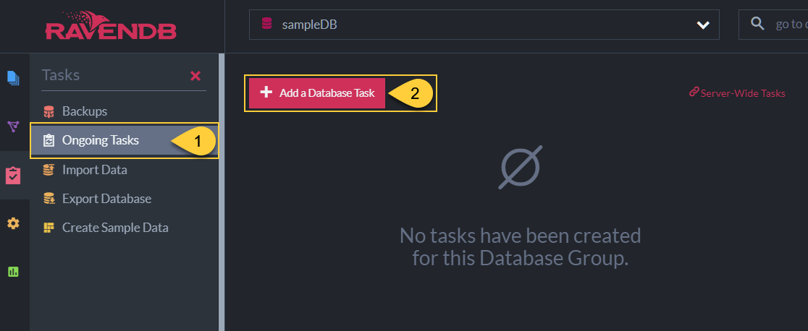
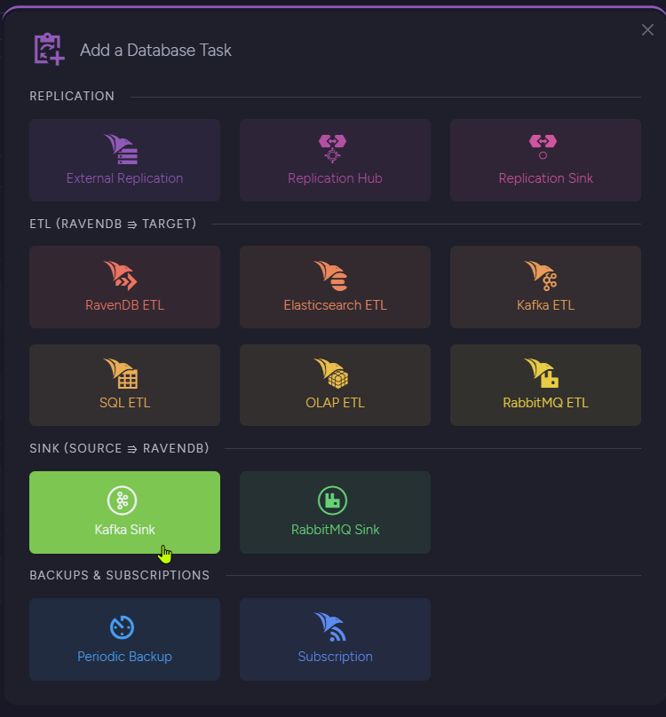
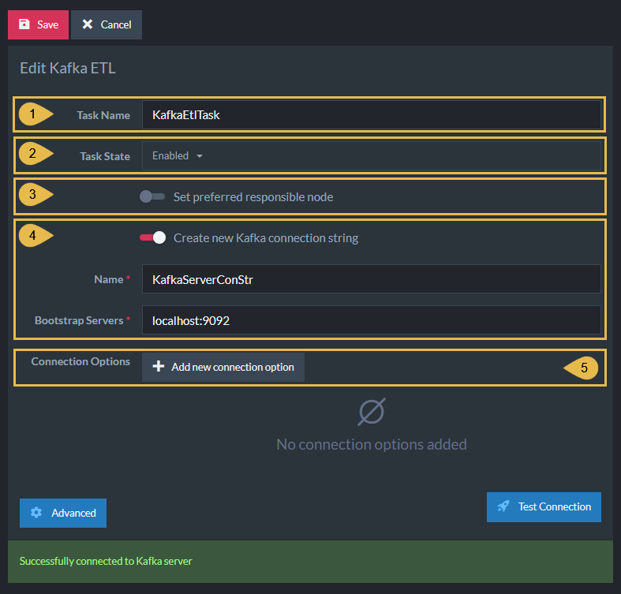
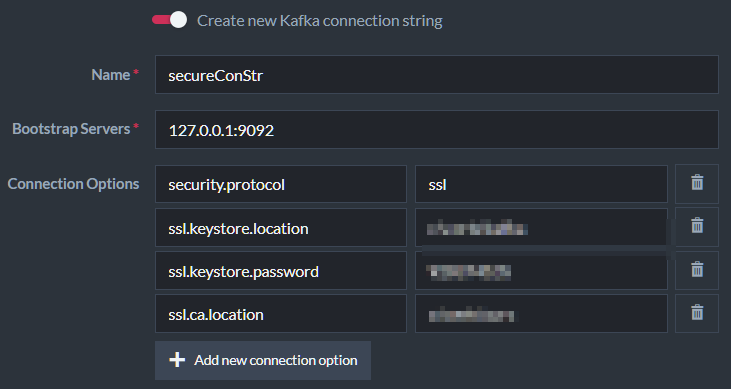
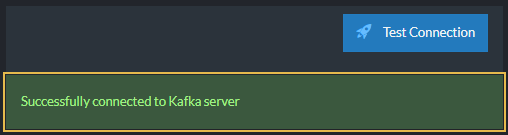
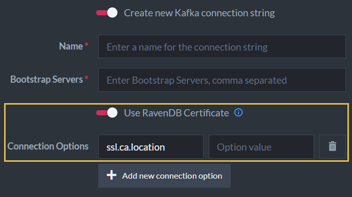
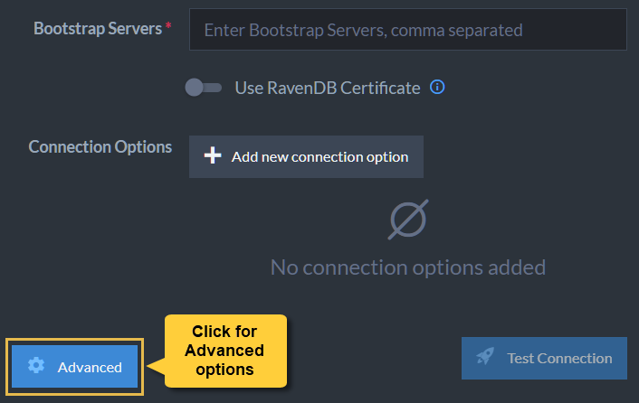
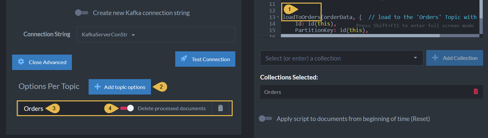
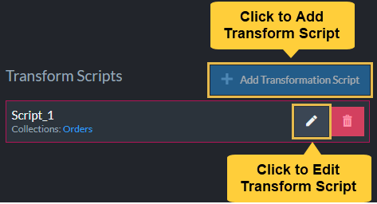
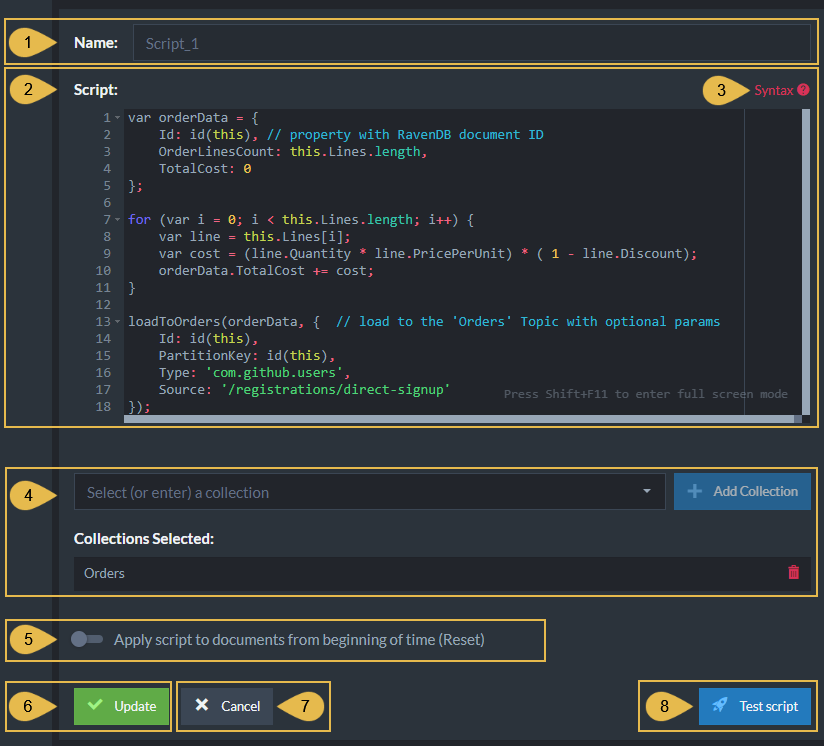

import Admonition from '@theme/Admonition';
import Tabs from '@theme/Tabs';
import TabItem from '@theme/TabItem';
import CodeBlock from '@theme/CodeBlock';
import LanguageSwitcher from "@site/src/components/LanguageSwitcher";
import LanguageContent from "@site/src/components/LanguageContent";
import Panel from "@site/src/components/Panel";
import ContentFrame from "@site/src/components/ContentFrame";

# Kafka ETL Task

<Admonition type="note" title="">

* RavenDB ETL tasks for **Apache Kafka**:
   * **Extract** selected data from RavenDB documents.
   * **Transform** the data to new JSON objects and add the new objects to CloudEvents messages.
   * **Load** the messages to **topics** of a Kafka broker.

* Messages enqueued in Kafka topics are added at the queue's tail.  
  When the messages reach the queue's head, Kafka clients can access and consume them.

* Kafka ETL tasks transfer **documents only**.  
  Document extensions like attachments, counters, or time series are not transferred.

* This page explains how to create a Kafka ETL task using Studio.  
  [Learn here](../../../../server/ongoing-tasks/etl/queue-etl/kafka.mdx) how to define a Kafka ETL task using code.

* In this article:
  * [Setup workflow](../../../../studio/database/tasks/ongoing-tasks/kafka-etl-task.mdx#setup-workflow)
  * [Creating a Kafka ETL task](../../../../studio/database/tasks/ongoing-tasks/kafka-etl-task.mdx#creating-a-kafka-etl-task)
    * [Open Kafka ETL Task View](../../../../studio/database/tasks/ongoing-tasks/kafka-etl-task.mdx#open-kafka-etl-task-view)
    * [Define Kafka ETL Task](../../../../studio/database/tasks/ongoing-tasks/kafka-etl-task.mdx#define-kafka-etl-task)
    * [Use RavenDB Certificate](../../../../studio/database/tasks/ongoing-tasks/kafka-etl-task.mdx#use-ravendb-certificate)
    * [Options Per Topic](../../../../studio/database/tasks/ongoing-tasks/kafka-etl-task.mdx#options-per-topic)
    * [Edit Transformation Script](../../../../studio/database/tasks/ongoing-tasks/kafka-etl-task.mdx#edit-transformation-script)
  * [Prerequisites for a secure Kafka server](../../../../studio/database/tasks/ongoing-tasks/kafka-etl-task.mdx#prerequisites-for-a-secure-kafka-server)
    * [What needs to be granted](../../../../studio/database/tasks/ongoing-tasks/kafka-etl-task.mdx#what-needs-to-be-granted)
    * [Reading the transactional IDs from Studio](../../../../studio/database/tasks/ongoing-tasks/kafka-etl-task.mdx#reading-the-transactional-ids-from-studio)
    * [Entering the grants on the Kafka cluster](../../../../studio/database/tasks/ongoing-tasks/kafka-etl-task.mdx#entering-the-grants-on-the-kafka-cluster)

</Admonition>

<Panel heading="Setup workflow">

* **If your Kafka cluster does not use ACLs (Access Control Lists):**  
  Create, test, and run the task as described in [Creating a Kafka ETL task](#creating-a-kafka-etl-task) below.

* **If your Kafka cluster does use ACLs:**

  1. Create and save the task as described in [Creating a Kafka ETL task](#creating-a-kafka-etl-task) below. Do not test or run it yet.
  2. Follow the steps in [Prerequisites for a secure Kafka server](#prerequisites-for-a-secure-kafka-server) below.
  3. Test and run the task.

</Panel>

<Panel heading="Creating a Kafka ETL task">

<ContentFrame>

## Open Kafka ETL Task View



1. **Ongoing Tasks**  
   Click to open the ongoing tasks view.
2. **Add a Database Task**  
   Click to create a new ongoing task.



* **Kafka ETL**  
  Click to define a Kafka ETL task.

</ContentFrame>

<ContentFrame>

## Define Kafka ETL Task



1. **Task Name** (Optional)  
   * Enter a name for your task.
   * If no name is provided, the server will create a name based on the defined connection string,  
     e.g. *Queue ETL to conStr*.

2. **Task State**  
   Select the task state:  
   Enabled - The task runs in the background, transforming and sending documents as defined in this view.  
   Disabled - No documents are transformed and sent.

3. **Responsible Node** (Optional)
  * Select a node from the [Database Group](../../../../studio/database/settings/manage-database-group.mdx) to be responsible for this task.
  * If no node is selected, the cluster will assign a responsible node (see [Members Duties](../../../../studio/database/settings/manage-database-group.mdx#database-group-topology---members-duties)).

4. **Create new Kafka connection String**
    * Select an existing connection string from the list or create a new one.
    * The connection string defines the destination Kafka broker/s URL/s.
    * **Name** - Enter a name for the connection string.
    * **Bootstrap Servers** - Provide at least one target `URL:Port` pair.  
      To push messages to more than one server, use this format: `localhost:9092, localhost:9093`.

5. **Add new Connection Option**  
   An optional Key/Value dictionary.  
   This option can be used, for example, to provide the additional fields required to connect a secure Kafka server.

     

6. **Test Connection**  
   Click after defining the connection string, to test the connection to the Kafka topic.

     

</ContentFrame>

<ContentFrame>

## Use RavenDB Certificate

If RavenDB has been set up **securely**, another option will show up: **Use RavenDB Certificate**.



If enabled, the Kafka connection runs over SSL/TLS, and RavenDB authenticates with a
client certificate derived from its cluster setup. The certificate is either the
cluster server certificate itself (if it carries the client-auth EKU, the X.509
extension that permits acting as a TLS client) or a separate certificate that
RavenDB issues from the server certificate's key pair.

Enabling **Use RavenDB Certificate** replaces the security options you would
otherwise enter via [Add new connection option](../../../../studio/database/tasks/ongoing-tasks/kafka-etl-task.mdx#define-kafka-etl-task).

<Admonition type="warning" title="">

A [Kafka truststore](https://kafka.apache.org/documentation/streams/developer-guide/security.html)
is the broker's pool of certificates trusted for client TLS handshakes;
a client certificate is accepted only if it chains back to an entry in the truststore.

To complete the setup, register RavenDB's cluster-wide certificate in
Kafka's truststore on the target machine(s). The connection will fail until
this registration is in place.

</Admonition>

</ContentFrame>

<ContentFrame>

## Options Per Topic



Clicking the Advanced button will display per-topic options.  
In it, you'll find the option to delete documents from RavenDB while they were processed by the selected topic.



1. **The Topic**  
   `loadToOrders` is the script instruction to transfer documents to the `Orders` topic.
2. **Add Topic Options**  
   Click to add a per-topic option.
3. **Collection/Topic Name**  
   This is the name of the Kafka topic to which the documents are pushed.
4. **Delete Processed Documents**  
   Enabling this option will remove from the RavenDB collection documents that were processed and pushed to the Kafka topic.
   <Admonition type="warning" title="">
   Enabling this option will **remove processed documents** from the database.  
   The documents will be deleted after the messages are pushed.
   </Admonition>

</ContentFrame>

<ContentFrame>

## Edit Transformation Script





1. **Script Name**  
   Enter a name for the script (Optional).  
   A default name will be generated if no name is entered, e.g. Script_1.

2. **Script**  
   Edit the transformation script.
   * Define a **document object** whose contents will be extracted from RavenDB documents and appended to Kafka topic/s.  
     E.g., `var orderData` in the above example.
   * Make sure that one of the properties of the document object is given the value `id(this)`.  
     This property will contain the RavenDB document ID.
   * Use the `loadTo<TopicName>` method to pass the document object to the Kafka destination.

3. **Syntax**  
   Click for a transformation script Syntax Sample.

4. **Collections**
    * **Select (or enter) a collection**  
      Type or select the names of the collections your script is using.
    * **Collections Selected**  
      A list of collections that were already selected.

5. **Apply script to documents from beginning of time (Reset)**
    * When this option is **enabled**:  
      The script will be executed over **all existing documents in the specified collections** the first time the task runs.
    * When this option is **disabled**:  
      The script will be executed **only over new and modified documents**.

6. **Add/Update**  
   Click to add a new script or update the task with changes made in an existing script.

7. **Cancel**  
   Click to cancel your changes.

8. **Test Script**  
   Click to **test** the transformation script.

</ContentFrame>

</Panel>

<Panel heading="Prerequisites for a secure Kafka server">

<ContentFrame>

## What needs to be granted

When the Kafka cluster uses ACLs (Access Control Lists), two kinds of ACL grants must be set up on the cluster:

* **WRITE** on each target topic.
* **WRITE** and **DESCRIBE** on each RavenDB transformation script **transactional ID**.

The transactional ID is generated by RavenDB when the task is saved, see [Reading the transactional IDs from Studio](#reading-the-transactional-ids-from-studio) below.

<Admonition type="note" title="">
For more on these grants and how the transactional ID is built, see [Prerequisites for a secure Kafka server](../../../../server/ongoing-tasks/etl/queue-etl/kafka.mdx#prerequisites-for-a-secure-kafka-server) on the API page.
</Admonition>

</ContentFrame>

---

<ContentFrame>

## Reading the transactional IDs from Studio

When an ACL grant is missing, RavenDB raises an exception whose message names the missing resource and the operation. Read each transactional ID from the exception text and use it for the ACL grants.

</ContentFrame>

---

<ContentFrame>

## Entering the grants on the Kafka cluster

Configure the grants on the Kafka cluster using its admin tools.  
The example below uses Apache Kafka's CLI; the same operations are available in vendor UIs like Confluent Cloud, AKHQ, or kafka-ui.

```bash
# Grant WRITE on a target topic
kafka-acls --bootstrap-server <broker> --add \
  --allow-principal User:<principal> \
  --operation Write --topic <topic-name>

# Grant WRITE and DESCRIBE on a transactional ID
kafka-acls --bootstrap-server <broker> --add \
  --allow-principal User:<principal> \
  --operation Write --operation Describe \
  --transactional-id <transactional-id-from-Studio>
```

</ContentFrame>

</Panel>
