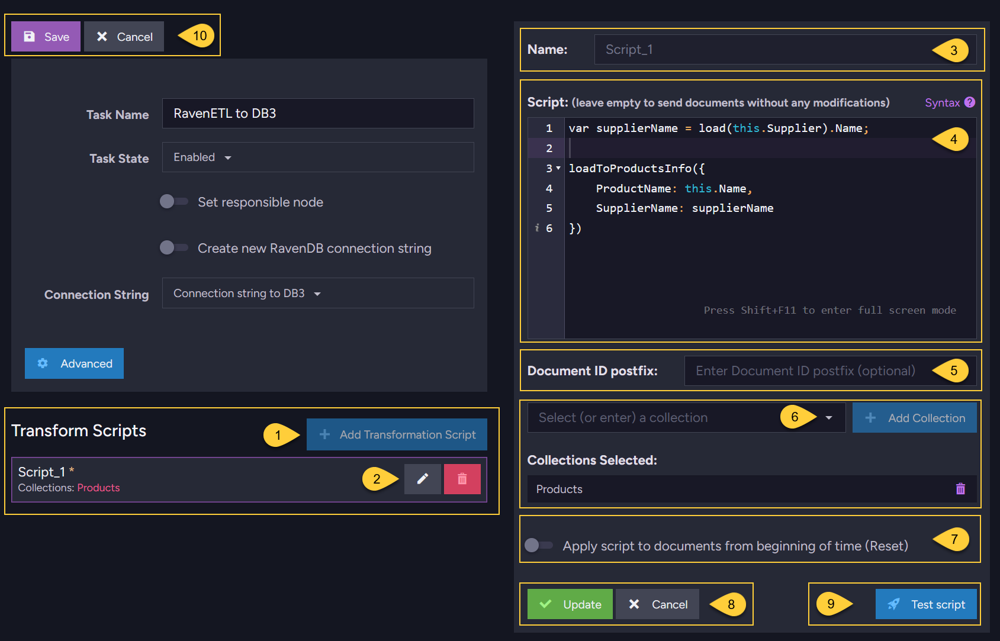

import Admonition from '@theme/Admonition';
import Tabs from '@theme/Tabs';
import TabItem from '@theme/TabItem';
import CodeBlock from '@theme/CodeBlock';
import LanguageSwitcher from "@site/src/components/LanguageSwitcher";
import LanguageContent from "@site/src/components/LanguageContent";

# RavenDB ETL Task
<Admonition type="note" title="Note">

* A **RavenDB ETL Task** is an [ETL process](../../../../server/ongoing-tasks/etl/basics.mdx#basics) 
  that transfers data from the current database to another RavenDB database instance, 
  outside of the [Database Group](../../../../studio/database/settings/manage-database-group.mdx)  

* The sent data can be filtered and modified by transformation scripts  

* Learn more about the benefits of using ETL in [Why use ETL](../../../../server/ongoing-tasks/etl/basics.mdx#why-use-etl)  

* ETL is different from data replication. See [RavenDB ETL Task -vs- Replication Task](../../../../studio/database/tasks/ongoing-tasks/ravendb-etl-task.mdx#ravendb-etl-task--vs--replication-task)  

* In RavenDB ETL, [a certificate must be passed](../../../../studio/database/tasks/ongoing-tasks/ravendb-etl-task.mdx#passing-certificate-between-secure-clusters) 
  from the source server to the destination so that the destination server trusts the source.  

* In this page:  
  * [RavenDB ETL Task - Definition](../../../../studio/database/tasks/ongoing-tasks/ravendb-etl-task.mdx#ravendb-etl-task---definition)  
  * [RavenDB ETL Task - Transform Scripts](../../../../studio/database/tasks/ongoing-tasks/ravendb-etl-task.mdx#ravendb-etl-task---transform-scripts)  
  * [Passing Certificate Between Secure Clusters](../../../../studio/database/tasks/ongoing-tasks/ravendb-etl-task.mdx#passing-certificate-between-secure-clusters)  
  * [RavenDB ETL Task - Details in Tasks List View](../../../../studio/database/tasks/ongoing-tasks/ravendb-etl-task.mdx#ravendb-etl-task---details-in-tasks-list-view)  
  * [RavenDB ETL Task - Offline Behaviour](../../../../studio/database/tasks/ongoing-tasks/ravendb-etl-task.mdx#ravendb-etl-task---offline-behaviour)  
  * [RavenDB ETL Task -vs- External Replication Task](../../../../studio/database/tasks/ongoing-tasks/ravendb-etl-task.mdx#ravendb-etl-task--vs--external-replication-task)  
</Admonition>
## RavenDB ETL Task - Definition

1. **Task Name** (Optional)  
   * Choose a name of your choice  
   * If no name is given then the RavenDB server will create one for you based on the defined connection string  

2. **Preferred Node** (Optional)  
  * Select a preferred mentor node from the [Database Group](../../../../studio/database/settings/manage-database-group.mdx) to be the responsible node for this RavenDB ETL Task  
  * If not selected, then the cluster will assign a responsible node (see [Members Duties](../../../../studio/database/settings/manage-database-group.mdx#database-group-topology---members-duties))  

3. **Connection String**  
   * Select an existing connection string from the list or create a new one  
   * The connection string defines the destination database and its database group server node URLs  

## RavenDB ETL Task - Transform Scripts

1. Click to add a new script  

2. Edit or Delete an existing script  

3. Enter the script to use.  
   In the above example, each source document from the "Products" collection will be sent to the "ProductsInfo" collection in the destination database *db3* 
   (which is external to the cluster).  
   Each new document will have 2 fields: "ProductName" and "SupplierName".  
   For detailed script options see [Transformation Script Options](../../../../server/ongoing-tasks/etl/raven.mdx#transformation-script-options).  

4. By default, updates to the ETL script will _not_ be applied to documents that were already sent.  
   When checking this option RavenDB will start the ETL process for this script from _scratch_ ("beginning of time"),  
   rather than apply the update only to new or updated documents.  

5. Select the collections for the ETL task - **or** - apply the script to all collections  

## Passing Certificate Between Secure Clusters

**Pass Certificate from Source Cluster to Destination Cluster**  
  This step must be done if connecting *to another cluster* so that the destination cluster trusts the source.  

  * **Via RavenDB Studio:**  
  Navigate from the "Manage Server" tab (left side) &gt; "Certificates" to open the [Certificate Management view](../../../../server/security/authentication/certificate-management.mdx#studio-certificates-management-view).  
     - Learn how to [pass certificates here](../../../../server/security/authentication/certificate-management.mdx#enabling-communication-between-servers:-importing-and-exporting-certificates).  
  * **Via API:**  
  See the code sample to learn how to [define a client certificate in the DocumentStore](../../../../client-api/creating-document-store.mdx).  
     - To generate and configure a client certificate from the source server, see [CreateClientCertificateOperation](../../../../client-api/operations/server-wide/certificates/create-client-certificate.mdx)
* Learn the rationale needed to configure client certificates in [The RavenDB Security Authorization Approach](../../../../server/security/authentication/certificate-management.mdx#the-ravendb-security-authorization-approach)

## RavenDB ETL Task - Details in Tasks List View

1. **RavenDB ETL Task Details**:
   *  Task Status - Active / Not Active / Not on Node / Reconnect  
   *  Connection String - The connection string used  
   *  Destination Database - The destination database to which the data is being sent  
   *  Actual Destination URL - The server URL to which the data is actually being sent,  
      the one that is currently used out of the available _Topology Discovery URLs_  
   *  Topology Discovery URLs - List of the available destination Database Group server URLs  

2. **Graph view**:  
   Graph view of the responsible node for the External Replication Task  

## RavenDB ETL Task - Offline Behaviour

* **When the source cluster is down** (and there is no leader):  

  * Creating a _new_ Ongoing Task is a Cluster-Wide operation,  
    thus, a new Ongoing RavenDB ETL Task ***cannot*** be scheduled.  

  * If a RavenDB ETL Task was _already_ defined and active when the cluster went down,  
    then the task will not be active, so ETL will not take place.  

* **When the node responsible for the ETL task is down:**  

  * If the responsible node for the RavenDB ETL Task is down,  
    then another node from the Database Group will take ownership of the task so that the ETL process will continue executing.  

* **When the destination node is down:**  

  * The ETL process will wait until the destination is reachable again and proceed from where it left off.  

  * If there is a cluster on the other side, and the URL addresses of the destination database group nodes are listed in the connection string, 
    then when the destination node is down, RavenDB ETL will simply start transferring data to one of the other nodes specified.  

## RavenDB ETL Task -vs- External Replication Task

1. **Data ownership**:  

    * When a RavenDB node performs an **ETL** to another node it is _not_ replicating the data, it is _writing_ it.  
      In other words, we always _overwrite_ whatever exists on the destination database, and there is no [conflict handling](../../../../studio/database/settings/conflict-resolution.mdx).  

    * The source database for the ETL process is the owner of the data.  
      This means that [as long as the destination collection is the same as the source](../../../../server/ongoing-tasks/etl/raven.mdx#deletions),  
      any modifications made to the data sent by ETL on the destination database are lost when overwriting occurs.  
      **If you modify a document loaded by ETL, your modifications will be lost** when the ETL process deletes and loads the updated document into the destination database.

    * If you need to modify the data that's transferred to the destination database,  
      you should create a companion document in the destination database instead of modifying the data sent directly.  
      The rule is:  With ETL destination documents, you can look but don't touch.  

    * **On the other hand**, data that is replicated with RavenDB's [External Replication Task](../../../../studio/database/tasks/ongoing-tasks/external-replication-task.mdx) does _not_ overwrite existing documents.
      Conflicts are created and handled according to the destination database policy defined.  
      This means that with an External Replication Task you _can_ change the replicated data on the destination database and conflicts will be solved.  

2. **Data content**:

    * In **ETL**, the document content sent can be filtered and modified using the supplied transformation script. 
      Additionally, partial data can be sent by selecting specific collections.

    * In contrast, with the **External Replication Task**, _all_ documents in the database, along with their related data,  
      are replicated to the destination database _without_ any content modification.
      
    * Refer to section [what is being replicated](../../../../server/ongoing-tasks/external-replication.mdx#general-information-about-external-replication-task) 
      for exact details on what is and isn’t replicated in the External Replication Task.

