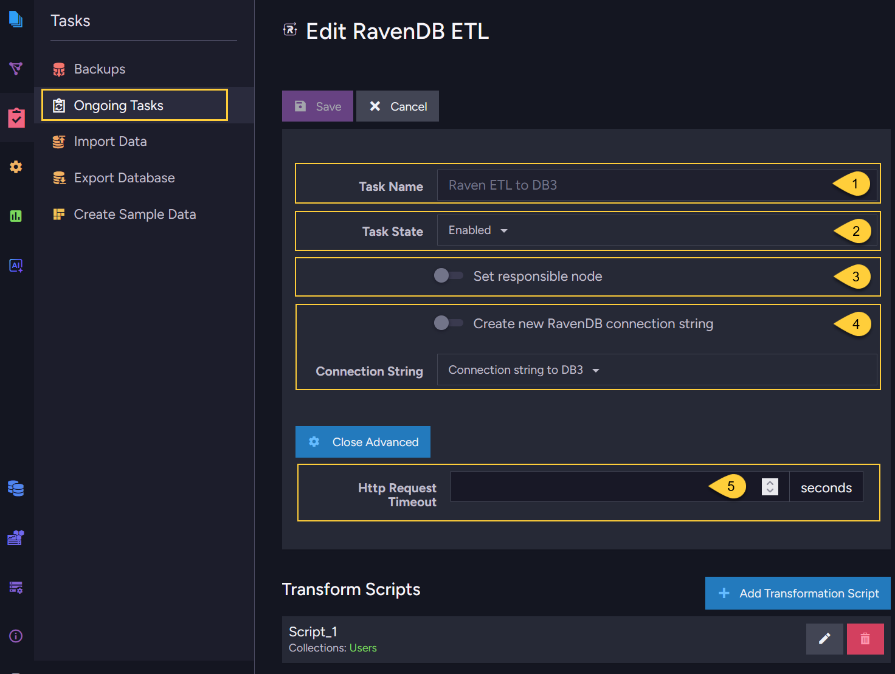
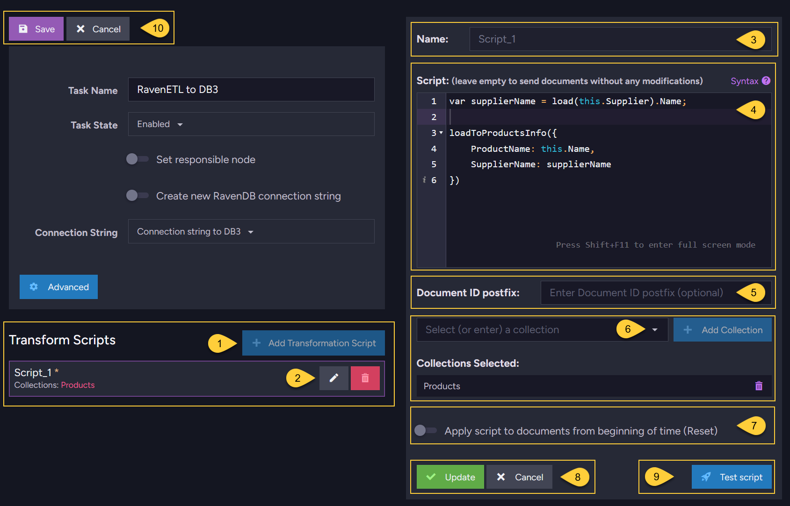
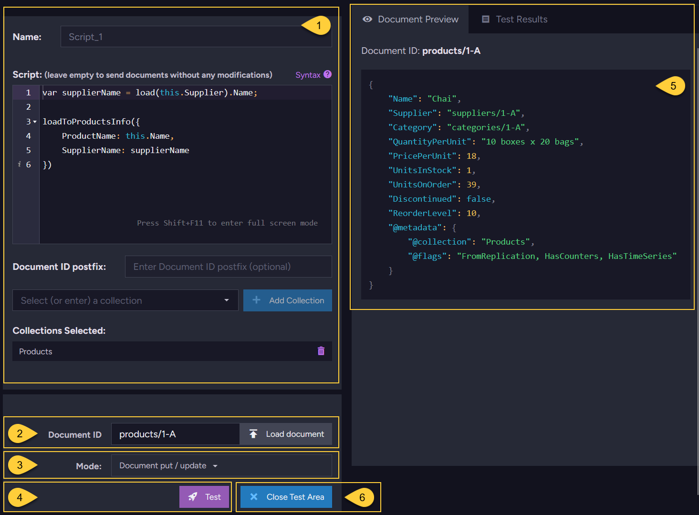
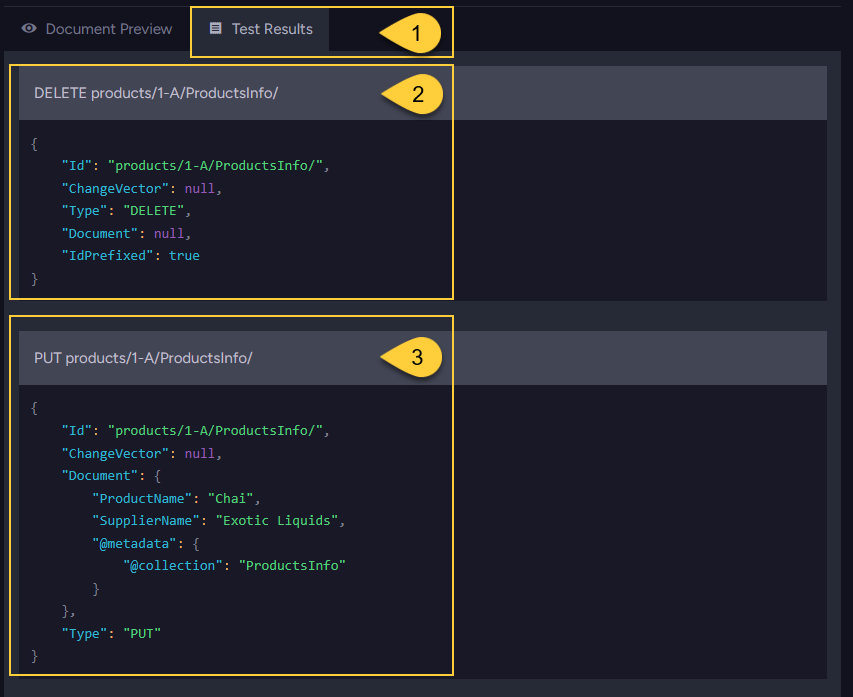
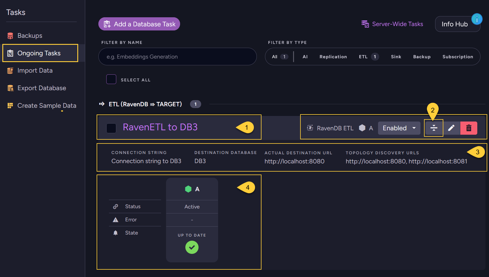

import Admonition from '@theme/Admonition';
import Tabs from '@theme/Tabs';
import TabItem from '@theme/TabItem';
import CodeBlock from '@theme/CodeBlock';
import LanguageSwitcher from "@site/src/components/LanguageSwitcher";
import LanguageContent from "@site/src/components/LanguageContent";
import Panel from "@site/src/components/Panel";
import ContentFrame from "@site/src/components/ContentFrame";

<Admonition type="note" title="">

* A **RavenDB ETL Task** is an [ETL process](../../../../server/ongoing-tasks/etl/basics.mdx#basics) 
  that transfers data from a source RavenDB database to another RavenDB database instance that is outside of the [Database Group](../../../../studio/database/settings/manage-database-group.mdx).
  The sent data can be filtered and modified by transformation scripts, giving you control over what is shared and in what format.

* This article focuses on how to define the RavenDB ETL task from Studio.  
  Learn more about the RavenDB ETL task options in [Ongoing Tasks: RavenDB ETL](../../../../server/ongoing-tasks/etl/raven.mdx).      
    
* RavenDB ETL is different from External Replication,  
  see [RavenDB ETL task -vs- External Replication task](../../../../studio/database/tasks/ongoing-tasks/ravendb-etl-task.mdx#ravendb-etl-task--vs--external-replication-task)

* On secure servers, the destination cluster must trust the source,  
  see [Passing certificate between secure clusters](../../../../studio/database/tasks/ongoing-tasks/ravendb-etl-task.mdx#passing-certificate-between-secure-clusters).

* In this article:  
  * [RavenDB ETL task - definition](../../../../studio/database/tasks/ongoing-tasks/ravendb-etl-task.mdx#ravendb-etl-task-definition)  
  * [RavenDB ETL task - transform scripts](../../../../studio/database/tasks/ongoing-tasks/ravendb-etl-task.mdx#ravendb-etl-task-transform-scripts)  
  * [RavenDB ETL task - test script](../../../../studio/database/tasks/ongoing-tasks/ravendb-etl-task.mdx#ravendb-etl-task-test-script)  
  * [RavenDB ETL task - details in tasks list view](../../../../studio/database/tasks/ongoing-tasks/ravendb-etl-task.mdx#ravendb-etl-task-details-in-tasks-list-view)  
  * [RavenDB ETL task - offline behavior](../../../../studio/database/tasks/ongoing-tasks/ravendb-etl-task.mdx#ravendb-etl-task-offline-behavior)  
  * [RavenDB ETL task -vs- External Replication task](../../../../studio/database/tasks/ongoing-tasks/ravendb-etl-task.mdx#ravendb-etl-task-vs-external-replication-task)
  * [Passing certificate between secure clusters](../../../../studio/database/tasks/ongoing-tasks/ravendb-etl-task.mdx#passing-certificate-between-secure-clusters)  
    
</Admonition>

<Panel heading="RavenDB ETL task - definition">

1. **Task name** (Optional)  
   Enter a name of your choice.  
   If no name is provided, then the RavenDB server will create one for you based on the defined connection string.  

2. **Task state** (Optional)  
   Choose whether the task should be active immediately after creation or not.  
   If active, then the ETL process will start immediately after saving the task.  
    
3. **Set responsible node** (Optional)  
   Select a preferred node from the [Database Group](../../../../studio/database/settings/manage-database-group.mdx) to be the responsible node for this RavenDB ETL task.  
   If not selected, then the cluster will assign a responsible node (see [Members Duties](../../../../studio/database/settings/manage-database-group.mdx#database-group-topology---members-duties)).  

4. **Connection string**  
   Select an existing connection string from the list or create a new one.  
   The connection string defines the destination database and its database group server node URLs.  
    
5. **HTTP Request Timeout** (Optional)  
   * Sets the maximum time in seconds that the source server will wait for the destination server to process and acknowledge a batch of documents during the Load stage.
     If the destination does not respond within this time, the request is canceled and the ETL task enters fallback mode and retries.
   * If not set, no per-request timeout is enforced,  
     the global HTTP client timeout of 12 hours applies as the only backstop.  
   * Consider setting this if the destination server is slow or under heavy load,  
     or if batches are large and take a long time to process.

</Panel>

<Panel heading="RavenDB ETL task - transform scripts">

1. Click to add a new script.  
2. Edit or delete an existing script.
3. Enter a name for the script.    
4. Enter the script to use.  
   In the above example, each source document from the "Products" collection will be sent to the _"ProductsInfo"_ collection in the destination database _DB3_.  
   Each document in the destination will have 2 fields: _"ProductName"_ and _"SupplierName"_.  
   See [Transformation script options](../../../../server/ongoing-tasks/etl/raven.mdx#transformation-script-options) for detailed script options.  
5. Document ID postfix (Optional):  
   When setting this postfix, it is appended to every document ID written to the destination.  
   Learn more in [Setting a destination document ID postfix](../../../../server/ongoing-tasks/etl/raven.mdx#setting-a-destination-document-id-postfix).
6. Open the dropdown to select the source collections for the ETL task.    
7. By default, the ETL script is Not be applied to documents that were already sent to the destination.  
   When checking this option, RavenDB will start the ETL process for this script for ALL documents in the source collection(s),
   rather than apply the script only to new or modified documents.
8. Click "Update" to update the edited script.
9. Click "Test script" to open a test area where the transformation script can be run against an existing document from the source collection without triggering the ETL task.  
   Learn more below, in [RavenDB ETL task - test script](../../../../studio/database/tasks/ongoing-tasks/ravendb-etl-task#ravendb-etl-task-test-script).
10. When done editing, click "Save" to save the RavenDB ETL task with the defined scripts.

</Panel>

<Panel heading=" RavenDB ETL task - test script">

1. **The transformation script and its configured source collections**:  
   Edit the script here before testing.
   The script will be tested against the document selected in item 2.    
2. **Document ID**:  
   Enter or select the ID of an existing document to use as the test input.  
   Click **Load document** to preview the selected document in the **Document Preview** tab (item 5).    
3. **Mode** - Select the operation to simulate:
   * `Document put / update` - simulates the ETL result when the source document is created or modified.  
   * `Document delete` - simulates the ETL result when the source document is deleted.
4. Click **Test** to run the script against the selected document and view the results in the **Test Results** tab.    
5. **Document Preview**:  
   Shows the full content of the source document loaded in item 2, including its fields and metadata.
6. Click **Close Test Area** to exit the test area and return to the task edit view.    
    
---
    
    
    
1. **Test Results**:  
   This tab shows the commands that the ETL process would send to the destination database for the selected source document and mode.    
2. **DELETE command**:  
   When `Document put / update` mode is selected, the ETL process first sends a DELETE command for the existing document in the destination.
   This is the standard ETL load behavior - the old version is deleted before the new one is written.
   This behavior can be customized, learn more in [Deletions](../../../../server/ongoing-tasks/etl/raven.mdx#deletions).
3. **PUT command**:  
   The PUT command contains the transformed document object that will be written to the destination collection.

</Panel>

<Panel heading=" RavenDB ETL task - details in tasks list view">

1. **The RavenDB ETL task**.  
   Click the task name to open the task edit view.
2. Click to expand the **Task details panel**.    
3. *  **Connection string** - the connection string used.  
   *  **Destination database** - the destination database to which data is being sent.  
   *  **Actual destination URL** - the server URL currently being used out of the available Topology Discovery URLs. 
   *  **Topology discovery URLs** -  
      the list of destination Database Group server URLs configured in the connection string.   
4. The task **Status and State** on the node responsible for running the task.    

</Panel>

<Panel heading="RavenDB ETL Task - Offline Behavior">    

* **When the source cluster is down** (and there is no leader):  

  * Creating a _new_ Ongoing Task is a Cluster-Wide operation, thus, a new Ongoing RavenDB ETL Task ***cannot*** be scheduled.
  * If a RavenDB ETL Task was _already_ defined and active when the cluster went down, then the task will not be active, so ETL will not take place.  

* **When the node responsible for the ETL task is down:**  

  * If the responsible node for the RavenDB ETL Task is down,
    then another node from the Database Group will take ownership of the task so that the ETL process will continue executing.  

* **When the destination node is down:**  

  * The ETL process will wait until the destination is reachable again and proceed from where it left off.
  * If there is a cluster on the other side, and the URL addresses of the destination database group nodes are listed in the connection string, 
    then when the destination node is down, RavenDB ETL will simply start transferring data to one of the other nodes specified.  

</Panel>

<Panel heading="RavenDB ETL task -vs- External Replication task">

### Data ownership

* **With RavenDB ETL**:  
  * When a RavenDB node performs an **ETL** to another node it is _not_ replicating the data, it is _writing_ it.  
    In other words, ETL always _overwrites_ whatever exists on the destination database,  
    and there is no [conflict handling](../../../../studio/database/settings/conflict-resolution.mdx).    
  * The source database for the ETL process is the owner of the data.  
    This means that as long as the destination collection is the same as the source,
    any modifications made to the data sent by ETL on the destination database are lost when overwriting occurs.
    **If you modify a document loaded by ETL, your modifications will be lost** when the ETL process deletes and loads the updated document into the destination database.
  * If you need to modify the transferred data in the destination database,
    you should create a companion document in the destination database instead of modifying the data sent directly.
    The rule is: With ETL destination documents, you can look but don't touch.

* **With External Replication**:  
  Data that is replicated with RavenDB's [External Replication Task](../../../../studio/database/tasks/ongoing-tasks/external-replication-task.mdx) does _not_ overwrite existing documents in the destination database. 
  Conflicts are created and handled according to the destination database's conflict resolution policy, meaning you _can_ modify replicated data on the destination side and conflicts will be resolved.

### Data content

* **With RavenDB ETL**:  
  Document content can be filtered and transformed using a transformation script.  
  You can also send only specific collections rather than the entire database.

* **With External Replication**:  
  _All_ documents and their related data are replicated as-is, without any content filtering or modification.  
  Refer to section [what is being replicated](../../../../server/ongoing-tasks/external-replication.mdx#general-information-about-external-replication-task) 
  for exact details on what is and isn’t replicated with External Replication.

</Panel>

<Panel heading="Passing certificate between secure clusters">

When connecting to another cluster, the destination cluster must be configured to trust the source.  
This is done by passing the source server's certificate to the destination cluster.

---

### Via RavenDB Studio

1. On the **source** server, go to **Manage Server** (left sidebar) > **Certificates**.
2. Export the source server's certificate.  
   See [Certificate Management view](../../../../server/security/authentication/certificate-management.mdx#studio-certificates-management-view) for details.
3. On the **destination** server, import the exported certificate as a trusted client certificate.  
   See [Importing and exporting certificates](../../../../server/security/authentication/certificate-management.mdx#enabling-communication-between-servers-importing-and-exporting-certificates).

---

### Via the Client API

1. To generate and configure a client certificate from the source server,  
   see [CreateClientCertificateOperation](../../../../client-api/operations/server-wide/certificates/create-client-certificate.mdx).
2. Configure the generated certificate in the destination server's `DocumentStore`,  
   see [Defining a client certificate in the DocumentStore](../../../../client-api/creating-document-store.mdx#creating-a-document-store---example) for a code sample.

---

To understand why this trust configuration is required,  
see [The RavenDB Security Authorization Approach](../../../../server/security/authentication/certificate-management.mdx#the-ravendb-security-authorization-approach).

</Panel>