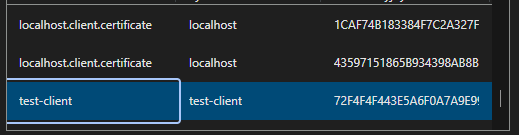

import Admonition from '@theme/Admonition';
import Tabs from '@theme/Tabs';
import TabItem from '@theme/TabItem';
import CodeBlock from '@theme/CodeBlock';
import LanguageSwitcher from "@site/src/components/LanguageSwitcher";
import LanguageContent from "@site/src/components/LanguageContent";

# Emergency access to a secured cluster

If your RavenDB instance connection is lost in the following situations:
- The certificate expired and was not renewed
- The certificate was deleted
- You were authenticating with a 2EKU server certificate, and it was renewed with 1EKU [(context)](https://ravendb.net/articles/ravendb-global-changes-in-lets-encrypt)

There's a way to restore the connectivity, but it requires a manual intervention. 
In this guide we will describe how to do it using `rvn admin-channel`.

### 1. Create a new .pfx certificate

You'll need to generate a new client certificate. Either:

- use an existing, non-expired one
- contact your system administrator to generate one for you
- generate a new self-signed certificate (example below)

Generating a new self-signed certificate using `openssl`:
```bash
#!/usr/bin/env bash
set -e
mkdir -p certs

openssl req -x509 -newkey rsa:2048 -nodes \
  -keyout certs/client.key \
  -out certs/client.crt \
  -days 825 \
  -subj "/CN=test-client" \
  -addext "keyUsage=digitalSignature" \
  -addext "extendedKeyUsage=clientAuth"

openssl pkcs12 -export -out certs/client.pfx \
  -inkey certs/client.key -in certs/client.crt \
  -name "test-client" -passout pass:
```

### 2. Copy the certificate .pfx to the server environment

You will need to connect directly to the server environment where Raven.Server process is running.

We need to send the new certificate to the production environment - so it's "reachable" for the `rvn` executable, which is located inside your RavenDB distribution package.

You can use `scp`, copy via remote desktop (rdp), or any other relevant method.

e.g.

```bash
scp certs/client.pfx user@my-server:/path/to/ravendb/RavenDB/Server/
```


### 3. Connect to the server environment via terminal or rdp

Use `ssh`, `rdp` or any other relevant method to access the **terminal** of the physical server, VM or a container.
This will allow us to bypass the expired certificate and connect to the server directly via IPC to register a new client certificate.

e.g.
```bash
ssh user@my-server.example.com
```

### 4. Use rvn admin-channel to trust a new certificate

Go to the directory where you have extracted/installed RavenDB, and run the `rvn` tool with `admin-channel` command. 

The `rvn admin-channel` will connect directly to the local RavenDB server process using IPC pipe. 

Once you're connected, use `trustClientCert` command.

```bash
$root@my-machine:/ravendb/RavenDB/Server# ./rvn admin-channel
Will try to connect to discovered Raven.Server process : 1056...

       _____                       _____  ____
      |  __ \                     |  __ \|  _ \
      | |__) |__ ___   _____ _ __ | |  | | |_) |
      |  _  // _` \ \ / / _ \ '_ \| |  | |  _ <
      | | \ \ (_| |\ V /  __/ | | | |__| | |_) |
      |_|  \_\__,_| \_/ \___|_| |_|_____/|____/


      Safe by default, optimized for efficiency

 Build 62, Version 6.2, SemVer 6.2.13, Commit a922a12
 PID 1056, 64 bits, 16 Cores, Phys Mem 31.405 GBytes, Arch: X64
 Source Code (git repo): https://github.com/ravendb/ravendb
 Built with love by RavenDB Ltd. and awesome contributors!
+---------------------------------------------------------------+
Connected to RavenDB Console through named pipe connection...

ravendb> trustClientCert emergency-access ./certs/client.pfx  # <------------ here
Successfully read certificate: 5809A91F933B62A0B6A27BCCD3202365DCAE56DB
[Subject]
  CN=test-client

[Issuer]
  CN=test-client

[Serial Number]
  72F4F4F443E5A6F0A7A9E992E9A7FACAF70A328C

[Not Before]
  01/14/2026 18:09:51

[Not After]
  04/18/2028 19:09:51

[Thumbprint]
  5809A91F933B62A0B6A27BCCD3202365DCAE56DB

Successfully registered the client certificate 5809A91F933B62A0B6A27BCCD3202365DCAE56DB
ravendb>
```

Success! Now let's go back to your local machine.

### 5. Connect to the server using the new certificate 

Install your new .pfx certificate to your OS certificate store, and use it to connect to the server.

Pick a new certificate from the certificates list when connecting to Studio:



You can see that your new temporary certificate is now trusted by the server:


Now you can use this certificate to connect to the server and perform any necessary actions.

