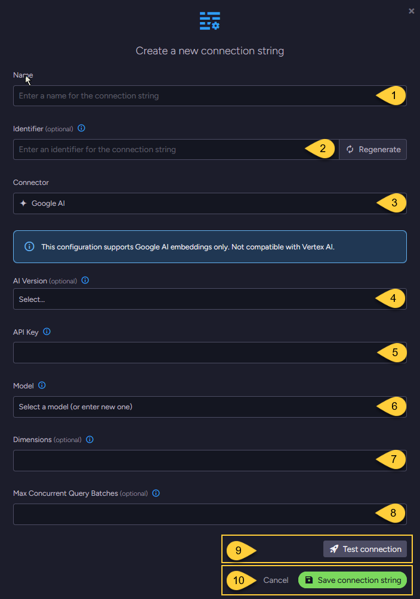

import Admonition from '@theme/Admonition';
import Tabs from '@theme/Tabs';
import TabItem from '@theme/TabItem';
import CodeBlock from '@theme/CodeBlock';
import LanguageSwitcher from "@site/src/components/language-switcher";
import LanguageContent from "@site/src/components/language-content";

export const supportedLanguages = ["csharp"];

# Connection String to Google AI
<LanguageSwitcher supportedLanguages={supportedLanguages} />
<LanguageContent language="csharp">

<Admonition type="note" title="Note">

* This article explains how to define a connection string to [Google AI](https://ai.google.dev/gemini-api/docs/embeddings),  
  enabling RavenDB to seamlessly integrate its [embeddings generation tasks](../../ai-integration/generating-embeddings/overview) with Google's AI services.

* This configuration supports **Google AI provider** only and is not compatible with Vertex AI.

* In this article:
  * [Define the connection string - from the Studio](../../ai-integration/connection-strings/google-ai#define-the-connection-string---from-the-studio)
  * [Define the connection string - from the Client API](../../ai-integration/connection-strings/google-ai#define-the-connection-string---from-the-client-api)
  * [Syntax](../../ai-integration/connection-strings/google-ai#syntax) 
    
</Admonition>
## Define the connection string - from the Studio

1. **Name**  
   Enter a name for this connection string.

2. **Identifier** (optional)  
   Enter an identifier for this connection string.  
   Learn more about the identifier in the [connection string identifier](../../ai-integration/connection-strings/connection-strings-overview#the-connection-string-identifier) section.

3. **Connector**  
   Select **Google AI** from the dropdown menu.

4. **AI Version** (optional)  
   * Select the Google AI API version to use.
   * If not specified, `V1_Beta` is used. Learn more in [API versions explained](https://ai.google.dev/gemini-api/docs/api-versions).

5. **API key**  
   Enter the API key used to authenticate requests to Google's AI services.

6. **Model**  
   Select or enter the Google AI text embedding model to use.

7. **Dimensions** (optional)  
   * Specify the number of dimensions for the output embeddings.  
   * If not specified, the model's default dimensionality is used.

8. **Max concurrent query batches**: (optional)
   * When making vector search queries, the content of the search terms must also be converted to embeddings to compare them against the stored vectors.
     Requests to generate such query embeddings via the AI provider are sent in batches.
   * This parameter defines the maximum number of these batches that can be processed concurrently.  
     You can set a default value using the [Ai.Embeddings.MaxConcurrentBatches](../../server/configuration/ai-integration-configuration#ai.embeddings.maxconcurrentbatches) configuration key.

9. Click **Test Connection** to confirm the connection string is set up correctly.

10. Click **Save** to store the connection string or **Cancel** to discard changes.

## Define the connection string - from the Client API

<TabItem value="something-something" label="create_connection_string_google_ai">
<CodeBlock language="csharp">
{`using (var store = new DocumentStore())
\{
    // Define the connection string to Google AI
    var connectionString = new AiConnectionString
    \{
        // Connection string name & identifier
        Name = "ConnectionStringToGoogleAI", 
        Identifier = "identifier-to-the-connection-string", // optional
        
        // Google AI connection settings
        GoogleSettings = new GoogleSettings(
            apiKey: "your-api-key",
            model: "text-embedding-004",
            aiVersion: GoogleAIVersion.V1)
    \};
    
    // Optionally, override the default maximum number of query embedding batches
    // that can be processed concurrently 
    connectionString.GoogleSettings.EmbeddingsMaxConcurrentBatches = 10;
    
    // Deploy the connection string to the server
    var operation = new PutConnectionStringOperation<AiConnectionString>(connectionString);
    var putConnectionStringResult = store.Maintenance.Send(operation);
\}
`}
</CodeBlock>
</TabItem>

## Syntax

<TabItem value="something-something" label="google_ai_settings">
<CodeBlock language="csharp">
{`public class AiConnectionString
\{
    public string Name \{ get; set; \}
    public string Identifier \{ get; set; \}
    public GoogleSettings GoogleSettings \{ get; set; \}
\}

public class GoogleSettings : AbstractAiSettings
\{
    public string ApiKey \{ get; set; \}
    public string Model \{ get; set; \}
    public GoogleAIVersion? AiVersion \{ get; set; \}
    public int? Dimensions \{ get; set; \}
\}

public enum GoogleAIVersion
\{
    V1, // Represents the "v1" version of the Google AI API
    V1_Beta // Represents the "v1beta" version of the Google AI API
\}

public class AbstractAiSettings
\{
    public int? EmbeddingsMaxConcurrentBatches \{ get; set; \}
\}
`}
</CodeBlock>
</TabItem>

</LanguageContent>