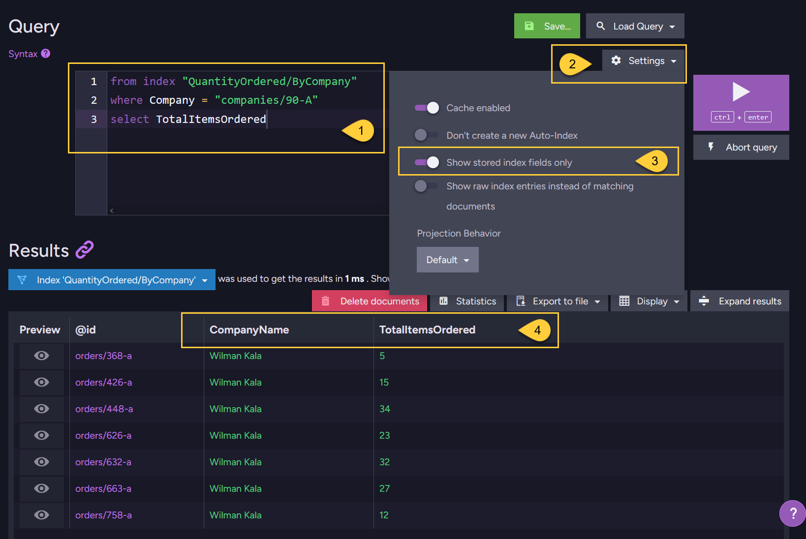

import Admonition from '@theme/Admonition';
import Tabs from '@theme/Tabs';
import TabItem from '@theme/TabItem';
import CodeBlock from '@theme/CodeBlock';
import LanguageSwitcher from "@site/src/components/LanguageSwitcher";
import LanguageContent from "@site/src/components/LanguageContent";

export const supportedLanguages = ["java", "python", "php", "nodejs", "csharp"];

# Storing Data in Index
<LanguageSwitcher supportedLanguages={supportedLanguages} />
<LanguageContent language="java">

<Admonition type="note" title="">

Once the [tokenization and analysis](../indexes/using-analyzers.mdx) process is completed, 
the resulting tokens created by the used analyzer are stored in the index.  
By default, tokens saved in the index are available for searching, but their original 
field values are not stored.  

Lucene allows you to store the original field text (before it is analyzed) as well.  

* In this page:
  * [Storing Data in Index](../indexes/storing-data-in-index.mdx#storing-data-in-index)

</Admonition>

## Storing Data in Index

Lucene's original field text storage feature is exposed in the index definition object as 
the `Storage` property of the `IndexFieldOptions`.  

When the original values are stored in the index, they become available for retrieval via 
[projections](../indexes/querying/projections.mdx).  

<Tabs groupId='languageSyntax'>
<TabItem value="AbstractIndexCreationTask" label="AbstractIndexCreationTask">
<CodeBlock language="java">
{`public static class Employees_ByFirstAndLastName extends AbstractIndexCreationTask {
    public Employees_ByFirstAndLastName() {
        map =  "docs.Employees.Select(employee => new {" +
            "    FirstName = employee.FirstName," +
            "    LastName = employee.LastName" +
            "})";

        store("FirstName", FieldStorage.YES);
        store("LastName", FieldStorage.YES);
    }
}
`}
</CodeBlock>
</TabItem>
<TabItem value="Operation" label="Operation">
<CodeBlock language="java">
{`IndexDefinition indexDefinition = new IndexDefinition();
indexDefinition.setName("Employees_ByFirstAndLastName");
indexDefinition.setMaps(Collections.singleton("docs.Employees.Select(employee => new {" +
    "    FirstName = employee.FirstName," +
    "    LastName = employee.LastName" +
    "})"));

java.util.Map<String, IndexFieldOptions> fields = new HashMap<>();
indexDefinition.setFields(fields);

IndexFieldOptions firstNameOptions = new IndexFieldOptions();
firstNameOptions.setStorage(FieldStorage.YES);
fields.put("FirstName", firstNameOptions);

IndexFieldOptions lastNameOptions = new IndexFieldOptions();
lastNameOptions.setStorage(FieldStorage.YES);
fields.put("LastName", lastNameOptions);

store
    .maintenance()
    .send(new PutIndexesOperation(indexDefinition));
`}
</CodeBlock>
</TabItem>
</Tabs>

<Admonition type="info" title="">
The default `Storage` value for each field is `FieldStorage.NO`.  
Keep in mind that storing fields will increase disk space usage.  
</Admonition>

<Admonition type="info" title="">
If **the projection requires only the fields that are stored**, the document will 
not be loaded from the storage and the query results will be retrieved directly from the index.  
This can increase query performance at the cost of disk space used.  
</Admonition>

</LanguageContent>
<LanguageContent language="python">

<Admonition type="note" title="">

Once the [tokenization and analysis](../indexes/using-analyzers.mdx) process is completed, 
the resulting tokens created by the used analyzer are stored in the index.  
By default, tokens saved in the index are available for searching, but their original 
field values are not stored.  

Lucene allows you to store the original field text (before it is analyzed) as well.  

* In this page:
  * [Storing Data in Index](../indexes/storing-data-in-index.mdx#storing-data-in-index)

</Admonition>

## Storing Data in Index

Lucene's original field text storage feature is exposed in the index definition object as 
the `storage` property of the `IndexFieldOptions`.  

When the original values are stored in the index, they become available for retrieval via 
[projections](../indexes/querying/projections.mdx).  

<Tabs groupId='languageSyntax'>
<TabItem value="AbstractIndexCreationTask" label="AbstractIndexCreationTask">
<CodeBlock language="python">
{`class Employees_ByFirstAndLastName(AbstractIndexCreationTask):
    def __init__(self):
        super().__init__()
        self.map = "from employee in docs.Employees select new { employee.FirstName, employee.LastName }"
        self._store("FirstName", FieldStorage.YES)
        self._store("LastName", FieldStorage.YES)
`}
</CodeBlock>
</TabItem>
<TabItem value="Operation" label="Operation">
<CodeBlock language="python">
{`store.maintenance.send(
    PutIndexesOperation(
        IndexDefinition(
            name="Employees_ByFirstAndLastName",
            maps={
                """
    from employee in docs.Employees
    select new
    {
        employee.FirstName,
        employee.LastName
    }
    """
            },
            fields={
                "FirstName": IndexFieldOptions(storage=FieldStorage.YES),
                "LastName": IndexFieldOptions(storage=FieldStorage.YES),
            },
        )
    )
)
`}
</CodeBlock>
</TabItem>
</Tabs>

<Admonition type="info" title="">
The default `storage` value for each field is `FieldStorage.NO`.  
Keep in mind that storing fields will increase disk space usage.  
</Admonition>

<Admonition type="info" title="">
If **the projection requires only the fields that are stored**, the document will 
not be loaded from the storage and the query results will be retrieved directly from the index.  
This can increase query performance at the cost of disk space used.  
</Admonition>

</LanguageContent>
<LanguageContent language="php">

<Admonition type="note" title="">

Once the [tokenization and analysis](../indexes/using-analyzers.mdx) process is completed, 
the resulting tokens created by the used analyzer are stored in the index.  
By default, tokens saved in the index are available for searching, but their original 
field values are not stored.  

Lucene allows you to store the original field text (before it is analyzed) as well.  

* In this page:
  * [Storing Data in Index](../indexes/storing-data-in-index.mdx#storing-data-in-index)

</Admonition>

## Storing Data in Index

Lucene's original field text storage feature is exposed in the index definition object as 
the `storage` property of the `IndexFieldOptions`.  

When the original values are stored in the index, they become available for retrieval via 
[projections](../indexes/querying/projections.mdx).  

<Tabs groupId='languageSyntax'>
<TabItem value="AbstractIndexCreationTask" label="AbstractIndexCreationTask">
<CodeBlock language="php">
{`class Employees_ByFirstAndLastName extends AbstractIndexCreationTask
{
    public function __construct()
    {
        parent::__construct();

        $this->map =  "docs.Employees.Select(employee => new {" .
            "    FirstName = employee.FirstName," .
            "    LastName = employee.LastName" .
            "})";

        $this->store('FirstName', FieldStorage::yes());
        $this->store('LastName', FieldStorage::yes());
    }
}
`}
</CodeBlock>
</TabItem>
<TabItem value="Operation" label="Operation">
<CodeBlock language="php">
{`$indexDefinition = new IndexDefinition();
$indexDefinition->setName("Employees_ByFirstAndLastName");
$indexDefinition->setMaps([
    "docs.Employees.Select(employee => new {" .
    "    FirstName = employee.FirstName," .
    "    LastName = employee.LastName" .
    "})"
]);

$fields = [];

$firstNameOptions = new IndexFieldOptions();
$firstNameOptions->setStorage(FieldStorage::yes());
$fields['FirstName'] = $firstNameOptions;

$lastNameOptions = new IndexFieldOptions();
$lastNameOptions->setStorage(FieldStorage::yes());
$fields['LastName'] = $lastNameOptions;

$indexDefinition->setFields($fields);

$store->maintenance()->send(new PutIndexesOperation($indexDefinition));
`}
</CodeBlock>
</TabItem>
</Tabs>

<Admonition type="info" title="">
The default `storage` value for each field is `FieldStorage.NO`.  
Keep in mind that storing fields will increase disk space usage.  
</Admonition>

<Admonition type="info" title="">
If **the projection requires only the fields that are stored**, the document will 
not be loaded from the storage and the query results will be retrieved directly from the index.  
This can increase query performance at the cost of disk space used.  
</Admonition>

</LanguageContent>
<LanguageContent language="nodejs">

<Admonition type="note" title="">

Once the [tokenization and analysis](../indexes/using-analyzers.mdx) process is completed, 
the resulting tokens created by the used analyzer are stored in the index.  
By default, tokens saved in the index are available for searching, but their original 
field values are not stored.  

Lucene allows you to store the original field text (before it is analyzed) as well.  

* In this page:
  * [Storing Data in Index](../indexes/storing-data-in-index.mdx#storing-data-in-index)

</Admonition>

## Storing Data in Index

Lucene's original field text storage feature is exposed in the index definition object as 
the `Storage` property of the `IndexFieldOptions`.  

When the original values are stored in the index, they become available for retrieval via 
[projections](../indexes/querying/projections.mdx).  

<Tabs groupId='languageSyntax'>
<TabItem value="AbstractIndexCreationTask" label="AbstractIndexCreationTask">
<CodeBlock language="js">
{`class Employees_ByFirstAndLastName extends AbstractIndexCreationTask {
    constructor() {
        super();
        
        this.map = \`docs.Employees.Select(employee => new {    
            FirstName = employee.FirstName,    
            LastName = employee.LastName
        })\`;

        this.store("FirstName", "Yes");
        this.store("LastName", "Yes");
    }
}
`}
</CodeBlock>
</TabItem>
<TabItem value="Operation" label="Operation">
<CodeBlock language="js">
{`const indexDefinition = new IndexDefinition();
indexDefinition.name = "Employees_ByFirstAndLastName";
indexDefinition.maps = new Set([
    "docs.Employees.Select(employee => new {" +
    "    FirstName = employee.FirstName," +
    "    LastName = employee.LastName" +
    "})"
]);
indexDefinition.fields = {
    "FirstName": { storage: "Yes" },
    "LastName": { storage: "Yes" }
};

await store.maintenance.send(new PutIndexesOperation(indexDefinition));
`}
</CodeBlock>
</TabItem>
</Tabs>

<Admonition type="info" title="">
The default `Storage` value for each field is `"No"`.  
Keep in mind that storing fields will increase disk space usage.  
</Admonition>

<Admonition type="info" title="">
If **the projection requires only the fields that are stored**, the document will 
not be loaded from the storage and the query results will be retrieved directly from the index.  
This can increase query performance at the cost of disk space used.  
</Admonition>

</LanguageContent>
<LanguageContent language="csharp">

<Admonition type="note" title="">

* RavenDB allows you to store data in a static index.

* When data is stored in the index, it can be retrieved directly from the index when querying the index and [projecting selected fields](../indexes/querying/projections.mdx),
  without requiring the server to load the original document from storage.  
  This behavior can be configured at the query level. See [Projection behavior with a static-index](../indexes/querying/projections.mdx#projection-behavior-with-a-static-index) for details.

* In this article:
  * [What content is stored in the index](../indexes/storing-data-in-index.mdx#what-content-is-stored-in-the-index)
  * [When and why to store data in an index](../indexes/storing-data-in-index.mdx#when-and-why-to-store-data-in-an-index)    
  * [Storing data in index - from the Client API](../indexes/storing-data-in-index.mdx#storing-data-in-index---from-the-client-api)
  * [Storing data in index - from the Studio](../indexes/storing-data-in-index.mdx#storing-data-in-index---from-the-studio)

</Admonition>
## What content is stored in the index

* A static index is defined by its map function which determines the content of each **index-entry**.  
  Typically, a single index-entry is created for each document from the indexed source collection -  
  unless using a [Fanout index](../indexes/indexing-nested-data.mdx#fanout-index---multiple-index-entries-per-document), which produces multiple entries per document.

* Each index-entry consists of a set of **index-fields**, populated with values as defined in the map function.  
  The content of an index-field can be a direct value from the source document field,   
  or a computed value based on the source document's content.

* You can configure an [Analyzer](../indexes/using-analyzers.mdx) (either a custom one or one of RavenDB’s built-in analyzers) to tokenize the content of an index-field for [Full-text search](../indexes/querying/searching.mdx).
  The tokens (terms) created by the analyzer form the searchable content of the index. When querying the index, you can filter documents based on these terms.

* **RavenDB allows you to store the original index-field value in the index**.  
  **This stored value is the raw content produced by the map function, BEFORE it is tokenized by the analyzer**.  
  * The tokens (terms) generated by the analyzer are searchable but not stored.
  * The index-field values, if explicitly marked as stored, are retrievable when [Projecting index query results](../indexes/querying/projections.mdx)  
    (by default they are not stored).

* This behavior is supported by both Lucene and Corax search engines.

## When and why to store data in an index

* **Store a field in the index if**:

  * **You want to project that field without loading the full document.**  
    Storing data in a static index allows RavenDB to retrieve that data directly from the index when projecting fields in a query, instead of loading the original document from storage.
    If all projected fields are stored, the document will not be loaded - values are fetched directly from the index, resulting in faster projections and better performance.
  * **The index-field is a computed value that you want to return in the query results.**  
    Normally, querying an index returns matching documents.
    But if you're projecting a computed index-field that is Not stored,
    you'll need to re-calculate the computed value manually from the documents returned by the query.  
    Storing the computed field avoids this extra step.

* **You do not need to store a field in the index in order to**:

  * Filter by the field in a query.
  * Perform full-text search on the field.

* **Disadvantage of storing data in the index**:

  * Increased disk space usage - stored fields take up additional space and increase index size.

## Storing data in index - from the Client API

To store an index-field in a static index, add it to the `Stores` dictionary with `FieldStorage.Yes` in the index definition (this syntax applies to LINQ indexes).
The default is `FieldStorage.No`.
**Index example:**

<Tabs groupId='languageSyntax'>
<TabItem value="LINQ_index" label="LINQ_index">
<CodeBlock language="csharp">
{`public class QuantityOrdered_ByCompany :
    AbstractIndexCreationTask<Order, QuantityOrdered_ByCompany.IndexEntry>
{
    // The index-entry:
    public class IndexEntry
    {
        // The index-fields:
        public string Company { get; set; }
        public string CompanyName { get; set; }
        public int TotalItemsOrdered { get; set; }
    }
    
    public QuantityOrdered_ByCompany()
    {
        Map = orders => from order in orders
            select new IndexEntry
            {
                // 'Company' is a SIMPLE index-field,
                // its value is taken directly from the Order document:
                Company = order.Company,
                
                // 'CompanyName' is also considered a simple index-field,
                // its value is taken from the related Company document:
                CompanyName = LoadDocument<Company>(order.Company).Name,
                
                // 'TotalItemsOrdered' is a COMPUTED index-field:
                // (the total quantity of items ordered in an Order document)
                TotalItemsOrdered = order.Lines.Sum(orderLine => orderLine.Quantity) 
            };
        
        // Store the calculated 'TotalItemsOrdered' index-field in the index:
        // ==================================================================
        Stores.Add(x => x.TotalItemsOrdered, FieldStorage.Yes);
        
        // You can use an analyzer to tokenize the 'CompanyName' index-field for full-text search:
        // =======================================================================================
        Analyzers.Add(x => x.CompanyName, "SimpleAnalyzer");
        
        // Store the original value of \`CompanyName\` in the index (BEFORE tokenization):
        // =============================================================================
        Stores.Add(x => x.CompanyName, FieldStorage.Yes);
    }
}
`}
</CodeBlock>
</TabItem>
<TabItem value="JS_index" label="JS_index">
<CodeBlock language="csharp">
{`public class QuantityOrdered_ByCompany_JS : AbstractJavaScriptIndexCreationTask
{
    public QuantityOrdered_ByCompany_JS()
    {
        Maps = new HashSet<string>()
        {
            @"map('orders', function(order) {
                let company = load(order.Company, 'Companies')
                return {
                    Company: order.Company,
                    CompanyName: company.Name,
                    TotalItemsOrdered: order.Lines.reduce(function(total, line) {
                        return total + line.Quantity;
                    }, 0)
                };
            })" 
        };

        Fields = new Dictionary<string, IndexFieldOptions>
        {
            {
                "TotalItemsOrdered", new IndexFieldOptions
                {
                    Storage = FieldStorage.Yes
                }
            },
            {
                "CompanyName", new IndexFieldOptions
                {
                    Storage = FieldStorage.Yes,
                    Analyzer = "SimpleAnalyzer"
                }
            }
        };
    }
}
`}
</CodeBlock>
</TabItem>
<TabItem value="IndexDefinition" label="IndexDefinition">
<CodeBlock language="csharp">
{`var indexDefinition = new IndexDefinition
{
    Name = "QuantityOrdered/ByCompany",
    
    Maps =
    {
        @"from order in docs.Orders
          select new
          {
              Company = order.Company,
              CompanyName = LoadDocument(order.Company, ""Companies"").Name,
              TotalItemsOrdered = order.Lines.Sum(orderLine => orderLine.Quantity) 
          }"
    },
    
    Fields = new Dictionary<string, IndexFieldOptions>
    {
        {
            "TotalItemsOrdered", new IndexFieldOptions
            {
                Storage = FieldStorage.Yes
            }
        },
        {
            "CompanyName", new IndexFieldOptions
            {
                Storage = FieldStorage.Yes,
                Analyzer = "SimpleAnalyzer"
            }
        }
    }
};

store.Maintenance.Send(new PutIndexesOperation(indexDefinition));
`}
</CodeBlock>
</TabItem>
</Tabs>
<a id="query-the-index"/>
**Querying the index and projecting results:**

<Admonition type="note" title="">

* In this query, the projected results are defined by the custom class `NumberOfItemsOrdered`.

* By default, the results will be retrieved from the index, because this class contains a single field `TotalItemsOrdered `, which is stored in the index.
  The server does Not need to load the original document from storage.  
  This behavior can be configured at the query level. See [Projection behavior with a static-index](../indexes/querying/projections.mdx#projection-behavior-with-a-static-index) for details.

<Tabs groupId='languageSyntax'>
<TabItem value="Query" label="Query">
<CodeBlock language="csharp">
{`using (var session = store.OpenSession())
{
    List<NumberOfItemsOrdered> itemsOrdered = session
        .Query<QuantityOrdered_ByCompany.IndexEntry, QuantityOrdered_ByCompany>()
        .Where(order => order.Company == "companies/90-A")
         // Project results into a custom class:
        .ProjectInto<NumberOfItemsOrdered>()
        .ToList();
}
`}
</CodeBlock>
</TabItem>
<TabItem value="Query_async" label="Query_async">
<CodeBlock language="csharp">
{`using (var asyncSession = store.OpenAsyncSession())
{
    List<NumberOfItemsOrdered> itemsOrdered = await asyncSession
        .Query<QuantityOrdered_ByCompany.IndexEntry, QuantityOrdered_ByCompany>()
        .Where(order => order.Company == "companies/90-A")
        .ProjectInto<NumberOfItemsOrdered>()
        .ToListAsync();
}
`}
</CodeBlock>
</TabItem>
<TabItem value="DocumentQuery" label="DocumentQuery">
<CodeBlock language="csharp">
{`using (var session = store.OpenSession())
{
    List<NumberOfItemsOrdered> itemsOrdered = session.Advanced
        .DocumentQuery<QuantityOrdered_ByCompany.IndexEntry, QuantityOrdered_ByCompany>()
        .WhereEquals(order => order.Company, "companies/90-A")
        .SelectFields<NumberOfItemsOrdered>()
        .ToList();
}
`}
</CodeBlock>
</TabItem>
<TabItem value="DocumentQuery_async" label="DocumentQuery_async">
<CodeBlock language="csharp">
{`using (var asyncSession = store.OpenAsyncSession())
{
    List<NumberOfItemsOrdered> itemsOrdered = await asyncSession.Advanced
        .AsyncDocumentQuery<QuantityOrdered_ByCompany.IndexEntry, QuantityOrdered_ByCompany>()
        .WhereEquals(order => order.Company, "companies/90-A")
        .SelectFields<NumberOfItemsOrdered>()
        .ToListAsync();
}
`}
</CodeBlock>
</TabItem>
<TabItem value="Projection_class" label="Projection_class">
<CodeBlock language="csharp">
{`public class NumberOfItemsOrdered
{
    // This field was stored in the index definition
    public int TotalItemsOrdered { get; set; }
}
`}
</CodeBlock>
</TabItem>
<TabItem value="RQL" label="RQL">
<CodeBlock language="sql">
{`from index "QuantityOrdered/ByCompany"
where Company = "companies/90-A"
select TotalItemsOrdered
`}
</CodeBlock>
</TabItem>
</Tabs>

</Admonition>
<Admonition type="note" title="">

* In this query, the projected results are defined by the custom class `ProjectedDetails`.
 
* In this case, some of the fields in this class are Not stored in the index, so by default,
  the server does need to load the original document from storage to complete the projection.  
  This behavior can be configured at the query level. See [Projection behavior with a static-index](../indexes/querying/projections.mdx#projection-behavior-with-a-static-index) for details.

<Tabs groupId='languageSyntax'>
<TabItem value="Query" label="Query">
<CodeBlock language="csharp">
{`using (var session = store.OpenSession())
{
    List<ProjectedDetails> orders = session
        .Query<QuantityOrdered_ByCompany.IndexEntry, QuantityOrdered_ByCompany>()
        .Where(order => order.Company == "companies/90-A")
         // Project results into a custom class:
        .ProjectInto<ProjectedDetails>()
        .ToList();
}
`}
</CodeBlock>
</TabItem>
<TabItem value="Query_async" label="Query_async">
<CodeBlock language="csharp">
{`using (var asyncSession = store.OpenAsyncSession())
{
    List<ProjectedDetails> orders = await asyncSession
        .Query<QuantityOrdered_ByCompany.IndexEntry, QuantityOrdered_ByCompany>()
        .Where(order => order.Company == "companies/90-A")
        .ProjectInto<ProjectedDetails>()
        .ToListAsync();
}
`}
</CodeBlock>
</TabItem>
<TabItem value="DocumentQuery" label="DocumentQuery">
<CodeBlock language="csharp">
{`using (var session = store.OpenSession())
{
    List<ProjectedDetails> orders = session.Advanced
        .DocumentQuery<QuantityOrdered_ByCompany.IndexEntry, QuantityOrdered_ByCompany>()
        .WhereEquals(order => order.Company, "companies/90-A")
        .SelectFields<ProjectedDetails>()
        .ToList();
}
`}
</CodeBlock>
</TabItem>
<TabItem value="DocumentQuery_async" label="DocumentQuery_async">
<CodeBlock language="csharp">
{`using (var asyncSession = store.OpenAsyncSession())
{
    List<ProjectedDetails> orders = await asyncSession.Advanced
        .AsyncDocumentQuery<QuantityOrdered_ByCompany.IndexEntry, QuantityOrdered_ByCompany>()
        .WhereEquals(order => order.Company, "companies/90-A")
        .SelectFields<ProjectedDetails>()
        .ToListAsync();
}
`}
</CodeBlock>
</TabItem>
<TabItem value="Projection_class" label="Projection_class">
<CodeBlock language="csharp">
{`public class ProjectedDetails
{
    // This field was Not stored in the index definition
    public string Company { get; set; }
    // This field was Not stored in the index definition
    public DateTime OrderedAt { get; set; }
    // This field was stored in the index definition
    public int TotalItemsOrdered { get; set; }
}
`}
</CodeBlock>
</TabItem>
<TabItem value="RQL" label="RQL">
<CodeBlock language="sql">
{`from index "QuantityOrdered/ByCompany"
where Company = "companies/90-A"
select Company, OrderedAt, TotalItemsOrdered
`}
</CodeBlock>
</TabItem>
</Tabs>
</Admonition>

## Storing data in index - from the Studio

To configure index-fields from the Studio, open the _Edit Index_ view:

1. This is the index from the [example above](../indexes/storing-data-in-index.mdx#storing-data-in-index---from-the-client-api).
2. These are the index-fields defined in the index map function.
Scroll down to configure each index-field:

1. Open the _Fields_ tab.
2. Enter the name of the index-field. Here we configure index-field `TotalItemsOrdered`.
3. Select _Yes_ from the dropdown to store the field in the index.
4. Here we configure index-field `CompanyName`.
5. This index-field is stored in the index and also configured for full-text search.
When querying the index from the Studio,  
you can choose to display the stored index fields in the Results view:

1. This is the query from the [example above](../indexes/storing-data-in-index.mdx#query-the-index).
2. Open the _Settings_ options.
3. Toggle ON _Show stored index fields only_.
4. When executing the query,  
   the results will display the stored index-fields for each object returned by the query.  

</LanguageContent>

<!---
### Indexes
- [Boosting](../indexes/boosting)
- [Analyzers](../indexes/using-analyzers)
- [Term Vectors](../indexes/using-term-vectors)
- [Dynamic Fields](../indexes/using-dynamic-fields)
- [Projection behavior with a static-index](../indexes/querying/projections#projection-behavior-with-a-static-index)

### Querying
- [Projections and Stored Fields](../indexes/querying/projections#projections-and-stored-fields)

-->