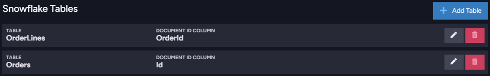

import Admonition from '@theme/Admonition';
import Tabs from '@theme/Tabs';
import TabItem from '@theme/TabItem';
import CodeBlock from '@theme/CodeBlock';
import LanguageSwitcher from "@site/src/components/language-switcher";
import LanguageContent from "@site/src/components/language-content";

# Ongoing Tasks: Snowflake ETL  
<Admonition type="note" title="Note">

* Snowflake is a widely used cloud-based [Data Warehouse](https://docs.snowflake.com/en/user-guide/warehouses) 
  implementation, designated to gather data from a variety of sources and consolidate 
  it in a central depository where it can be efficiently managed, distributed, and analyzed 
  using BI (Business Intelligence) tools.  

* Data can be easily transferred from a RavenDB database to a Snowflake warehouse via user-defined Snowflake 
  [ETL](../../../server/ongoing-tasks/etl/basics) tasks that continuously monitor the origin RavenDB database, 
  detect data items as they are added or modified, and update the warehouse on the fly.  

* Snowflake ETL is enabled with a RavenDB [Enterprise License](https://ravendb.net/buy).  

* In this page:  
  * [Creating a Task](../../../server/ongoing-tasks/etl/snowflake#creating-a-task)  
  * [Snowflake warehouse setup](../../../server/ongoing-tasks/etl/snowflake#snowflake-warehouse-setup)  
  * [Snowflake Tables](../../../server/ongoing-tasks/etl/snowflake#snowflake-tables)  
     * [Performance improvement suggestions](../../../server/ongoing-tasks/etl/snowflake#performance-improvement-suggestions)  
  * [Transformation Scripts](../../../server/ongoing-tasks/etl/snowflake#transformation-scripts)  
     * [`loadTo` Method](../../../server/ongoing-tasks/etl/snowflake#method)  
     * [Alternative Syntax](../../../server/ongoing-tasks/etl/snowflake#alternative-syntax)  
     * [Filtering](../../../server/ongoing-tasks/etl/snowflake#filtering)  
     * [Loading Other Documents](../../../server/ongoing-tasks/etl/snowflake#loading-other-documents)  
     * [Accessing Metadata](../../../server/ongoing-tasks/etl/snowflake#accessing-metadata)  
     * [Loading to Multiple Tables](../../../server/ongoing-tasks/etl/snowflake#loading-to-multiple-tables)  
     * [Document Extensions](../../../server/ongoing-tasks/etl/snowflake#document-extensions)  
  * [Transaction Processing](../../../server/ongoing-tasks/etl/snowflake#transaction-processing)  
  * [Advanced Options](../../../server/ongoing-tasks/etl/snowflake#advanced-options)  

</Admonition>
## Creating a Task

A Snowflake ETL task can be created using **Code** or via **Studio**.

* To create the task using **Code:**
   * Define a [Snowflake Connection String](https://github.com/snowflakedb/snowflake-connector-net/blob/master/doc/Connecting.md) 
     and register it using the [PutConnectionStringOperation](../../../client-api/operations/maintenance/connection-strings/add-connection-string#putconnectionstringoperation) 
     operation.  
     Find an example [Here](../../../client-api/operations/maintenance/connection-strings/add-connection-string#add-a-snowflake-connection-string).
   * Define an **ETL Task**, associate it with your connection string, and run it using the 
     [AddEtlOperation](../../../client-api/operations/maintenance/etl/add-etl#add-etl-operation) operation.  
     Find an example [Here](../../../client-api/operations/maintenance/etl/add-etl#add-snowflake-etl-task).  

* To create the task using **Studio**:
  <Admonition type="info" title="Info">
   Find [Here](../../../studio/database/tasks/ongoing-tasks/snowflake-etl-task) 
   a **detailed look** at the creation of a Snowflake ETL task using Studio.  
  </Admonition>
  In short:

   * Open the Studio `Settings -> Ongoing Tasks` view and click the **Snowflake ETL** option.  
     
        

   * Use the New Snowfake ETL view to define and save the new task.  
     
        

## Snowflake warehouse setup

Prior to running the ETL task, please create the **destination tables** in the warehouse database 
that RavenDB records are to be transferred to.  

## Snowflake Tables

Use the **Snowflake Tables** section to select which tables the ETL process is to transfer data to.  
For each table, specify a column that would be used as the document ID column.  
RavenDB will fill the document ID column with the source document IDs, and use them to handle updates and deletes.  

<Admonition type="info" title="Info">
The column does **not** have to be a table's primary key.
</Admonition>

<Admonition type="info" title="Info">
### Performance improvement suggestions

* **Insert data directly**:  
  The ETL process performs document updates by issuing DELETE and INSERT statements 
  to the relational database. If your system uses _append-only_, you can boost the 
  ETL process performance by setting Insert Only Mode to insert the data directly 
  without running a set of DELETE statements first.  
    * Using code (take a look [here](../../../client-api/operations/maintenance/etl/add-etl#add-snowflake-etl-task)
      to see the snowflake-table definition in its context):  
<TabItem value="something" label="snowflake_insert-only">
<CodeBlock language="csharp">
{`new SnowflakeEtlTable 
\{
    TableName = "Orders", 
    DocumentIdColumn = "Id", 
    
    // Set Insert Only Mode
    InsertOnlyMode = true
\},
`}
</CodeBlock>
</TabItem>
    * Using Studio: see [Define a Snowflake ETL Task](../../../studio/database/tasks/ongoing-tasks/snowflake-etl-task#define-a-snowflake-etl-task).  

* **SQL tables indexes**:  
  To improve performance, you can define SQL tables indexes at least for the column used 
  to hold the document ID.

</Admonition>

## Transformation Scripts

An ETL task can apply multiple transformation scripts.  
The script is defined per collection, and **cannot** be empty.

## `loadTo` Method

A transformation script is executed per document once the document is created or modified.  
To load data to the destination table, call the `loadTo<TableName>()` method and pass it a user defined JavaScript object.  

The name of the table that the document is inserted to is indicated as a part of the `loadTo` method name.  
E.g., to write data into the database `OrderLines` table, use the following call in the script:

<TabItem value="something" label="javascript">
<CodeBlock language="javascript">
{`loadToOrderLines(\{ ... \});
`}
</CodeBlock>
</TabItem>

You must pass the method a JavaScript object, e.g. -  

<TabItem value="something" label="javascript">
<CodeBlock language="javascript">
{`loadToOrderLines(\{
        OrderId: id(this),
        Qty: line.Quantity,
        Product: line.Product,
        Cost: line.PricePerUnit
\});
`}
</CodeBlock>
</TabItem>
### Alternative Syntax

The target table name can be passed to the `loadTo` command separately as a string argument, using the following syntax:  
`loadTo('Target', obj)`  

E.g., the following two calls to `loadTo` are equivalent.  
`loadToEmployees(this);`  
`loadTo('Employees', this);`  

<Admonition type="info" title="Info">

 * The target name `'Employees'` in this syntax is **not** a variable and **cannot** be used as one; 
   it is simply a string literal of the target's name.  
 * Separating the target name from the `loadTo` command makes it possible to include symbols like 
   `-` and `.` in target names. This is not possible when the standard `loadToEmployees` syntax is 
   used because including special characters in the name of a JS function turns it invalid.  
</Admonition>
### Filtering

To filter documents out or include them in the transfer, use a logic of your choosing while calling `loadTp`.  
E.g.,  

<TabItem value="something" label="javascript">
<CodeBlock language="javascript">
{`if (this.ShipTo.Country === 'USA') \{
    // load only orders shipped to USA
    loadToOrders(\{ ... \});
\}
`}
</CodeBlock>
</TabItem>
### Loading Other Documents

Use the `load` method to load a document with a specified ID during script execution.  

<TabItem value="something" label="javascript">
<CodeBlock language="javascript">
{`var company = load(this.Company);
`}
</CodeBlock>
</TabItem>
### Accessing Metadata

Access metadata as follows:  

<TabItem value="something" label="javascript">
<CodeBlock language="javascript">
{`var value = this['@metadata']['custom-metadata-key'];
`}
</CodeBlock>
</TabItem>
### Loading to Multiple Tables

The `loadTo` method can be called as many times as needed by a single script.  
The following script demonstrates this by looping through the `Lines` array of an `Order` document, 
using consecutive `loadTo` calls to store each line's properties in the `OrderLines` database table.  
The process is concluded with a final `loadTo` call, storing the lines' total cost in the `Orders` table.  

<TabItem value="something" label="javascript">
<CodeBlock language="javascript">
{`var orderData = \{
    Id: id(this),
    OrderLinesCount: this.Lines.length,
    TotalCost: 0
\};

for (var i = 0; i < this.Lines.length; i++) \{
    var line = this.Lines[i];
    orderData.TotalCost += line.PricePerUnit * line.Quantity;
    loadToOrderLines(\{
        OrderId: id(this),
        Qty: line.Quantity,
        Product: line.Product,
        Cost: line.PricePerUnit
    \});
\}
orderData.TotalCost = Math.round(orderData.TotalCost  * 100) / 100;

loadToOrders(orderData);
`}
</CodeBlock>
</TabItem>
### Document Extensions

[Counters](../../../document-extensions/counters/overview), [Time series](../../../document-extensions/timeseries/overview), 
and [Revisions](../../../document-extensions/revisions/overview) are not supported by Snowflake ETL.  

#### Loading Attachments

To store binary data that is kept as RavenDB attachments, use the `loadAttachment()` method.  

<TabItem value="something" label="sql">
<CodeBlock language="sql">
{`CREATE TABLE [dbo].[Attachments]
(
    [Id] int identity primary key,
    [OrderId] [nvarchar](50) NOT NULL,
    [AttachmentName] [nvarchar](50) NULL,
    [Data] [varbinary](max) NULL
)
`}
</CodeBlock>
</TabItem>

then you can define the script to load document's attachments:

<TabItem value="something" label="javascript">
<CodeBlock language="javascript">
{`var attachments = this['@metadata']['@attachments'];

for (var i = 0; i < attachments.length; i++) \{
    var attachment = \{
        OrderId: id(this),
        AttachmentName: attachments[i].Name,
        Data: loadAttachment(attachments[i].Name)
    \};
    loadToAttachments(attachment);
\}
`}
</CodeBlock>
</TabItem>

Attachments can also be accessed using the `getAttachments()` helper function rather than grabbing them from metadata.  
To check whether an attachment exists, use the `hasAttachment(name)` function.  

## Transaction Processing

* All records created in a single ETL run, one per each `loadTo` call, are sent in a single batch and processed 
  as part of the same transaction.  

* The ETL task will issue an SQL `INSERT` statement with each document it loads to the warehouse database.  
  The transaction is handled as an atomic unit, and the inserted documents will be stored in the warehouse 
  database using a `COMMIT` statement **only when the transaction completes**.  
  <Admonition type="note" title="Note">
  If the ETL task is interrupted while the transaction is underway, e.g. due to a server failover or because 
  the task was restarted for some other reason, the transaction will be rolled back and the ETL task will 
  process the interrupted batch from scratch, starting right after the last `COMMIT`.  
  This may cause a delay for users of the destination database, who see incoming documents only when they are 
  stored in the database when transactions complete.  
  </Admonition>

## Advanced Options

#### Command timeout:
You can set the number of seconds after which an SQL command will timeout.  
Default: `null` (use provider default)  

* **Set using Code**:  
<TabItem value="something" label="snowflake_command-timeout">
<CodeBlock language="csharp">
{`var snowflakeEtlConfig = new SnowflakeEtlConfiguration
\{
    Name = "task-name",
    ConnectionStringName = "snowflake-connection-string-name",
    
    // Set Command Timeout
    CommandTimeout = 5,
`}
</CodeBlock>
</TabItem>

* **Set via Studio**:  
  
    

    

