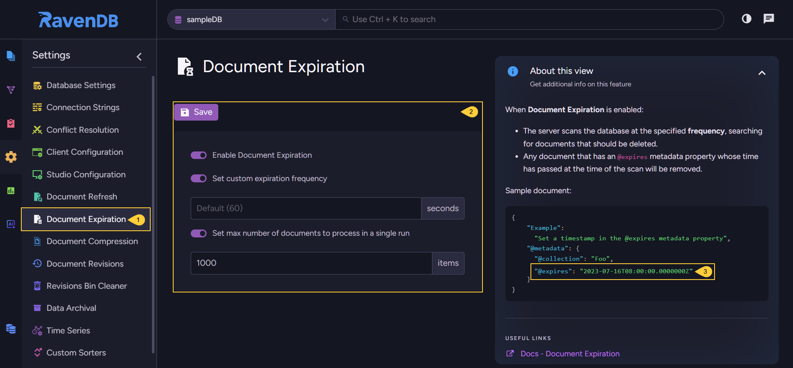

import Admonition from '@theme/Admonition';
import Tabs from '@theme/Tabs';
import TabItem from '@theme/TabItem';
import CodeBlock from '@theme/CodeBlock';
import LanguageSwitcher from "@site/src/components/language-switcher";
import LanguageContent from "@site/src/components/language-content";

# Document Expiration 
<Admonition type="note" title="Note">

* Use this view to configure the **Document Expiration** feature.  
* Documents can be scheduled for deletion by an `@expires` property in their `@metadata`.  
* When the document expiration feature is enabled, it routinely checks for documents that 
  include the `@expires` property and deletes them on the scheduled time.  
* Learn more about this option [here](../../../server/extensions/expiration).  

</Admonition>
## Document Expiration View

1. **Document Expiration**  
   Click to configure document expiration.

2. **Enable document expiration**  
   Toggle this option to enable or disable the expiration feature for the selected database.  
    * **Set custom expiration frequency**  
      Set the frequency at which the server looks for expired documents and deletes them.  
      Default value: _60 seconds_
    * **Set max number of documents to process in a single run**  
      Set the maximal number of documents the feature is allowed to delete in one run.  
    * **Save**  
      Changes in the configuration will apply only after saving them.  

3. **Set the `@expires` property inside the document that should be deleted**  
   * Add the `@metadata` of each document whose expiration you want to schedule, an `@expires` property.  
   * Set the expiration time in UTC format, e.g. - `"@expires": "2025-04-22T08:00:00.0000000Z"`  
   * Deletion will occure automatically, if the 'Enable document expiration' option is checked.  

