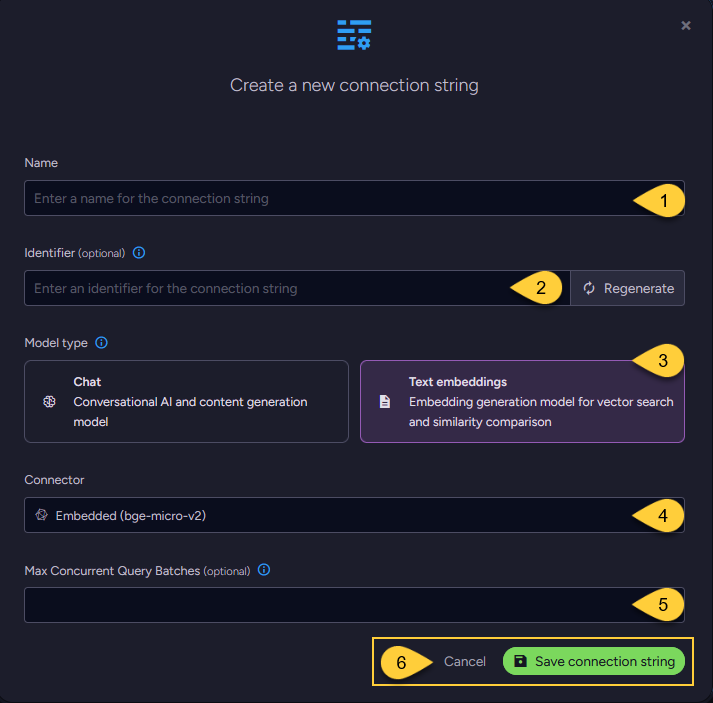

import Admonition from '@theme/Admonition';
import Tabs from '@theme/Tabs';
import TabItem from '@theme/TabItem';
import CodeBlock from '@theme/CodeBlock';

<Admonition type="note" title="">

* This article explains how to define a connection string to the [bge-micro-v2](https://huggingface.co/TaylorAI/bge-micro-v2) model.  
  This model, designed exclusively for embeddings generation, is embedded within RavenDB, enabling RavenDB to seamlessly handle its
  [Embeddings generation tasks](../../../ai-integration/generating-embeddings/overview.mdx) without requiring an external AI service.  

* Running the model locally consumes processor resources and will impact RavenDB's overall performance,  
  depending on your workload and usage patterns.

* In this article:
  * [Define the connection string - from Studio](../../../ai-integration/connection-strings/embedded.mdx#define-the-connection-string---from-studio)
  * [Define the connection string - from the Client API](../../../ai-integration/connection-strings/embedded.mdx#define-the-connection-string---from-the-client-api)
  * [Syntax](../../../ai-integration/connection-strings/embedded.mdx#syntax)

</Admonition>

## Define the connection string - from Studio



1. **Name**  
   Enter a name for this connection string.

2. **Identifier** (optional)  
   Learn more about the identifier in the [connection string identifier](../../../ai-integration/connection-strings/overview.mdx#the-connection-string-identifier) section.

3. **Model Type**  
   Select "Text Embeddings".

4. **Connector**  
   Select **Embedded (bge-micro-v2)** from the dropdown menu.

5. **Max concurrent query batches**: (optional)
   * When making vector search queries, the content of the search terms must also be converted to embeddings to compare them against the stored vectors.  
     Requests to generate such query embeddings via the AI provider are sent in batches.
   * This parameter defines the maximum number of these batches that can be processed concurrently.  
     You can set a default value using the [Ai.Embeddings.MaxConcurrentBatches](../../../server/configuration/ai-integration-configuration.mdx#aiembeddingsmaxconcurrentbatches) configuration key.

6. Click **Save** to store the connection string or **Cancel** to discard changes.

## Define the connection string - from the Client API

<TabItem value="embedded_connection_string_embedding" label="embedded_connection_string_embedding">
```python
store = DocumentStore([ravendb_url], database_name)
store.initialize()

# Define the connection string to the embedded model
connection_string = AiConnectionString(
    # Connection string name & identifier
    name="ConnectionStringToEmbedded",
    identifier="identifier-to-the-connection-string",
    # Model type
    model_type=AiModelType.TEXT_EMBEDDINGS,
    # Embedded model settings
    # No user configuration is required for the embedded model 
    # as it uses predefined values managed internally by RavenDB.
    embedded_settings=EmbeddedSettings()
)

# Optionally, override the default maximum number of query embedding batches that can be processed concurrently
connection_string.embedded_settings.embeddings_max_concurrent_batches = 10

# Deploy the connection string to the server
put_connection_string_op = PutConnectionStringOperation(connection_string)
put_connection_string_result = store.maintenance.send(put_connection_string_op)
```
</TabItem>

## Syntax

<TabItem value="embedded_settings" label="embedded_settings">
```python
class AiConnectionString(ConnectionString):
    def __init__(
        self,
        name: str,
        identifier: str,
        # ...
        model_type: AiModelType = None,
        embedded_settings: Optional[EmbeddedSettings] = None,
      ): ...

class EmbeddedSettings(AbstractAiSettings):
    def __init__(self, embeddings_max_concurrent_batches: int = None):
        super().__init__(embeddings_max_concurrent_batches)

class AbstractAiSettings:
    def __init__(self, embeddings_max_concurrent_batches: int = None): ...
```
</TabItem>
