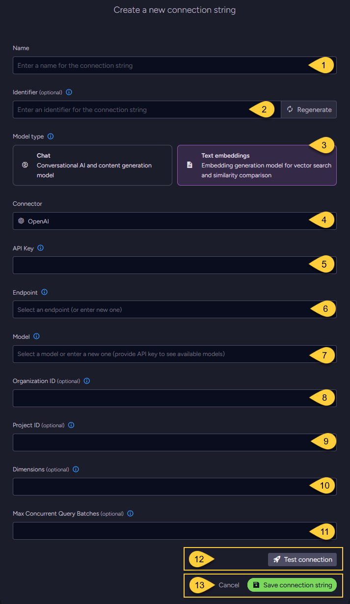
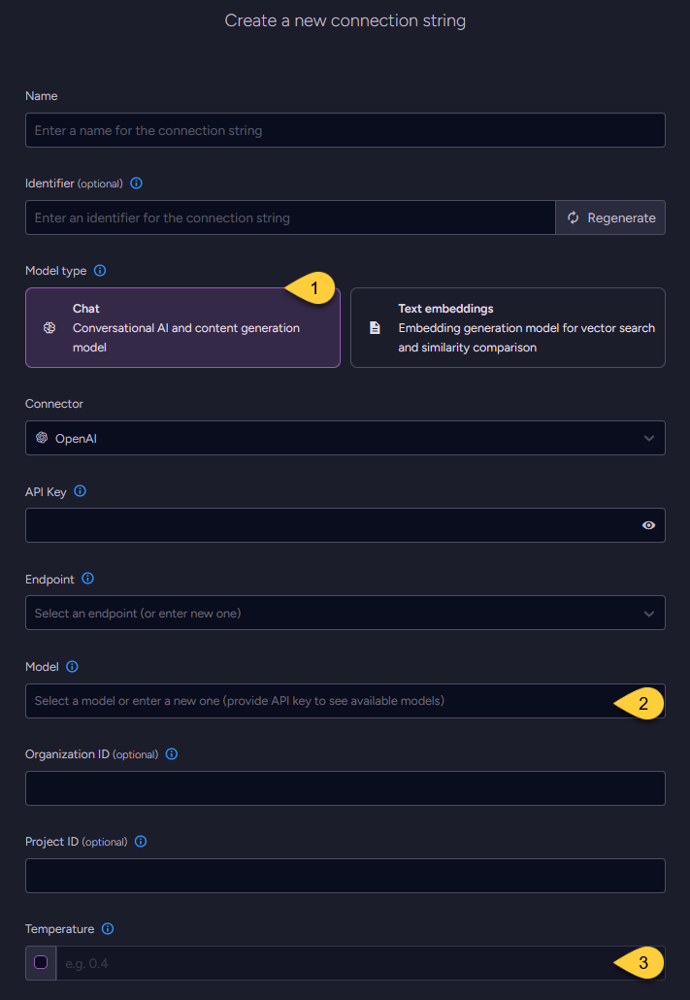

import Admonition from '@theme/Admonition';
import Tabs from '@theme/Tabs';
import TabItem from '@theme/TabItem';
import CodeBlock from '@theme/CodeBlock';
import ContentFrame from '@site/src/components/ContentFrame';
import Panel from '@site/src/components/Panel';

<Admonition type="note" title="">

* This article explains how to define a connection string to the [OpenAI Service](https://platform.openai.com/docs/guides/embeddings),  
  enabling RavenDB to use OpenAI models for [Embeddings generation tasks](../../../ai-integration/generating-embeddings/overview.mdx),
  [Gen AI tasks](../../../ai-integration/gen-ai-integration/overview.mdx), and [AI agents](../../../ai-integration/ai-agents/overview.mdx).  
    
* Use this connection string format to connect RavenDB to **any OpenAI-compatible provider** that offers a compatible API.
  As long as the provider follows the OpenAI API format, RavenDB will be able to use it for Embeddings generation, Gen AI tasks, and chat-based agent interactions.  

* In this article:
  * [Define the connection string - from Studio](../../../ai-integration/connection-strings/open-ai.mdx#define-the-connection-string-from-studio)
    * [Configuring a text embedding model](../../../ai-integration/connection-strings/open-ai.mdx#configuring-a-text-embedding-model)
    * [Configuring a chat model](../../../ai-integration/connection-strings/open-ai.mdx#configuring-a-chat-model)
  * [Define the connection string - from the Client API](../../../ai-integration/connection-strings/open-ai.mdx#define-the-connection-string-from-the-client-api)
  * [Syntax](../../../ai-integration/connection-strings/open-ai.mdx#syntax) 
    
</Admonition>

<Panel heading="Define the connection string - from Studio">

### Configuring a text embedding model



1. **Name**  
   Enter a name for this connection string.

2. **Identifier** (optional)  
   Learn more about the identifier in the [connection string identifier](../../../ai-integration/connection-strings/overview.mdx#the-connection-string-identifier) section.

3. **Model Type**  
   Select "Text Embeddings".

4. **Connector**  
   Select **OpenAI** from the dropdown menu.

5. **API key**  
   Enter the API key used to authenticate requests to OpenAI or any OpenAI-compatible provider.

6. **Endpoint**  
   Enter the base URL of the OpenAI API.  
   This can be the standard OpenAI endpoint or a URL provided by any OpenAI-compatible provider.

7. **Model**  
   Select or enter the text embedding model to use, as provided by OpenAI or any OpenAI-compatible provider.

8. **Organization ID** (optional)  
   * Set the organization ID to use for the `OpenAI-Organization` request header.
   * Users belonging to multiple organizations can set this value to specify which organization is used for an API request. 
     Usage from these API requests will count against the specified organization's quota.
   * If not specified, the header will be omitted, and the default organization will be billed.  
     You can change your default organization in your user settings.  
   * Learn more in [Setting up your organization](https://platform.openai.com/docs/guides/production-best-practices/setting-up-your-organization#setting-up-your-organization)

9. **Project ID** (optional)  
   * Set the project ID to use for the `OpenAI-Project` request header.  
   * Users who are accessing their projects through their legacy user API key can set this value to specify which project is used for an API request.
     Usage from these API requests will count as usage for the specified project.
   * If not specified, the header will be omitted, and the default project will be accessed.
 
10. **Dimensions** (optional)  
    * Specify the number of dimensions for the output embeddings.  
      Supported only by _text-embedding-3_ and later models.
    * If not specified, the model's default dimensionality is used.

11. **Max concurrent query batches**: (optional)
    * When making vector search queries, the content of the search terms must also be converted to embeddings to compare them against the stored vectors.
      Requests to generate such query embeddings via the AI provider are sent in batches.
    * This parameter defines the maximum number of these batches that can be processed concurrently.  
      You can set a default value using the [Ai.Embeddings.MaxConcurrentBatches](../../../server/configuration/ai-integration-configuration.mdx#aiembeddingsmaxconcurrentbatches) configuration key.

12. Click **Test Connection** to confirm the connection string is set up correctly.

13. Click **Save** to store the connection string or **Cancel** to discard changes.

---
    
### Configuring a chat model

* When configuring a chat model, the UI displays the same base fields as those used for [text embedding models](../../../ai-integration/connection-strings/open-ai.mdx#configuring-a-text-embedding-mode),  
  including the connection string _Name_, optional _Identifier_, _API Key_, _Endpoint_, _Model_ name, _Organization ID_, and _Project ID_.

* One additional setting is specific to chat models: _Temperature_.



1. **Model Type**  
   Select "Chat".

2. **Model**  
   Enter the name of the OpenAI model to use for chat completions.

3. **Temperature** (optional)  
   The temperature setting controls the randomness and creativity of the model’s output.  
   Valid values typically range from `0.0` to `2.0`:  
     * Higher values (e.g., `1.0` or above) produce more diverse and creative responses.
     * Lower values (e.g., `0.2`) result in more focused, consistent, and deterministic output.
     * If not explicitly set, OpenAI uses a default temperature of `1.0`.  
       See [OpenAI chat completions parameters](https://platform.openai.com/docs/api-reference/chat/create#chat_create-temperature).

</Panel>

<Panel heading="Define the connection string - from the Client API">

<Tabs groupId='languageSyntax'>
<TabItem value="Connection_string_for_text_embedding_model" label="Connection_string_for_text_embedding_model">
```csharp
using (var store = new DocumentStore())
{
    // Define the connection string to OpenAI
    var connectionString = new AiConnectionString
    {
        // Connection string Name & Identifier
        Name = "ConnectionStringToOpenAI", 
        Identifier = "identifier-to-the-connection-string", // optional
        
        // Model type
        ModelType = AiModelType.TextEmbeddings,
        
        // OpenAI connection settings
        OpenAiSettings = new OpenAiSettings
        {
            ApiKey = "your-api-key",
            Endpoint = "https://api.openai.com/v1",
    
            // Name of text embedding model to use
            Model = "text-embedding-3-small",
            
            // Optionally, override the default maximum number of query embedding batches
            // that can be processed concurrently 
            EmbeddingsMaxConcurrentBatches = 10
        }
    };
    
    // Deploy the connection string to the server
    var putConnectionStringOp = 
        new PutConnectionStringOperation<AiConnectionString>(connectionString);
    var putConnectionStringResult = store.Maintenance.Send(putConnectionStringOp);
}
```
</TabItem>
<TabItem value="Connection_string_for_chat_model" label="Connection_string_for_chat_model">
```csharp
using (var store = new DocumentStore())
{
    // Define the connection string to OpenAI
    var connectionString = new AiConnectionString
    {
        // Connection string Name & Identifier
        Name = "ConnectionStringToOpenAI", 
        Identifier = "identifier-to-the-connection-string", // optional
        
        // Model type
        ModelType = AiModelType.Chat,
        
        // OpenAI connection settings
        OpenAiSettings = new OpenAiSettings
        {
            ApiKey = "your-api-key",
            Endpoint = "https://api.openai.com/v1",
    
            // Name of chat model to use
            Model = "gpt-4o",
            
            // Optionally, set the model's temperature
            Temperature = 0.4
        }
    };
    
    // Deploy the connection string to the server
    var putConnectionStringOp = 
        new PutConnectionStringOperation<AiConnectionString>(connectionString);
    var putConnectionStringResult = store.Maintenance.Send(putConnectionStringOp);
}
```
</TabItem>
</Tabs>

</Panel>

<Panel heading="Syntax">

<TabItem value="open_ai_settings" label="open_ai_settings">
```csharp
public class AiConnectionString
{
    public string Name { get; set; }
    public string Identifier { get; set; }
    public AiModelType ModelType { get; set; }
    public OpenAiSettings OpenAiSettings { get; set; }
}

public class OpenAiSettings : AbstractAiSettings
{
    public string ApiKey { get; set; }
    public string Endpoint { get; set; }
    public string Model { get; set; }
    
    public string OrganizationId { get; set; } // default organization is used if not set 
    public string ProjectId { get; set; }      // default project is used if not set
    
    // Relevant only for TEXT EMBEDDING models:
    // Specifies the number of dimensions in the generated embedding vectors.
    public int? Dimensions { get; set; } // optional
    
    // Relevant only for CHAT models:
    // Controls the randomness and creativity of the model’s output.
    // Higher values (e.g., 1.0 or above) produce more diverse and creative responses.
    // Lower values (e.g., 0.2) result in more focused and deterministic output.
    // If set to 'null', the temperature is not sent and the model's default will be used.
    public double? Temperature { get; set; } // optional
}

public class AbstractAiSettings
{
    public int? EmbeddingsMaxConcurrentBatches { get; set; }
}
```
</TabItem>

</Panel>