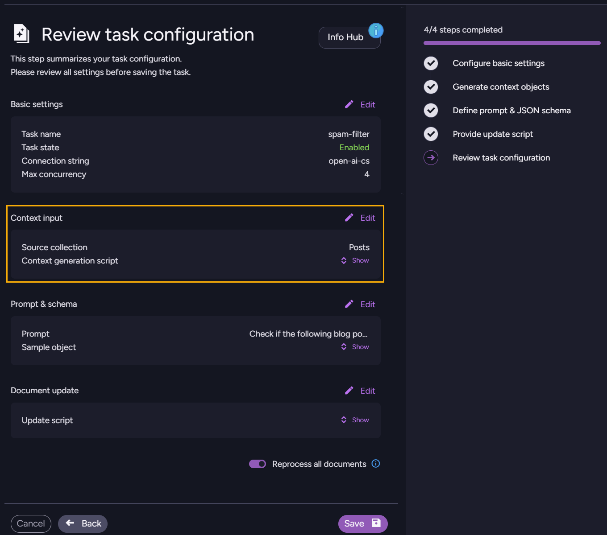

import Admonition from '@theme/Admonition';
import Tabs from '@theme/Tabs';
import TabItem from '@theme/TabItem';
import CodeBlock from '@theme/CodeBlock';
import LanguageSwitcher from "@site/src/components/LanguageSwitcher";
import LanguageContent from "@site/src/components/LanguageContent";

# Modify GenAI Task: Studio

Saved tasks are listed in the AI Tasks view.  
Selecting a task from the list will take you to the task's [Review task configuration](../../../ai-integration/gen-ai-integration/create-gen-ai-task/create-gen-ai-task_studio#review-configuration-and-save-task) page, which provides an overall view of the task configuration and allows you to review different sections, edit them, and save the modified configuration when you're done.  

1. **AI Hub**  
   Click to open the [AI Hub view](../../../ai-integration/ai-tasks-list-view).  
2. **AI Tasks**  
    Click to open the AI Tasks view.  
3. **Tasks list**  
   Pick the task that you want to modify by clicking its name or edit (pencil) icon.  
   This will take you to the task's **Review task configuration** page.  

## Review and edit task configuration

* Use this view to review, edit, and save the task configuration.  

* Click **Show** to view the current settings of a configuration section,  
  or **Edit** to modify a configuration section using the same [task creation wizard](../../../ai-integration/gen-ai-integration/create-gen-ai-task/create-gen-ai-task_studio) used to initially define the task.
  <Admonition type="warning" title="Precautions" id="precautions" href="#precautions">
   * If the task is enabled, your modifications will take effect as soon as you save the configuration.  
     Test your task and make sure you understand how it might change your documents before saving.  
   * Take every precaution to protect your data, including ensuring it is backed up.  
  </Admonition>