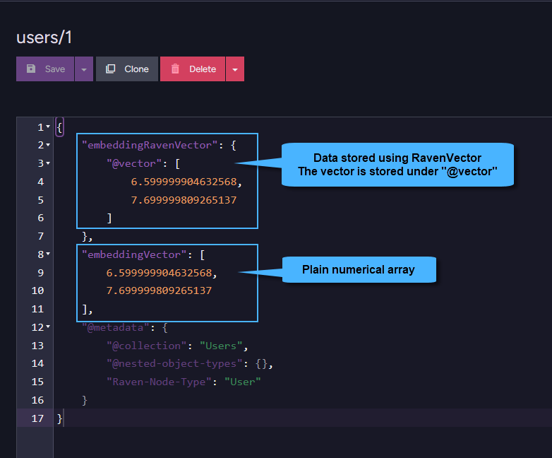

import Admonition from '@theme/Admonition';
import Tabs from '@theme/Tabs';
import TabItem from '@theme/TabItem';
import CodeBlock from '@theme/CodeBlock';
import ContentFrame from '@site/src/components/ContentFrame';
import Panel from '@site/src/components/Panel';

<Admonition type="note" title="">

* Data for vector search can be stored in **raw** or **pre-quantized** formats using several data types,  
  as outlined below.

* Text and numerical data that is not pre-quantized can be further quantized in the generated embeddings.  
  Learn more in [Quantization options](../../../ai-integration/vector-search/vector-search-using-dynamic-query.mdx#quantization-options).

* In this article:
  * [Supported data types for vector search](../../../ai-integration/vector-search/data-types-for-vector-search.mdx#supported-data-types-for-vector-search)
      * [Textual data](../../../ai-integration/vector-search/data-types-for-vector-search.mdx#textual-data)
      * [Numerical data](../../../ai-integration/vector-search/data-types-for-vector-search.mdx#numerical-data) 
  * [RavenVector](../../../ai-integration/vector-search/data-types-for-vector-search.mdx#ravenvector)
    
</Admonition>

<Panel heading="Supported data types for vector search">

### Textual data

<Admonition type="note" title="">

`string` - A single text entry.  
`string[]` - An array of text entries.

</Admonition>

### Numerical data

* You can store **pre-generated** embedding vectors in your documents,  
  typically created by machine-learning models from text, images, or other sources.

* When storing numerical embeddings in a document field:  
  * Ensure that all vectors within this field across all documents in the collection are generated by the **same model** and model version and have the **same dimensions**.
  * Consistency in both dimensionality and model source is crucial for meaningful comparisons in the vector space.

* In addition to the native types described below, we highly recommended using [RavenVector](../../../ai-integration/vector-search/data-types-for-vector-search.mdx#ravenvector)  
  for efficient storage and fast queries when working with numerical embeddings.

<Admonition type="note" title="">

**Raw embedding data**:  
Use when precision is critical.  

`number[]` - A single vector of numerical values representing raw embedding data.  
`number[][]`- An array of vectors, where each entry is a separate embedding vector.  

</Admonition>

<Admonition type="note" title="">

**Pre-quantized data**:   
Use when you prioritize storage efficiency and query speed.  

`number[]` - A single pre-quantized embedding vector in the _Int8_ or _Binary_ quantization format.  
`number[][]` - An array of pre-quantized embedding vectors.  

When storing data in these formats in your documents, you should use [RavenDB’s vector quantizer methods](../../../ai-integration/vector-search/vector-search-using-dynamic-query.mdx#section-1).

</Admonition>

<Admonition type="note" title="">

**Base64-encoded data**:  
Use when embedding data needs to be represented as a compact and easily serializable string format.

`string` - A single vector encoded as a Base64 string.    
`string[]` - An array of Base64-encoded vectors.    

</Admonition>

</Panel>

<Panel heading="RavenVector">

* `RavenVector` is a helper function that wraps a numerical array into a dedicated `@vector` object in RavenDB.  
  This structure is highly efficient - it minimizes disk space usage and improves read performance,  
  making it ideal for both storing and querying embeddings.    
    
* `RavenVector` is purely structural - it does not apply any transformation or validation to the vector,  
  it simply ensures that the vector is stored under the `@vector` field in the JSON document.  
  All vector processing and comparisons are handled entirely by the server.    

---
    
#### Example: storing a vector using RavenVector

<Tabs groupId='languageSyntax'>
<TabItem value="Store_document" label="Store_document">
```js
const session = documentStore.openSession();
    
const user = new User();

// Store embedding in a 'RavenVector' format
user.EmbeddingRavenVector = RavenVector([
        6.599999904632568,
        7.699999809265137
    ]);

// Store embedding in a raw numerical array
// This won’t take advantage of RavenDB’s optimized storage format
user.EmbeddingVector = [
        6.599999904632568,
        7.699999809265137
    ];

await session.store(user, "users/1");
await session.saveChanges();
```
</TabItem>
<TabItem value="Class" label="Class">
```js
class User {
    constructor(embeddingRavenVector, embeddingVector) {
        this.embeddingRavenVector = embeddingRavenVector;
        this.embeddingVector = embeddingVector;
    }
}
```
</TabItem>
</Tabs>

When stored, the vector's content created with the `RavenVector` function will appear under the `@vector` field in the JSON document:



To query the `embeddingRavenVector field`, use:

<TabItem value="" label="">
```js
const similarUsers = await session.query({ collection: "Users" })
    .vectorSearch(
        field => field.withEmbedding("embeddingRavenVector"),

        queryVector => queryVector.byEmbedding(
            // Use 'RavenVector' to wrap the query vector
            RavenVector([
                6.599999904632568,
                7.699999809265137
            ])
        )
    )
    .all();
```
</TabItem>

</Panel>
    
