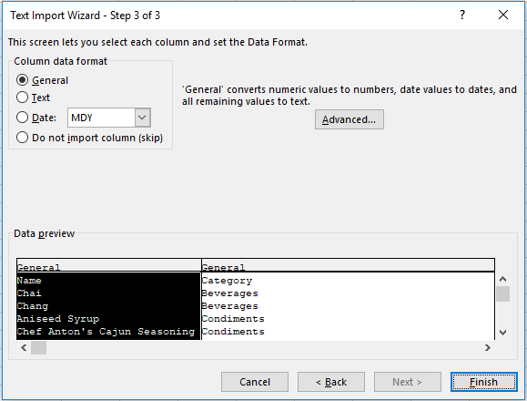
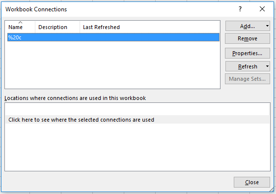

import Admonition from '@theme/Admonition';
import Tabs from '@theme/Tabs';
import TabItem from '@theme/TabItem';
import CodeBlock from '@theme/CodeBlock';
import LanguageSwitcher from "@site/src/components/LanguageSwitcher";
import LanguageContent from "@site/src/components/LanguageContent";

# Client API: How to Integrate with Excel

A very common use case for many applications is to expose data to users as an Excel file. RavenDB has dedicated support that allows you to directly consume data stored in a database by an Excel application. 

The integration of Excel with the data store is achieved by a designated query streaming endpoint that outputs a stream in a format acceptable by `Excel`, Comma Separated Values (CSV).

In order to take advantage of this feature, you need to specify a valid query according to [RQL syntax](../../client-api/session/querying/what-is-rql.mdx).

The generic HTTP request will have the following address:

<TabItem value="plain" label="plain">
<CodeBlock language="plain">
{`http://localhost:8080/databases/[db_name]/streams/queries?query=[query]&format=csv
`}
</CodeBlock>
</TabItem>

In order to include only specific properties in the CSV output you can use the `field` parameter:

<TabItem value="plain" label="plain">
<CodeBlock language="plain">
{`http://localhost:8080/databases/[db_name]/streams/queries?query=[query]&field=[field-1]&field=[field-2]...&field=[field-N]&format=csv
`}
</CodeBlock>
</TabItem>

<Admonition type="info" title="Dealing with long URLs" id="dealing-with-long-urls" href="#dealing-with-long-urls">

In some cases it might be cumbersome to use the URL to send the query or the query might be too long. Please see our [dedicated section](../../client-api/how-to/integrate-with-excel.mdx#dealing-with-long-query-urls-in-excel) that deals with that problem.

</Admonition>

## Example

First let's create a database, Northwind, and import the [sample data](../../studio/database/tasks/create-sample-data.mdx) into it.

Now let's query the product collection include the category document and project some of its properties using the below RQL:

<TabItem value="sql" label="sql">
<CodeBlock language="sql">
{`from Products as p
load p.Category as c
select 
\{
    Name: p.Name,
    Category: c.Name,
\}
`}
</CodeBlock>
</TabItem>

In order to execute the above query we will need to use the following URL:   

<TabItem value="bash" label="bash">
<CodeBlock language="bash">
{`http://localhost:8080/databases/Northwind/streams/queries?query=from%20Products%20as%20p%0Aload%20p.Category%20as%20c%0Aselect%20%0A%7B%0A%20%20%20%20Name%3A%20p.Name%2C%0A%20%20%20%20Category%3A%20c.Name%2C%0A%7D&format=csv
`}
</CodeBlock>
</TabItem>

Going to the above address in a web browser will download an export.csv file containing following results:

<TabItem value="plain" label="plain">
<CodeBlock language="plain">
{`Name,Category
Chang,Beverages
Aniseed Syrup,Condiments
Chef Anton's Cajun Seasoning,Condiments
Chef Anton's Gumbo Mix,Condiments
Grandma's Boysenberry Spread,Condiments
Uncle Bob's Organic Dried Pears,Produce
Northwoods Cranberry Sauce,Condiments
Mishi Kobe Niku,Meat/Poultry
Ikura,Seafood
Queso Cabrales,Dairy Products
Queso Manchego La Pastora,Dairy Products
Konbu,Seafood
Tofu,Produce
Genen Shouyu,Condiments
Pavlova,Confections
Alice Mutton,Meat/Poultry
Carnarvon Tigers,Seafood
`}
</CodeBlock>
</TabItem>

To push them to Excel we need to create a new spreadsheet and import data `From Text`:

In an Open File Dialog we paste our querying url:

Next, the Import Wizard will show up where we can adjust our import settings (don't forget to check `Comma` as a desired delimiter):

Finally we need to select where we would like to place the imported data:

As a result of the previous actions, the spreadsheet data should look like:

Now we must tell Excel to refresh data. Click on `Connections` in the `Data` panel:

You will see something like:

Go to Properties and:   

1. **uncheck** `Prompt for file name on refresh`.   
2. **check** `Refresh data when opening the file`.   

You can close the file, change something in the database, and reopen it. You will see new values.

## Dealing with Long Query URLs in Excel

If you try and query for a bit more complex query, you might realize that excel will refuse to execute your request.

### Long Query Example

<TabItem value="sql" label="sql">
<CodeBlock language="sql">
{`from Products as p
load p.Category as c
select 
\{
    Name: p.Name,
    Category: c.Name,
    Discontinued: p.Discontinued,
    PricePerUnit: p.PricePerUnit
\}
`}
</CodeBlock>
</TabItem>

After escaping the above query we will end up with the following request URL

<TabItem value="bash" label="bash">
<CodeBlock language="bash">
{`http://localhost:8080/databases/Northwind/streams/queries?query=from%20Products%20as%20p%0Aload%20p.Category%20as%20c%0Aselect%20%0A%7B%0A%20%20%20%20Name%3A%20p.Name%2C%0A%20%20%20%20Category%3A%20c.Name%2C%0A%20%20%20%20Discontinued%3A%20p.Discontinued%2C%0A%20%20%20%20PricePerUnit%3A%20p.PricePerUnit%0A%7D&format=csv
`}
</CodeBlock>
</TabItem>

Trying to use this url will throw the following error in excel

There are two ways to deal with this problem: You can use an online service like [TinyUrl](https://tinyurl.com/) and provide them with the above url.

What you get back is a url like, `https://tinyurl.com/y8t7j6r7`. This is a pretty nice workaround if you're not on an isolated system and have no security restrictions.
The other option is to redirect the query through a pre-defined query that resides in your database.
For that you will need to include a document in your database with a `Query` property. Let's generate such a document and call it `Excel/ProductWithCatagory`.
The name of the document has no significance, but it is recommanded to use a key that reflects the purpose of this document.
Let's add the `Query` property and set its value to the above query:

<TabItem value="json" label="json">
<CodeBlock language="json">
{`\{
    "Query": "from%20Products%20as%20p%0Aload%20p.Category%20as%20c%0Aselect%20%0A%7B%0A%20%20%20%20Name%3A%20p.Name%2C%0A%20%20%20%20Category%3A%20c.Name%2C%0A%20%20%20%20Discontinued%3A%20p.Discontinued%2C%0A%20%20%20%20PricePerUnit%3A%20p.PricePerUnit%0A%7D",
    "@metadata": \{
        "@collection": "Excel"
    \}
\}
`}
</CodeBlock>
</TabItem>

Now that we have the document ready for use, all we need to do is modify our URL so it will use the document redirection feature.

<TabItem value="bash" label="bash">
<CodeBlock language="bash">
{`http://localhost:8080/databases/Northwind/streams/queries?fromDocument=Excel%2FProductWithCatagory&format=csv
`}
</CodeBlock>
</TabItem>

Repeating the instrucions above you should get the following result:

