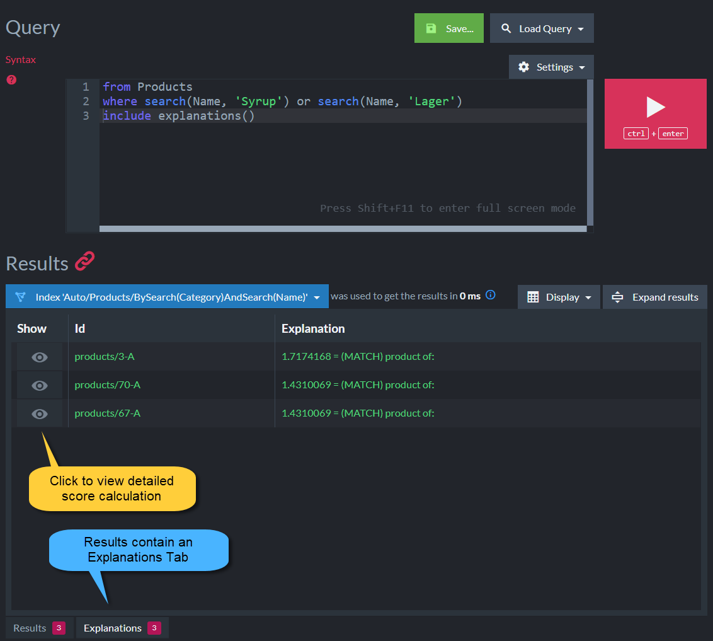

import Admonition from '@theme/Admonition';
import Tabs from '@theme/Tabs';
import TabItem from '@theme/TabItem';
import CodeBlock from '@theme/CodeBlock';

<Admonition type="note" title="">

* When making a query, each document in the query results is assigned a **score**.  
  This score determines the order by which the documents come back in the results when requesting   
  to [order by score](../../../../client-api/session/querying/sort-query-results.mdx#order-by-score).

* Each document in the results includes this score under the `@index-score` property in its metadata.

* Use `includeExplanations` to get the score details and see how it was calculated.  

    <Admonition type="info" title="">
    * Including explanations is available only when using **Lucene** as the underlying search engine.
    * You can configure which search engine will be used. Learn how in [Selecting the search engine](../../../../indexes/search-engine/corax.mdx#selecting-the-search-engine).
    </Admonition>
* In this page:
    * [Include explanations in a query](../../../../client-api/session/querying/debugging/include-explanations.mdx#include-explanations-in-a-query)  
    * [View explanations](../../../../client-api/session/querying/debugging/include-explanations.mdx#view-explanations)  
    * [Syntax](../../../../client-api/session/querying/debugging/include-explanations.mdx#syntax)  
</Admonition>
## Include explanations in a query

<Tabs groupId='languageSyntax'>
<TabItem value="query" label="query">
<CodeBlock language="php">
{`$explanations = new Explanations();

/** @var array<Product> $syrups */
$syrups = $session->advanced()->documentQuery(Product::class)
    ->includeExplanations(null, $explanations)
    ->search("Name", "Syrup")
    ->toList();

$scoreDetails = $explanations->getExplanations($syrups[0]->getId());
`}
</CodeBlock>
</TabItem>
<TabItem value="RQL" label="RQL">
<CodeBlock language="sql">
{`from "Products"
where search(Name, "Syrup") or search(Name, "Lager")
include explanations()
`}
</CodeBlock>
</TabItem>
</Tabs>

<Admonition type="note" title="">
Please note that the First parameter is optional.  
If you intend to use the default options, just paste `null` instead of the options object.  
</Admonition>

## View explanations

* The detailed explanations can be viewed from the **Query view** in Studio.  

* Running a query with `includeExplanations` will show an additional **Explanations Tab**.

* Sample score details:

## Syntax

<TabItem value="syntax" label="syntax">
<CodeBlock language="php">
{`public function includeExplanations(?ExplanationOptions $options, Explanations &$explanations): DocumentQueryInterface;
`}
</CodeBlock>
</TabItem>

| Parameter          | Type                  | Description |
|--------------------|-----------------------|-------------|
| **$options**       | `?ExplanationOptions` | This object is optional. If you intend to use the default options, place `null` here. |
| **&$explanations** | `Explanations`        | <ul><li>A callback function (action) that takes `Explanations` as an argument. It will be called by the client with the resulting `Explanations`.</li><li>You can interact with the resulting `Explanations` inside your callback.</li></ul> |
