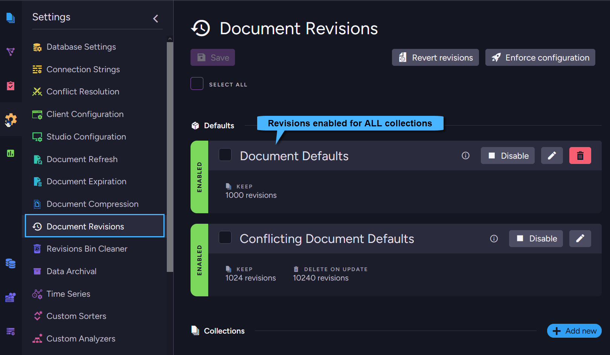
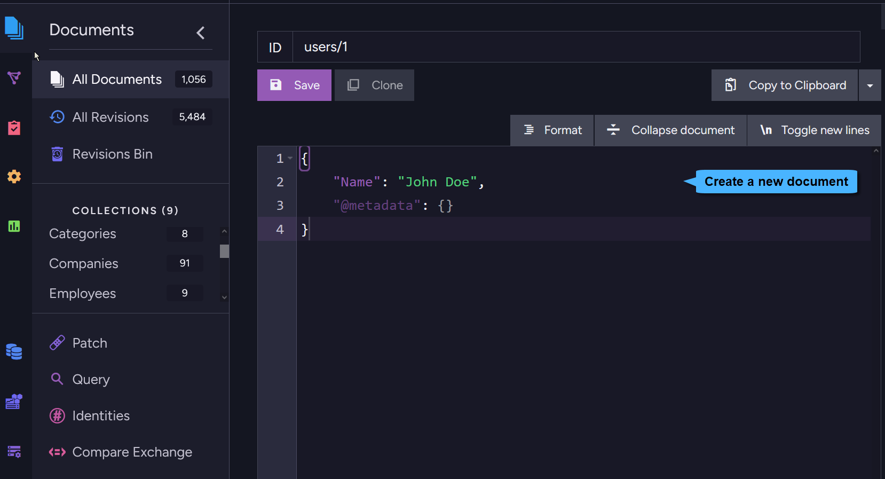
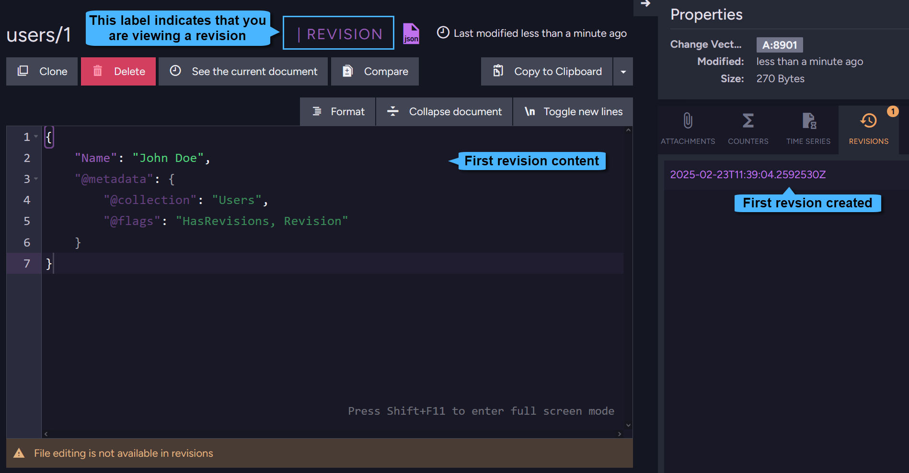
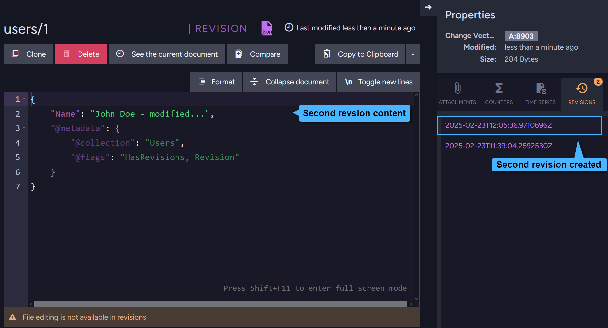
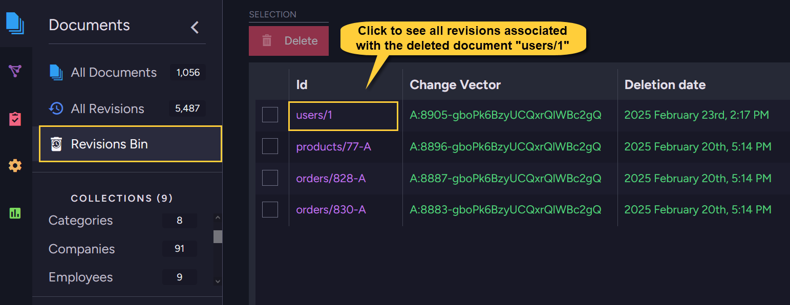
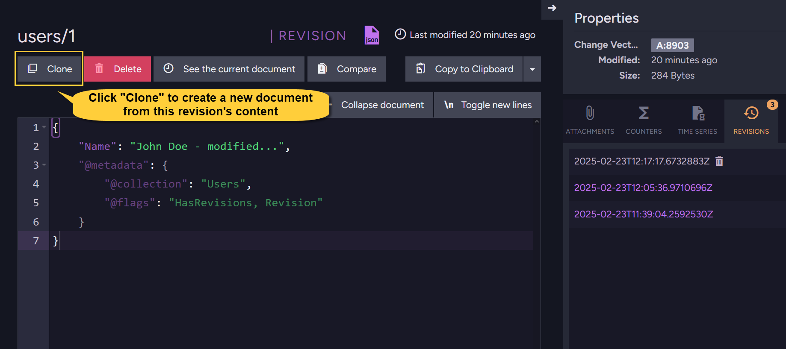

import Admonition from '@theme/Admonition';
import Tabs from '@theme/Tabs';
import TabItem from '@theme/TabItem';
import CodeBlock from '@theme/CodeBlock';

<Admonition type="note" title="">

* **Document Revisions** are snapshots of documents and their extensions:

    * The trail of revisions created for a document can be inspected to track changes made in the document over time.
    * A document's live version can be [reverted](../../document-extensions/revisions/revert-revisions.mdx) to any of its recorded revisions.
      <Admonition type="info" title="">
      For example, tracking document revisions allows you to check how an employee's contract has changed over time,
      restore a single corrupted document without requiring a backup file, or conduct a full-scale audit of your data.  
      </Admonition>
* Managed via the Client API or from the Studio, revisions can be created **automatically** or **manually**:

    * **Automatic revisions creation**:  
      When revisions settings are defined and enabled for a collection, a document revision is automatically created whenever documents are created, modified, or deleted.
      To configure revisions settings, and set limits for the number of revisions retained per document,
      apply a [Revisions configuration](../../document-extensions/revisions/overview.mdx#revisions-configuration) to all and/or specific collections.

    * **Manual revisions creation**:  
      When revisions settings are disabled, you can still create revisions manually.  
      See [Force revision creation](../../document-extensions/revisions/overview.mdx#force-revision-creation) below.
* In this page:
    * [Revisions configuration](../../document-extensions/revisions/overview.mdx#revisions-configuration)
        * [Defining a revisions configuration](../../document-extensions/revisions/overview.mdx#defining-a-revisions-configuration)
        * [Default settings and collection-specific configurations](../../document-extensions/revisions/overview.mdx#default-settings-and-collection-specific-configurations)
        * [Revisions configuration options](../../document-extensions/revisions/overview.mdx#revisions-configuration-options)
        * [Revisions configuration execution](../../document-extensions/revisions/overview.mdx#revisions-configuration-execution)
        * [Enabling and disabling revisions for existing documents](../../document-extensions/revisions/overview.mdx#enabling-and-disabling-revisions-for-existing-documents)
    * [How it works](../../document-extensions/revisions/overview.mdx#how-it-works)
    * [Revisions storage](../../document-extensions/revisions/overview.mdx#revisions-storage)
    * [Force revision creation](../../document-extensions/revisions/overview.mdx#force-revision-creation)

</Admonition>
## Revisions configuration

* The revisions configuration enables or disables the creation and purging of revisions for documents,  
  and optionally limits the number of revisions retained per document.

* By default, the revisions feature is **disabled** for all collections: no revisions are created or purged for any document.
  You can modify this behavior and other revisions settings by applying a revisions configuration to the database.
  The revisions configuration is stored in the database record.

    <Admonition type="note" title="">

    #### Conflict Revisions

    Revisions created for **conflicting documents** are a special case that is not covered in this article.
   
    * Conflict revisions are **enabled** by default.
    * Read about the conflict revisions API here:
      [Conflict Revisions Configuration](../../document-extensions/revisions/client-api/operations/conflict-revisions-configuration.mdx)
    * Read about managing conflict revisions via the Studio here:
      [Editing the Conflicting Document Defaults](../../studio/database/settings/document-revisions.mdx#editing-the-conflicting-document-defaults)
   
    </Admonition>
#### Defining a revisions configuration

You can apply a revisions configuration using the Studio or the Client API:

* Via Studio:
    * Manage the revisions configuration in the [Document Revisions Settings](../../studio/database/settings/document-revisions.mdx) view.
    * Inspect existing revisions and manually create a new revision in the [Revisions tab](../../studio/database/document-extensions/revisions/revisions-overview.mdx#revisions-tab) in the Studio's Document View.
* Via Client API:
    * Use the [ConfigureRevisionsOperation](../../document-extensions/revisions/client-api/operations/configure-revisions.mdx) _Store_ operation to define and apply a revisions configuration.
#### Default settings and collection-specific configurations

The revisions configuration consists of default settings and/or collection-specific configurations:

* **Default settings**:  
  The default settings apply to all documents for which a collection-specific configuration is not defined.

* **Collection-specific configurations**:  
  Collection-specific configurations apply only to documents of the collections they are defined for,  
  overriding the default settings for these collections.  
  <Admonition type="note" title="">
  If no default settings are applied, revisions will be **disabled** for any collection where a collection-specific configuration is not defined.
  </Admonition>
#### Revisions configuration options

A revisions configuration defines -

* Whether to enable or disable revisions creation:
    * If the revisions configuration is **Enabled** for a collection,  
      creating, modifying, or deleting any document in this collection will trigger the automatic creation of a new document revision,
      and optionally the purging of existing revisions for the document.
    * If the revisions configuration is **Disabled** for a collection,  
      RavenDB will **not** automatically create or purge revisions for documents in this collection.

* Whether to limit the number of revisions that can be kept per document.  
  RavenDB will only purge revisions if they exceed the limits you set.

* Learn more about the available configuration options in [Configure revisions operations](../../document-extensions/revisions/client-api/operations/configure-revisions.mdx).
#### Revisions configuration execution

Creating a revisions configuration does **not** immediately trigger its execution.  
Default and collection-specific configurations are executed when -

1. **Documents are Created, Modified, or Deleted**.  
   When a document is created, modified, or deleted, the configuration (either default or collection-specific) that applies to its collection is examined.
   If the revisions configuration is enabled for this collection:
    * A revision of the document will be created.
    * Existing revisions will optionally be purged according to the limits set in the configuration.

2. **Enforce Configuration is applied**.  
   [Enforcing the configuration](../../studio/database/settings/document-revisions.mdx#enforce-configuration) applies the defined revisions configuration immediately throughout the database, **purging** all the revisions pending purging
   according to default settings or collection-specific configurations, and **deleting** all revisions that no configuration applies to.  
   <Admonition type="warning" title="">
    * Large databases and collections may contain numerous revisions pending purging, which Enforcing Configuration will purge all at once.
      Be aware that this operation may require substantial server resources, so time it accordingly.
    * Revisions that were created over time but to which no configuration currently applies will be deleted.  
      Make sure that your configuration includes the default settings and collection-specific configurations needed to retain the revisions you want to keep.  
   </Admonition>
#### Enabling and disabling revisions for existing documents

* When revisions creation is **Enabled** for a populated collection:
    * The first revision will be created for an existing document the next time the document is modified  
      (recording the document **after** its modification), or when the document is deleted.

* When revisions creation is **Disabled** for a collection after revisions have been created:
    * The creation of new revisions and the purging of existing revisions will stop.
    * Existing revisions will remain intact.

## How it works

Let's play with revisions a little to get a taste of its advantages.

1. **Enable Revisions** so we can experiment with the feature.  
   Revisions can be enabled from the [Studio](../../studio/database/settings/document-revisions.mdx)
   or using the [ConfigureRevisionsOperation](../../document-extensions/revisions/client-api/operations/configure-revisions.mdx) _Store_ operation.

     

2. **Create a new document in the `Users` collection**.  
   We will follow the automatic creation of revisions for this document.  
   You can create the document in the [Studio](../../studio/database/documents/create-new-document.mdx#create-new-document)
   or using the [session.Store](../../client-api/session/storing-entities.mdx#example) method.

     

3. **Inspect the new document's [Revisions Tab](../../studio/database/document-extensions/revisions/revisions-overview.mdx#revisions-tab)** in the Studio.  
   Creating the document also created its first revision.

     

     Click the _"See the current document"_ button to return to the parent document view.

4. **Modify and Save the document**.  
   This will create a second revision.

     

5. **Delete the document**.  
   Though you deleted the document, its **audit trail** is **not lost**: all its revisions are moved to the [Revisions Bin](../../studio/database/document-extensions/revisions/revisions-bin.mdx),  
   including a new revision (called "Delete Revision"), created to indicate that the document was deleted.
     
     <Admonition type="info" title=""> 
     * A "Delete Revision" is created only if the deleted document has revisions.
     * If a document has no revisions, a "Delete Revision" will be created only if the Revisions Configuration is set and enabled for its collection.
     </Admonition>

     To see the revisions created for the document before it was deleted:  
     * Open the `Documents > Revisions Bin` section in the Studio  
     * Click the deleted document's ID  

     

6. **Restore the document**.  
   Even after a document is deleted, you can still restore it from one of its revisions.  
   To do so, open the revision containing the content you want to restore.  
   Click _Clone_ to create a new document from that revision.

     
  
     Save the new document using the exact **same ID** as the deleted document.
     This will restore all revisions of the deleted document from the Revisions Bin and associate them with the new document.
  
     Opening the document’s Revisions Tab will show the full audit trail,
     including the "Delete Revision" created when the original document was deleted and the new revision created when the restored document was saved.
  
     

## Revisions storage

##### Revisions storage

When a document revision is created, a full version of the modified document is stored in the revisions storage,
using the same blittable JSON document format as regular documents.
##### Revisions Compression

* By default, revisions are compressed.  
  This setting can be customized server-wide via the [CompressRevisionsDefault](../../server/configuration/database-configuration.mdx#databasescompressioncompressrevisionsdefault) configuration key.
* At the database level, revisions compression can be customized via the database record,  
  as shown in [this example](../../server/storage/documents-compression.mdx#set-compression-for-selected-collections).
* Individual fields are compressed as they are compressed in regular documents:  
  any text field exceeding 128 bytes is compressed.  
  Learn more about documents compression in [Documents Compression](../../server/storage/documents-compression.mdx).
##### Storage of document extensions in revisions

Read [here](../../document-extensions/revisions/revisions-and-other-features.mdx#revisions-and-time-series) about revisions and **time series**.  
Read [here](../../document-extensions/revisions/revisions-and-other-features.mdx#revisions-and-counters) about revisions and **counters**.  
Read [here](../../document-extensions/revisions/revisions-and-other-features.mdx#revisions-and-attachments) about revisions and **attachments**.

## Force revision creation

So far we've discussed the automatic creation of revisions when the feature is enabled.  
However, you can also **force the creation** of a document revision, whether the feature is enabled or not.

This is useful when you choose to disable automatic revisions creation but still want to create a revision for a specific document,
e.g. take a snapshot of the document as a precaution before editing it.

* You can force the creation of a revision via the [Studio](../../document-extensions/revisions/overview.mdx#force-revision-creation-via-the-studio)
  or use the [Client API](../../document-extensions/revisions/overview.mdx#force-revision-creation-via-the-client-api).
* A revision **will** be created even if the revisions configuration is disabled for the document's collection.
* A revision **will** be created even if the document has not been modified  
  (unless the document has revisions and the latest revision contains the current document contents).
* Similar to revisions created automatically due to the revisions configuration,  
  deleting a document with a manually created revision will move the revision to the [Revisions Bin](../../studio/database/document-extensions/revisions/revisions-bin.mdx),  
  and a "Delete Revision" will be created.
##### Force revision creation via the Studio

To create a revision manually via the Studio,  
click the **Create Revision** button in the Revisions Tab in the document view.

##### Force revision creation via the Client API

To create a revision manually via the Client API, use the advanced session `ForceRevisionCreationFor` method,  
followed by a call to `SaveChanges`.

**Example**:

<Tabs groupId='languageSyntax'>
<TabItem value="Force_by_entity" label="Force_by_entity">
<CodeBlock language="csharp">
{`// Force revision creation by entity
// =================================

var company = new Company { 
        Name = "CompanyName" 
    };

session.Store(company);
companyId = company.Id;
session.SaveChanges();

// Forcing the creation of a revision by entity can be performed 
// only when the entity is tracked, after the document is stored.
session.Advanced.Revisions.ForceRevisionCreationFor<Company>(company);

// Call SaveChanges for the revision to be created
session.SaveChanges();

var revisionsCount = session.Advanced.Revisions.GetFor<Company>(companyId).Count;
Assert.Equal(1, revisionsCount);
`}
</CodeBlock>
</TabItem>
<TabItem value="Force_by_ID" label="Force_by_ID">
<CodeBlock language="csharp">
{`// Force revision creation by ID
// =============================

session.Advanced.Revisions.ForceRevisionCreationFor(companyId);
session.SaveChanges();

var revisionsCount = session.Advanced.Revisions.GetFor<Company>(companyId).Count;
Assert.Equal(1, revisionsCount);
`}
</CodeBlock>
</TabItem>
</Tabs>

**Syntax**:  

<TabItem value="syntax_1" label="syntax_1">
<CodeBlock language="csharp">
{`// Available overloads:
// ====================

// Force revision creation by entity.
// Can be used with tracked entities only.
void ForceRevisionCreationFor<T>(T entity,
    ForceRevisionStrategy strategy = ForceRevisionStrategy.Before);

// Force revision creation by document ID.
void ForceRevisionCreationFor(string id,
    ForceRevisionStrategy strategy = ForceRevisionStrategy.Before);
`}
</CodeBlock>
</TabItem>

| Parameter    | Type                         | Description                                                                                      |
|--------------|------------------------------|--------------------------------------------------------------------------------------------------|
| **entity**   | `T`                          | The tracked entity for which you want to create a revision.                                      |
| **id**       | `string`                     | The ID of the document for which you want to create a revision.                                  |
| **strategy** | `enum ForceRevisionStrategy` | Defines the revision creation strategy (see below).   Default: `ForceRevisionStrategy.Before` |

<TabItem value="syntax_2" label="syntax_2">
<CodeBlock language="csharp">
{`public enum ForceRevisionStrategy
\{
    // Do not force a revision
    None,
    
    // Create a forced revision from the document currently in store
    // BEFORE applying any changes made by the user.
    // The only exception is for a new document,
    // where a revision will be created AFTER the update.
    Before
\}
`}
</CodeBlock>
</TabItem>

