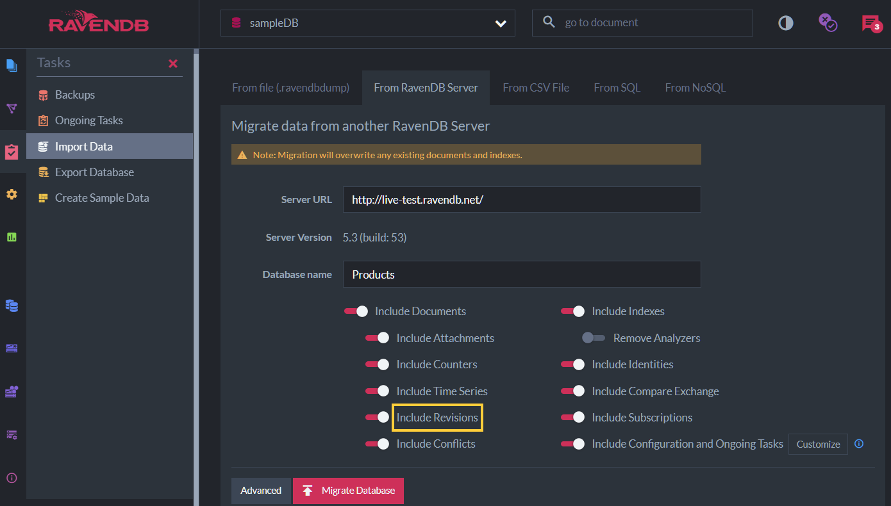

import Admonition from '@theme/Admonition';
import Tabs from '@theme/Tabs';
import TabItem from '@theme/TabItem';
import CodeBlock from '@theme/CodeBlock';

<Admonition type="note" title="">

* This page describes relationships between Revisions and other RavenDB features, including -
    * When is revisions creation triggered by other features
    * How revisions are supported by other features  

* In this page:  
   * [Revisions and Counters](../../../document-extensions/revisions/revisions-and-other-features.mdx#revisions-and-counters)  
   * [Revisions and Time Series](../../../document-extensions/revisions/revisions-and-other-features.mdx#revisions-and-time-series)  
   * [Revisions and Attachments](../../../document-extensions/revisions/revisions-and-other-features.mdx#revisions-and-attachments)  
   * [Revisions and Replication](../../../document-extensions/revisions/revisions-and-other-features.mdx#revisions-and-replication)
   * [Revisions and ETL](../../../document-extensions/revisions/revisions-and-other-features.mdx#revisions-and-etl)
   * [Revisions and Backup](../../../document-extensions/revisions/revisions-and-other-features.mdx#revisions-and-backup)  
   * [Revisions and Data Subscriptions](../../../document-extensions/revisions/revisions-and-other-features.mdx#revisions-and-data-subscriptions)
   * [Revisions Import and Export](../../../document-extensions/revisions/revisions-and-other-features.mdx#revisions-import-and-export)

</Admonition>
## Revisions and Counters

### Revisions creation:

* A document revision will be created when:   
  * A new counter is **created** on the document.  
  * A counter is **deleted** from the document.
    
* A revision will Not be created upon modifying the value of an existing [counter](../../../document-extensions/counters/overview.mdx).
### Stored data:

* A revision that is created for a document that contains counters  
  will have the `@counters-snapshot` property in its **metadata**.  
 
* This property holds the counters' names and values at the time when the revision was created. 

* The counter's value stored in the  revision's metadata is the **accumulated value** from all nodes.  
  It does not specify the value of the counter on each individual node.

* Sample revision metadata:  
<TabItem value="json" label="json">
<CodeBlock language="json">
{`\{
    ...
    "@metadata": \{
        "@counters-snapshot": \{
            "counterName1": 7,
            "counterName2": 42
        \},
    ...
    \}
\}
`}
</CodeBlock>
</TabItem>
### Reverted data:

When a document is [reverted](../../../document-extensions/revisions/revert-documents-to-revisions/revert-documents-to-specific-revisions.mdx) to a revision that has counters,  
the counters from the revision are restored to functionality along with their values.  
### Extract counters data from revisions:

Use [GetMetadataFor](../../../document-extensions/revisions/client-api/session/loading.mdx#get-revisions-metadata) to get the revisions metadata for a specified document,  
and then extract the counters' data.  

<Tabs groupId='languageSyntax'>
<TabItem value="Sync" label="Sync">
<CodeBlock language="csharp">
{`// Use GetMetadataFor to get revisions metadata for document 'orders/1-A'
List<IMetadataDictionary> revisionsMetadata = session
    .Advanced.Revisions.GetMetadataFor(id: "orders/1-A");

// Extract the counters data from the metadata
List<MetadataAsDictionary> countersDataInRevisions = revisionsMetadata
    .Where(metadata =>
        metadata.ContainsKey(Constants.Documents.Metadata.RevisionCounters))
    .Select(metadata =>
        (MetadataAsDictionary)metadata[Constants.Documents.Metadata.RevisionCounters])
    .ToList();
`}
</CodeBlock>
</TabItem>
<TabItem value="Async" label="Async">
<CodeBlock language="csharp">
{`// Use GetMetadataForAsync to get revisions metadata for document 'orders/1-A'
List<IMetadataDictionary> revisionsMetadata = await asyncSession
    .Advanced.Revisions.GetMetadataForAsync(id: "orders/1-A");

// Extract the counters data from the metadata
List<MetadataAsDictionary> countersDataInRevisions = revisionsMetadata
    .Where(metadata =>
        metadata.ContainsKey(Constants.Documents.Metadata.RevisionCounters))
    .Select(metadata =>
        (MetadataAsDictionary)metadata[Constants.Documents.Metadata.RevisionCounters])
    .ToList();
`}
</CodeBlock>
</TabItem>
</Tabs>

## Revisions and Time Series

### Revisions Creation:

* A document revision will be created when:  
    * A new time series is **created** on the document.  
    * A time series is **deleted** from the document.  
      (A time series is deleted from a document when all its entries are deleted)

* A revision will Not be created upon modifying the values of an existing [time series](../../../document-extensions/timeseries/overview.mdx).
### Stored Data:

* A revision that is created for a document that contains time series  
  will have the `@timeseries-snapshot` property in its **metadata**.  

* This property does Not hold the time series values data,  
  it only contains the following information for the time when the revision was created:
  * The time series names
  * The number of entries in each time series
  * Dates of the first and last entry in each time series
  
* Read more about Revisions and Time Series [here](../../../document-extensions/timeseries/time-series-and-other-features.mdx#revisions).

* Sample revision metadata:  
<TabItem value="json" label="json">
<CodeBlock language="json">
{`\{
    ...
    "@metadata": \{
        "@timeseries-snapshot": \{
            "timeSeriesName1": \{
                "Count": 5,
                "Start": "2023-03-22T11:25:00.9110000Z",
                "End": "2023-03-22T11:28:34.9110000Z"
            \},
            "timeSeriesName2": \{
                 "Count": 10,
                 "Start": "2023-03-22T11:26:00.3950000Z",
                 "End": "2023-03-22T11:28:48.3950000Z"
            \}
        \},
    ...
    \}
\}
`}
</CodeBlock>
</TabItem>
### Reverted Data:

When a document is [reverted](../../../document-extensions/revisions/revert-documents-to-revisions/revert-documents-to-specific-revisions.mdx) to a revision that has a time series:  

* If the current document **contains** a time series name as in the revision:
    * The reverted document will keep the time series entries & values as it was in the current document.
    * Time series entries and values from the revision are Not restored.

* If the current document **doesn't contain** a time series name as in the revision,  
  or if the document itself was deleted:  
  * The reverted document will have the time series from the revision  
  * However, the entries count will be 0  

## Revisions and Attachments

### Revisions Creation:

A document revision will be created when:  

  * A new [attachment](../../../document-extensions/attachments/what-are-attachments.mdx) is **added** to the document.  
  * An attachment is **deleted** from the document.   
### Stored Data:

* A revision that is created for a document with attachments  
  will have the `@attachments` property in its **metadata**.

* This property does Not hold the actual attachments, as the files are stored in **separate storage**.  
  The property only contains the following information for each attachment the document had when the revision was created:  
  * Attachment file name
  * File content type
  * File size
  * A hash string (a reference to the file in the storage)

* Existing attachment files in the storage are Not duplicated per revision that is created when the document itself is modified.

* An attachment file is removed from RavenDB's storage only when there is no live document or a revision that refers to it.

* Sample revision metadata:  
<TabItem value="json" label="json">
<CodeBlock language="json">
{`\{
    ...
    "@metadata": \{
        "@attachments": [
            \{
                "Name": "attachmentFileName.png",
                "ContentType": "image/png",
                "Size": 33241,
                "Hash": "iFg0o6D38pUcWGVlP71ddDp8SCcoEal47kG3LtWx0+Y=",
            \}, 
        ],
    ...
    \}
\}
`}
</CodeBlock>
</TabItem>
### Reverted Data:

When a document is [reverted](../../../document-extensions/revisions/revert-documents-to-revisions/revert-documents-to-specific-revisions.mdx) to a revision that has attachments,  
the attachments are restored to their state when the revision was created.

## Revisions and Replication

* Revisions are transferred during [replication](../../../server/clustering/replication/replication-overview.mdx) from one database instance to another.

* The revisions will be replicated by all replication types:
   * [Internal replication](../../../server/clustering/replication/replication-overview.mdx#internal-replication)
   * [External replication](../../../server/clustering/replication/replication-overview.mdx#external-replication)
   * [Hub/Sink replication](../../../server/clustering/replication/replication-overview.mdx#hubsink-replication)

* Revisions can [help keep data consistency](../../../server/clustering/replication/replication-overview.mdx#how-revisions-replication-help-data-consistency).  

## Revisions and ETL

* An [ETL](../../../server/ongoing-tasks/etl/raven.mdx) ongoing task does Not send  revisions to the destination database.  

* However, if revisions are enabled on the destination database,  
  whenever the ETL process sends a modified document and the target document is overwritten,  
  a new revision will be created for the document in the target database as expected.  

## Revisions and Backup

Revisions are [backed up](../../../server/ongoing-tasks/backup-overview.mdx#backup-contents) both by a logical-backup and by a snapshot.

## Revisions and Data Subscriptions

* Learn about revisions and data subscriptions [here](../../../client-api/data-subscriptions/advanced-topics/subscription-with-revisioning.mdx).  

## Revisions Import and Export

* Revisions can be imported and exported with a `.ravendbdump` file:
    * Using [the Client API](../../../client-api/smuggler/what-is-smuggler.mdx)
    * From the [import](../../../studio/database/tasks/import-data/import-data-file.mdx#import-options) and [export](../../../studio/database/tasks/export-database.mdx#export-options) views in the Studio  

* Revisions can be imported when migrating data from another [live RavenDB server](../../../studio/database/tasks/import-data/import-from-ravendb.mdx#step-#4:-set-import-options).

  

