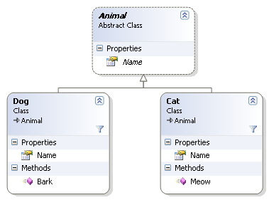

import Admonition from '@theme/Admonition';
import Tabs from '@theme/Tabs';
import TabItem from '@theme/TabItem';
import CodeBlock from '@theme/CodeBlock';

<Admonition type="note" title="">

* By default, RavenDB indexes are defined on a specific entity type, referred to as a `Collection`,  
  and do not consider the inheritance hierarchy.

* In this Page:  
   * [Polymorphic Data](../indexes/indexing-polymorphic-data.mdx#polymorphic-data)  
      * [Multi-Map Indexes](../indexes/indexing-polymorphic-data.mdx#multi-map-indexes)  
      * [Other Options](../indexes/indexing-polymorphic-data.mdx#other-options)  

</Admonition>
## Polymorphic Data

Let's assume, for example, that we have the following inheritance hierarchy:

When saving a `Cat` document, it will be assigned to the "Cats" collection,  
while a `Dog` document will be placed in the "Dogs" collection.

If we intend to create a simple Map-index for Cat documents based on their names, we would write:

<TabItem value="php" label="php">
<CodeBlock language="php">
{`from cat in docs.Cats
select new \{ cat.Name \}
`}
</CodeBlock>
</TabItem>

And for dogs:

<TabItem value="php" label="php">
<CodeBlock language="php">
{`from dog in docs.Dogs
select new \{ dog.Name \}
`}
</CodeBlock>
</TabItem>

<Admonition type="info" title="The challenge" id="the-challenge" href="#the-challenge">
Querying each index results in documents only from the specific collection the index was defined for.  
However, what if we need to query across ALL animal collections?
</Admonition>

## Multi-Map Indexes

The easiest way to do this is by writing a multi-map index such as:

<Tabs groupId='languageSyntax'>
<TabItem value="MultiMap" label="MultiMap">
<CodeBlock language="php">
{`class Animals_ByName extends AbstractMultiMapIndexCreationTask
{
    public function __construct()
    {
        parent::__construct();

        $this->addMap("from c in docs.Cats select new { c.name }");
        $this->addMap("from d in docs.Dogs select new { d.name }");
    }
}
`}
</CodeBlock>
</TabItem>
<TabItem value="MultiMapJavaScript" label="MultiMapJavaScript">
<CodeBlock language="php">
{`class Animals_ByName extends AbstractJavaScriptIndexCreationTask
{
    public function __construct()
    {
        parent::__construct();

        $this->setMaps([
            "map('cats', function (c){ return {Name: c.Name}})",
            "map('dogs', function (d){ return {Name: d.Name}})"
        ]);
    }
}
`}
</CodeBlock>
</TabItem>
</Tabs>

And query it like this:

<Tabs groupId='languageSyntax'>
<TabItem value="Query" label="Query">
<CodeBlock language="php">
{`/** @var array<Animal> $results */
$results = $session
    ->advanced()
    ->documentQuery(Animal::class, Animals_ByName::class)
    ->whereEquals("Name", "Mitzy")
    ->toList();
`}
</CodeBlock>
</TabItem>
<TabItem value="RQL" label="RQL">
<CodeBlock language="sql">
{`from index 'Animals/ByName'
where Name = 'Mitzy'
`}
</CodeBlock>
</TabItem>
</Tabs>

## Other Options

Another option would be to modify the way we generate the Collection for subclasses of `Animal`:

<TabItem value="other_ways_1" label="other_ways_1">
<CodeBlock language="php">
{`$store = new DocumentStore();
$store->getConventions()->setFindCollectionName(
    function (?string $className): string \{
        if (is_a($className, Animal::class)) \{
            return "Animals";
        \}
        return DocumentConventions::defaultGetCollectionName($className);
    \}
);
`}
</CodeBlock>
</TabItem>

Using this method, we can now index on all animals using:

<TabItem value="php" label="php">
<CodeBlock language="php">
{`from animal in docs.Animals
select new \{ animal.Name \}
`}
</CodeBlock>
</TabItem>

But what happens when you don't want to modify the entity name of an entity itself?

You can create a polymorphic index using:

<TabItem value="php" label="php">
<CodeBlock language="php">
{`from animal in docs.WhereEntityIs("Cats", "Dogs")
select new \{ animal.Name \}
`}
</CodeBlock>
</TabItem>

It will generate an index that matches both Cats and Dogs.

