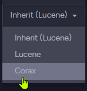

import Admonition from '@theme/Admonition';
import Tabs from '@theme/Tabs';
import TabItem from '@theme/TabItem';
import CodeBlock from '@theme/CodeBlock';
import LanguageSwitcher from "@site/src/components/LanguageSwitcher";
import LanguageContent from "@site/src/components/LanguageContent";

# Search Engine: Corax
<Admonition type="note" title="">

* **Corax** is RavenDB's native search engine, introduced in RavenDB 
  version 6.0 as an in-house searching alternative for Lucene.  
  Lucene remains available as well, you can use either search engine 
  as you prefer.  

* The main role of the database's search engine is to **satisfy incoming queries**.  
  In RavenDB, the search engine achieves this by handling each query via an index.  
  If no relevant index exists, the search engine will create one automatically.  
  
    The search engine is the main "moving part" of the indexing mechanism, 
    which processes and indexes documents by index definitions.  

* The search engine supports both [Auto](../../indexes/creating-and-deploying.mdx#auto-indexes) 
  and [Static](../../indexes/creating-and-deploying.mdx#static-indexes) indexing 
  and can be selected separately for each.  

* The search engine can be selected per server, per database, and per index (for static indexes only).  

* In this page:  
   * [Selecting the search engine](../../indexes/search-engine/corax.mdx#selecting-the-search-engine)  
      * [Server wide](../../indexes/search-engine/corax.mdx#select-search-engine-server-wide)  
      * [Per database](../../indexes/search-engine/corax.mdx#select-search-engine-per-database)  
      * [Per index](../../indexes/search-engine/corax.mdx#select-search-engine-per-index)  
   * [Unsupported features](../../indexes/search-engine/corax.mdx#unsupported-features)  
      * [Unimplemented methods](../../indexes/search-engine/corax.mdx#unimplemented-methods)  
   * [Handling of complex JSON objects](../../indexes/search-engine/corax.mdx#handling-of-complex-json-objects)  
   * [Compound fields](../../indexes/search-engine/corax.mdx#compound-fields)  
   * [Limits](../../indexes/search-engine/corax.mdx#limits)  
   * [Configuration options](../../indexes/search-engine/corax.mdx#configuration-options)  
   * [Index training: Compression dictionaries](../../indexes/search-engine/corax.mdx#index-training:-compression-dictionaries)
</Admonition>
## Selecting the search engine

* You can select your preferred search engine in several scopes:  
   * [Server-wide](../../indexes/search-engine/corax.mdx#select-search-engine-server-wide), 
     selecting which search engine will be used by all the databases hosted by this server.  
   * [Per database](../../indexes/search-engine/corax.mdx#select-search-engine-per-database), 
     overriding server-wide settings for a specific database.  
   * [Per index](../../indexes/search-engine/corax.mdx#select-search-engine-per-index), 
     overriding server-wide and per-database settings.  
     Per-index settings are available only for **static** indexes.  

     <Admonition type="note" title="">
     Note that the search engine is selected for **new indexes** only.  
     These settings do not apply to existing indexes.  
     </Admonition>

* These configuration options are available:  
   * [Indexing.Auto.SearchEngineType](../../server/configuration/indexing-configuration.mdx#indexingautosearchenginetype)  
     Use this option to select the search engine (either `Lucene` or `Corax`) for **auto** indexes.  
     The search engine can be selected **server-wide** or **per database**.  
   * [Indexing.Static.SearchEngineType](../../server/configuration/indexing-configuration.mdx#indexingstaticsearchenginetype)  
     Use this option to select the search engine (either `Lucene` or `Corax`) for **static** indexes.  
     The search engine can be selected **server-wide**, **per database**, or **per index**.  
   * Read about additional Corax configuration options [here](../../indexes/search-engine/corax.mdx#configuration-options).  
### Select search engine: Server wide

Select the search engine for all the databases hosted by a server 
by modifying the server's [settings.json](../../server/configuration/configuration-options.mdx#settingsjson) file.  
E.g. -  
<TabItem value="csharp" label="csharp">
<CodeBlock language="csharp">
{`\{
    "Indexing.Auto.SearchEngineType": "Corax",
    "Indexing.Static.SearchEngineType": "Corax"
\}
`}
</CodeBlock>
</TabItem>

<Admonition type="note" title="">
You must restart the server for the new settings to be read and applied.  
</Admonition>

<Admonition type="note" title="">
Selecting a new search engine will change the search engine only for indexes created from now on.  

E.g., If my configuration has been `"Indexing.Static.SearchEngineType": "Corax"` 
until now and I now changed it to `"Indexing.Static.SearchEngineType": "Lucene"`, 
static indexes created from now on will use Lucene, but static indexes created 
while Corax was selected will continue using Corax.  

After selecting a new search engine using the above options, change the search 
engine used by an existing index by [resetting](../../client-api/operations/maintenance/indexes/reset-index.mdx) 
the index.  
</Admonition>
### Select search engine: Per database

To select the search engine that the database would use, modify the 
relevant Database Record settings. You can easily do this via Studio:  

* Open Studio's [Database Settings](../../studio/database/settings/database-settings.mdx) 
  page, and enter `SearchEngine` in the search bar to find the search engine settings.  
  Click `Edit` to modify the default search engine.  

     

* Select your preferred search engine for Auto and Static indexes.  

     

* To apply the new settings either **disable and re-enable the database** or **restart the server**.  

     
### Select search engine: Per index 

You can also select the search engine that would be used by a specific index, 
overriding any per-database and per-server settings.  

#### Select index search engine via studio:  

* **Indexes-List-View** &gt; **Edit Index Definition**  
  Open Studio's [Index List](../../studio/database/indexes/indexes-list-view.mdx) 
  view and select the index whose search engine you want to set.  

    
    1. Open the index **Configuration** tab.  
    2. Select the search engine you prefer for this index.  
       

* The indexes list view will show the changed configuration.  

    
#### Select index search engine using code

While defining an index using the API, use the `SearchEngineType` 
property to select the search engine that would run the index.  
Available values: `SearchEngineType.Lucene`, `SearchEngineType.Corax`.  

* You can pass the search engine type you prefer:  
<TabItem value="index-definition_select-while-creating-index" label="index-definition_select-while-creating-index">
<CodeBlock language="csharp">
{`// Set search engine type while creating the index
new Product_ByAvailability(SearchEngineType.Corax).Execute(store);
`}
</CodeBlock>
</TabItem>  
* And set it in the index definition:  
<TabItem value="index-definition_set-search-engine-type" label="index-definition_set-search-engine-type">
<CodeBlock language="csharp">
{`private class Product_ByAvailability : AbstractIndexCreationTask<Product>
\{
    public Product_ByAvailability(SearchEngineType type)
    \{
        // Any Map/Reduce segments here
        Map = products => from p in products
                          select new
                          \{
                              p.Name,
                              p.Brand
                          \};

        // The preferred search engine type
        SearchEngineType = type;
    \}
\}
`}
</CodeBlock>
</TabItem>  

## Unsupported features

The below features are currently not supported by Corax.

#### Unsupported during indexing:

* Setting a [boost factor on an index-field](../../indexes/boosting.mdx#assign-a-boost-factor-to-an-index-field) is not supported.  
  Note that [boosting the whole index-entry](../../indexes/boosting.mdx#assign-a-boost-factor-to-the-index-entry) IS supported.
* Indexing [WKT shapes](../../indexes/indexing-spatial-data.mdx) is not supported.  
  Note that indexing **spatial points** IS supported.  
* [Custom analyzers](../../studio/database/settings/custom-analyzers.mdx)  
* [Custom Sorters](../../indexes/querying/sorting.mdx#creating-a-custom-sorter)  

#### Unsupported while querying:

* [Fuzzy Search](../../client-api/session/querying/text-search/fuzzy-search.mdx)  
* [Explanations](../../client-api/session/querying/debugging/include-explanations.mdx)  

#### Complex JSON properties:

Complex JSON properties cannot currently be indexed and searched by Corax.  
Read more about this [below](../../indexes/search-engine/corax.mdx#handling-of-complex-json-objects).  

#### Unsupported `WHERE` methods/terms:  

* [lucene()](../../client-api/session/querying/document-query/how-to-use-lucene.mdx)  
* [intersect()](../../indexes/querying/intersection.mdx)  
### Unimplemented methods

Trying to use Corax with an unimplemented method (see 
[Unsupported Features](../../indexes/search-engine/corax.mdx#unsupported-features) above) 
will generate a `NotSupportedInCoraxException` exception and end the search.  

<Admonition type="info" title="">
E.g. -  
The following query uses the `intersect` method, which is currently not supported by Corax.  
<TabItem value="sql" label="sql">
<CodeBlock language="sql">
{`from index 'Orders/ByCompany'
where intersect(Count > 10, Total > 3)
`}
</CodeBlock>
</TabItem>

If you set Corax as the search engine for the `Orders/ByCompany` index 
used by the above query, running the query will generate the following 
exception and the search will stop.  
  
</Admonition>

## Handling of complex JSON objects

To avoid unnecessary resource usage, the content of complex JSON properties is not indexed by RavenDB.  
[See below](../../indexes/search-engine/corax.mdx#if-corax-encounters-a-complex-property-while-indexing) 
how auto and static indexes handle such fields.  

<Admonition type="note" title="">
Lucene's approach of indexing complex fields as JSON strings usually makes no 
sense, and is not supported by Corax.  
</Admonition>

Consider, for example, the following `orders` document:  
<TabItem value="json" label="json">
<CodeBlock language="json">
{`\{
    "Company": "companies/27-A",
    "Employee": "employees/2-A",
    "ShipTo": \{
        "City": "Torino",
        "Country": "Italy",
        "Location": \{
            "Latitude": 45.0907661,
            "Longitude": 7.687425699999999
        \}
    \}
\}
`}
</CodeBlock>
</TabItem>

As `Location` contains a list of key/value pairs rather than a simple numeric value or a string, 
Corax will not index its contents (see [here](../../indexes/search-engine/corax.mdx#if-corax-encounters-a-complex-property-while-indexing) 
what will be indexes).  

There are several ways to handle the indexing of complex JSON objects:  

#### 1. Index a simple property contained in the complex field

Index one of the simple key/value properties stored within the nested object.  
In the `Location` field, for example, Location's `Latitude` and `Longitude`.  
can serve us this way:  

<TabItem value="json" label="json">
<CodeBlock language="json">
{`from order in docs.Orders
select new
\{
    Latitude = order.ShipTo.Location.Latitude,
    Longitude = order.ShipTo.Location.Longitude
\}
`}
</CodeBlock>
</TabItem>
#### 2. Index the document using lucene

As long as Corax doesn't index complex JSON objects, you can always 
select Lucene as your search engine when you need to index nested properties.  
#### 3. Revise index definition and fields usage

As [shown above](../../indexes/search-engine/corax.mdx#index-a-simple-property-contained-in-the-complex-field), 
indexing a whole complex field is rarely needed, and users would typically 
index and search only the simple properties such a field contains.  
Queries may sometimes need, however, to **project** the content of an entire 
complex field.  
When this is the case, you can revise the index definition (see below) to 
**disable the indexing** of the complex field but **store its content** so 
[projection queries](../../indexes/querying/projections.mdx#projections-and-stored-fields) 
would be able to project it.  
<Admonition type="note" title="">
Content we retrieve from the database and store in indexes becomes available for 
projection and will be henceforth retrieved directly from the indexes, accelerating 
its retrieval at the expense of indexes storage space.
</Admonition>

* To store a field's content and disable its indexing **via Studio**:  
  
     

     1. Open the index definition's **Fields** tab.  
     2. Click **Add Field** to specify what field Corax shouldn't index.  
     3. Enter the name of the field Corax should not index.  
     4. Select **Yes** to Store the field's content  
     5. Select **No** to disable the field's indexing  

* To store a field's content and disable its indexing **using Code**:  
<TabItem value="index-definition_disable-indexing-for-specified-field" label="index-definition_disable-indexing-for-specified-field">
<CodeBlock language="csharp">
{`private class Order_ByLocation : AbstractIndexCreationTask<Order>
\{
    public Order_ByLocation(SearchEngineType type)
    \{
        Map = orders => from o in orders
                        select new
                        \{
                            o.ShipTo.Location
                        \};

        SearchEngineType = type;

        // Disable indexing for this field
        Index("Location", FieldIndexing.No);

        // Store the field's content
        // (this is mandatory if the field's indexing is disabled)
        Store("Location", FieldStorage.Yes);
    \}
\}
`}
</CodeBlock>
</TabItem>  
#### 4. Turn the complex property into a string

You can handle the complex property as a string.  

<Tabs groupId='languageSyntax'>
<TabItem value="Not_Supported_By_Corax" label="Not_Supported_By_Corax">
<CodeBlock language="sql">
{`from order in docs.Orders
select new
{
    // This will fail for the above document when using Corax
    Location = order.ShipTo.Location
}
`}
</CodeBlock>
</TabItem>
<TabItem value="Use_ToString()" label="Use_ToString()">
<CodeBlock language="sql">
{`from order in docs.Orders
select new
{
    // .ToString() will convert the data to a string in JSON format (same as using JsonConvert.Serialize()) 
    Location = order.ShipTo.Location.ToString()
}
`}
</CodeBlock>
</TabItem>
</Tabs>

<Admonition type="note" title="">
Serializing all the properties of a complex property into a single string, 
including names, values, brackets, and so on, can be used as a last resort 
to produce a string that **doesn't** make a good feed for analyzers and is not 
commonly used for searches.  
It does, however, make sense in some cases to **project** such a string.  
</Admonition>
#### If Corax encounters a complex property while indexing:  
Auto and Static indexes handle complex fields differently.  
New and Old static indexes also handle complex fields differently.  

* **Auto Index**  
  An auto index will replace a complex field with a `JSON_VALUE` string.  
  This will allow basic queries over the field, like checking if it 
  exists using `Field == null` or `exists(Field)`.  
   * Corax will also raise a complex-field alert:  
<TabItem value="json" label="json">
<CodeBlock language="json">
{`We have detected a complex field in an auto index. To avoid higher 
resources usage when processing JSON objects, the values of these fields 
will be replaced with JSON_VALUE.  
Please consider querying on individual fields of that object or using 
a static index.
`}
</CodeBlock>
</TabItem>

* **New static index** (created or reset on RavenDB `6.2.x` and on)  
  The index will behave as determined by the 
  [Indexing.Corax.Static.ComplexFieldIndexingBehavior](../../server/configuration/indexing-configuration.mdx#indexingcoraxstaticcomplexfieldindexingbehavior) 
  configuration option.  
   * If `ComplexFieldIndexingBehavior` is set to **`Throw`** -  
     Corax will throw a `NotSupportedInCoraxException` exception with this message:  
<TabItem value="json" label="json">
<CodeBlock language="json">
{`The value of \`\{fieldName\}\` field is a complex object.  
Typically a complex field is not intended to be indexed as a whole hence indexing 
it as a text isn't supported in Corax. The field is supposed to have 'Indexing' 
option set to 'No' (note that you can still store it and use it in projections).  
Alternatively you can switch 'Indexing.Corax.Static.ComplexFieldIndexingBehavior' 
configuration option from 'Throw' to 'Skip' to disable the indexing of all complex 
fields in the index or globally for all indexes (index reset is required).  
If you really need to use this field for searching purposes, you have to call ToString() 
on the field value in the index definition. Although it's recommended to index individual 
fields of this complex object.  
Read more at: https://ravendb.net/l/OB9XW4/6.2  
`}
</CodeBlock>
</TabItem>
   * If `ComplexFieldIndexingBehavior` is set to **`Skip`** -  
     Corax will skip indexing the complex field without throwing an exception.  

* **Old static index** (created using RavenDB `6.0.x` or older)  
  If the index doesn't explicitly relate to the complex field, Corax will automatically 
  **disable indexing** for this field by defining **Indexing: No** for it as shown 
  [above](../../indexes/search-engine/corax.mdx#disable-the-indexing-of-the-complex-field).  
   * If the Indexing flag is set to anything but "no" -  
     Corax will throw a `NotSupportedInCoraxException` exception.  
     As disabling indexing for this field will prevent additional attempts to index its values,  
     the exception will be thrown just once.  

## Compound fields

<Admonition type="info" title="">
This feature should be applied to very large datasets and specific queries.  
It is meant for **experts only**.  
</Admonition>

A compound field is a Corax index field comprised of 2 simple data elements.  
<Admonition type="note" title="">
A compound field can currently be composed of exactly **2 elements**.  
</Admonition>

Expert users can define compound fields to optimize data retrieval: data stored in a compound 
field is sorted as requested by the user, and would later on be retrieved in this order 
with extreme efficiency.  
Compound fields can also be used to unify simple data elements in cohesive units to 
make the index more readable. 

* **Adding a Compound Field**  
  In an index definition, add a compound field using the `CompoundField` method.  
  Pass the method simple data elements in the order by which you want them to be sorted.  
* **Example**  
  An example of an index definition with a compound field can be:  
<TabItem value="csharp" label="csharp">
<CodeBlock language="csharp">
{`private class Product_Location : AbstractIndexCreationTask<Product>
\{
    public Product_Location()
    \{
        Map = products => 
            from p in products 
            select new \{ p.Brand, p.Location \};

        // Add a compound field 
        CompoundField(x => x.Brand, x => x.Location);
    \}
\}
`}
</CodeBlock>
</TabItem>

    The query that uses the indexed data will look no different than if the 
    index included no compound field, but produce the results much faster.  

<Tabs groupId='languageSyntax'>
<TabItem value="Query" label="Query">
<CodeBlock language="csharp">
{`using (var s = store.OpenSession())
{
    // Use the internal optimization previously created by the added compound field
    var products = s.Query<Product, Product_Location>()
        .Where(x => x.Brand == "RunningShoes")
        .OrderBy(x => x.Location)
        .ToList();
}
`}
</CodeBlock>
</TabItem>
<TabItem value="RQL" label="RQL">
<CodeBlock language="sql">
{`from Products 
where Brand = "RunningShoes" 
order by Location
`}
</CodeBlock>
</TabItem>
</Tabs>

## Limits

* Corax can create and use indexes of more than `int.MaxValue` (2,147,483,647) documents.  
  To match this capacity, queries over Corax indexes can 
  [skip](../../client-api/session/querying/what-is-rql.mdx#limit) 
  a number of results that exceeds `int.MaxValue` and 
  [take](../../indexes/querying/paging.mdx#example-ii---basic-paging) 
  documents from this location.  

* The maximum number of documents that can be **projected** by a query 
  (using either Corax or Lucene) is `int.MaxValue` (2,147,483,647).  

## Configuration options

Corax configuration options include:  

* [Indexing.Auto.SearchEngineType](../../server/configuration/indexing-configuration.mdx#indexingautosearchenginetype)  
  [Select](../../indexes/search-engine/corax.mdx#selecting-the-search-engine) the search engine for **Auto** indexes.  

* [Indexing.Static.SearchEngineType](../../server/configuration/indexing-configuration.mdx#indexingstaticsearchenginetype)  
  [Select](../../indexes/search-engine/corax.mdx#selecting-the-search-engine) the search engine for **Static** indexes.  

* [Indexing.Corax.IncludeDocumentScore](../../server/configuration/indexing-configuration.mdx#indexingcoraxincludedocumentscore)  
  Choose whether to include the score value in document metadata when sorting by score.  
  <Admonition type="note" title="">
  Disabling this option can improve query performance.  
  </Admonition>

* [Indexing.Corax.IncludeSpatialDistance](../../server/configuration/indexing-configuration.mdx#indexingcoraxincludespatialdistance)  
  Choose whether to include spatial information in document metadata when sorting by distance.  
  <Admonition type="note" title="">
  Disabling this option can improve query performance.  
  </Admonition>

* [Indexing.Corax.MaxMemoizationSizeInMb](../../server/configuration/indexing-configuration.mdx#indexingcoraxmaxmemoizationsizeinmb)  
  The maximum amount of memory that Corax can use for a memoization clause during query processing.  
  <Admonition type="warning" title="Expert Level Configuration" id="expert-level-configuration" href="#expert-level-configuration">
  Please configure this option only if you are an expert.
  </Admonition>

* [Indexing.Corax.DocumentsLimitForCompressionDictionaryCreation](../../server/configuration/indexing-configuration.mdx#indexingcoraxdocumentslimitforcompressiondictionarycreation)  
  Set the maximum number of documents that will be used for the training of a Corax index during dictionary creation.  
  Training will stop when it reaches this limit.  

* [Indexing.Corax.MaxAllocationsAtDictionaryTrainingInMb](../../server/configuration/indexing-configuration.mdx#indexingcoraxmaxallocationsatdictionarytraininginmb)  
  Set the maximum amount of memory (in MB) that will be allocated for the training of a Corax index during dictionary creation.  
  Training will stop when it reaches this limit.  

* [Indexing.Corax.Static.ComplexFieldIndexingBehavior](../../server/configuration/indexing-configuration.mdx#indexingcoraxstaticcomplexfieldindexingbehavior)  
  Choose [how to react](../../indexes/search-engine/corax.mdx#if-corax-encounters-a-complex-property-while-indexing) 
  when a static Corax index is requested to index a complex JSON object.  
  

## Index training: Compression dictionaries

When creating Corax indexes, RavenDB analyzes index contents and trains 
[compression dictionaries](https://en.wikibooks.org/wiki/Data_Compression/Dictionary_compression) 
for much higher storage and execution efficiency.  

* The larger the collection, the longer the training process will take.  
  The index, however, will become more efficient in terms of resource usage.  
* The training process can take from a few seconds to up to a minute in multiterabyte collections.  
* The IO speed of the storage system also affects the training time.  

Here are some additional things to keep in mind about Corax indexes compression dictionaries:  

* Compression dictionaries are used to store index terms more efficiently.  
  This can significantly reduce the size of the index, which can improve performance.  
* The training process is **only performed once**, when the index is created.  
* The compression dictionaries are stored with the index and are used for all subsequent 
  operations (indexing and querying).  
* The benefits of compression dictionaries are most pronounced for large collections.  
  <Admonition type="note" title="">
  Training stops when it reaches either the 
  [number of documents](../../server/configuration/indexing-configuration.mdx#indexingcoraxdocumentslimitforcompressiondictionarycreation)
  threshold (100,000 docs by default) or the 
  [amount of memory](../../server/configuration/indexing-configuration.mdx#indexingcoraxmaxallocationsatdictionarytraininginmb) 
  threshold (up to 2GB). Both thresholds are configurable.  
  </Admonition>
* If upon creation there are less than 10,000 documents in the involved collections, 
  it may make sense to manually force an index reset after reaching 
  [100,000](../../server/configuration/indexing-configuration.mdx#indexingcoraxdocumentslimitforcompressiondictionarycreation) 
  documents to force retraining.  
  <Admonition type="note" title="">
  Indexes are replaced in a [side-by-side](../../studio/database/indexes/indexes-list-view.mdx#indexes-list-view---side-by-side-indexing) 
  manner: existing indexes would continue running until the new ones are created, 
  to avoid any interruption to existing queries.  
  </Admonition>
### Corax and the Test Index Interface
Corax indexes will **not** train compression dictionaries if they are created in the 
[Test Index](../../studio/database/indexes/create-map-index.mdx#test-index) interface, 
because the testing interface is designed for indexing prototyping and the training 
process will add unnecessary overhead.

