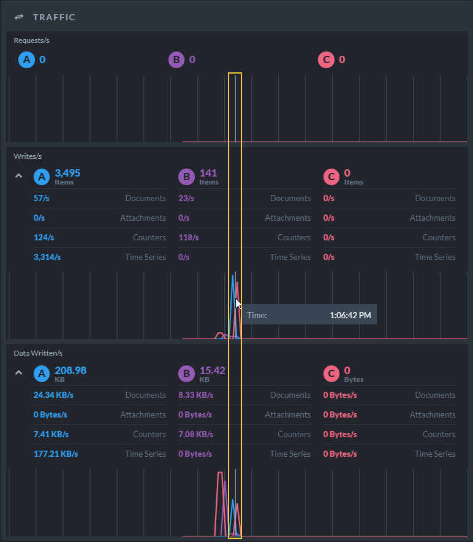
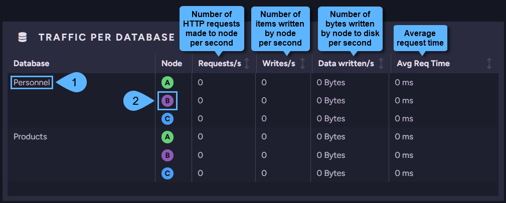

import Admonition from '@theme/Admonition';
import Tabs from '@theme/Tabs';
import TabItem from '@theme/TabItem';
import CodeBlock from '@theme/CodeBlock';
import LanguageSwitcher from "@site/src/components/LanguageSwitcher";
import LanguageContent from "@site/src/components/LanguageContent";

# Cluster Dashboard: Widgets
<Admonition type="note" title="">

* Widgets in the cluster dashboard display live diagnostic information about the whole cluster.  
* Information is displayed for all cluster nodes.  

* Available Widgets:  
  * [Let's Get Started Widget](../../../studio/cluster/cluster-dashboard/cluster-dashboard-widgets.mdx#let)  
  * [CPU Widget](../../../studio/cluster/cluster-dashboard/cluster-dashboard-widgets.mdx#cpu-widget)  
  * [Memory Widget](../../../studio/cluster/cluster-dashboard/cluster-dashboard-widgets.mdx#memory-widget)  
  * [Traffic Widget](../../../studio/cluster/cluster-dashboard/cluster-dashboard-widgets.mdx#traffic-widget)  
  * [Traffic Per Database Widget](../../../studio/cluster/cluster-dashboard/cluster-dashboard-widgets.mdx#traffic-per-database-widget)  
  * [Indexing Widget](../../../studio/cluster/cluster-dashboard/cluster-dashboard-widgets.mdx#indexing-widget)  
  * [Indexing Per Database Widget](../../../studio/cluster/cluster-dashboard/cluster-dashboard-widgets.mdx#indexing-per-database-widget)  
  * [Storage Widget](../../../studio/cluster/cluster-dashboard/cluster-dashboard-widgets.mdx#storage-widget)  
  * [Storage Per Database Widget](../../../studio/cluster/cluster-dashboard/cluster-dashboard-widgets.mdx#storage-per-database-widget)  
  * [License Widget](../../../studio/cluster/cluster-dashboard/cluster-dashboard-widgets.mdx#license-widget)  
</Admonition>
## Let's Get Started Widget

1. The **Let's Get Started** widget offers a comfortable starting point with links 
   to setting up your cluster, creating a new database, and learning basic RavenDB concepts.  
2. **Create New Database**  
   Click to [create a new database](../../../studio/database/create-new-database/general-flow.mdx).  
3. **Setup Your Cluster**  
   Click to open Studio's [Cluster View](../../../studio/cluster/cluster-view.mdx) 
   so you can create and manage your cluster.  
4. **Learn how to connect your client to the database**  
   Click to learn how to [connect your client to your database](../../../start/getting-started.mdx#documentstore) using RavenDB's API.  
5. **Learn more about Querying and Indexes**  
   Click to learn how [Querying](../../../client-api/session/querying/what-is-rql.mdx) 
   and [Indexes](../../../indexes/what-are-indexes.mdx) are managed in RavenDB.  
6. **Hide This Widget**  
   Click to remove the **Let's Get Started** widget from the cluster dashboard view.  
   The operation is reversible, any widget that was removed can be [added](../../../studio/cluster/cluster-dashboard/cluster-dashboard-customize.mdx#add-widget) 
   later to the cluster dashboard.  

## CPU Widget

1. **RavenDb CPU Usage**  
   RavenDB usage of CPU & Cores per node.  
2. **Machine CPU Usage**  
   Machine usage of CPU & Cores per node.  
3. **Data Displayed**  
   The CPU widget shows the current CPU usage.  
   Hover over the timeline to display earlier data.  
   

## Memory Widget

1. **RavenDB Memory Usage**  
   Memory used by RavneDB.  
2. **Machine Memory Usage**  
   Memory used by the nodes' machines.  
3. Click to toggle on/off additional statistics.  

**Memory Widget - Additional Statistics View**  

* **Data Displayed**  
  The memory widget shows the current memory usage.  
  Hover over the timeline to display earlier data.  
  

## Traffic Widget

1. **Requests/s**  
   Number of HTTP requests made to the node per second.  
2. **Writes/s**  
   Number of items (documents, attachments, etc.) written by the node per second.  
3. **Data Written/s**  
   Amount of data written by the node per second.  
4. Click to toggle on/off additional statistics.  

**Traffic Widget - Additional Statistics View**  

* **Data displayed**  
  The traffic widget shows the current traffic usage.  
  Hover over the timeline to display earlier data.  

## Traffic Per Database Widget

1. **Database Name**  
   The Database column lists all your databases.  
2. **Node Tag**  
   Click a node tag to open the node's _Traffic Watch view_ where all HTTP requests made to the node can be viewed.  

## Indexing Widget

1. **Map Indexes**  
   Indexed items (documents, attachments, counters, and time series) per second.  
2. **Map-Reduce Indexes**  
   Mapped Items and Reduced Mapped Entries per second.  
3. **Data displayed**  
   The indexing widget shows the current indexing volume.  
   Hover over the timeline to display earlier data.  
  

## Indexing Per Database Widget

1. **Database Name**  
   The Database column lists all your databases.  
2. **Node Tag**  
   Click a node tag to open the _Indexing Performance view_ for the selected node.  

## Storage Widget

1. Storage used by RavenDB.  
2. Storage used by the node's machine.  
3. Free storage remaining on the node's machine.  
4. Overall disk capacity on the node's machine.  

## Storage Per Database Widget

1. **Database Name**  
   The Database column lists all your databases.  
2. **Node Tag**  
   Click a node tag to open the _Storage Report view_ for the selected node.  

## License Widget

1. The **License** widget displays your license **Type**, **Expiration** 
   date and remaining period, and **Support Type**.  
2. **License Details**  
   Click to open the [About view](../../../start/licensing/licensing-overview.mdx) which contains information about your 
   License and Support plan.  

