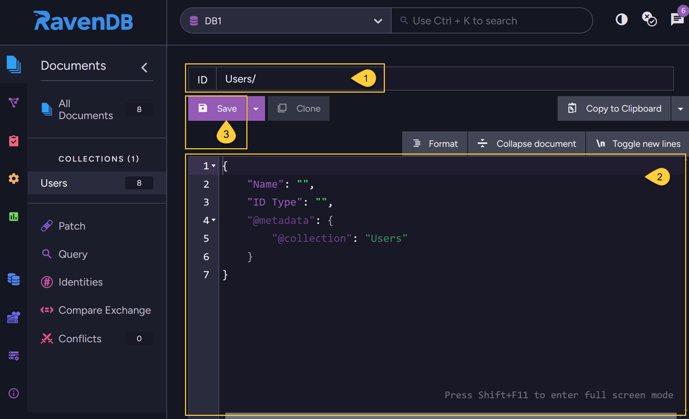
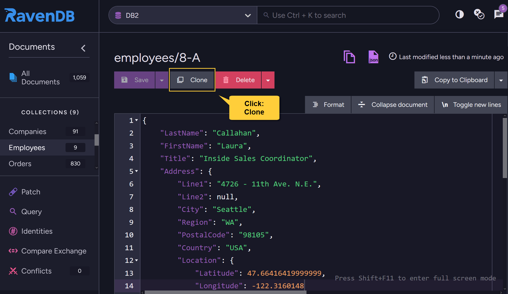
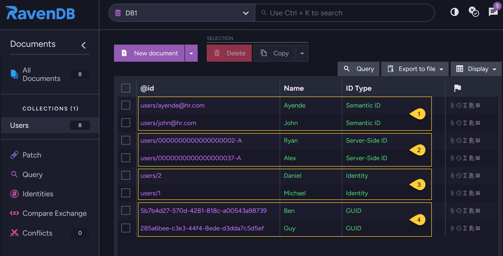

import Admonition from '@theme/Admonition';
import Tabs from '@theme/Tabs';
import TabItem from '@theme/TabItem';
import CodeBlock from '@theme/CodeBlock';
import LanguageSwitcher from "@site/src/components/LanguageSwitcher";
import LanguageContent from "@site/src/components/LanguageContent";

# Create New Document
<Admonition type="note" title="">

* From the Studio, a new document can be added to a database - either to an existing collection or to a new one.

* The new document ID can be generated as one of the following types:  
  * **Server-Side ID**  
  * **Semantic ID**  
  * **Identity**  
  * **GUID**  
  * **Artificial Document ID**  

* An ID generated by the [HiLo Algorithm](../../../client-api/document-identifiers/hilo-algorithm.mdx) ***cannot*** be generated from the Studio, only from the RavenDB Client.  

* For a full description of the different ID types, see [Document Identifier Generation](../../../server/kb/document-identifier-generation.mdx).  

* In this article:  
  * [Create new document](../../../studio/database/documents/create-new-document.mdx#create-new-document)  
  * [Create new document in current collection](../../../studio/database/documents/create-new-document.mdx#create-new-document-in-current-collection)  
  * [Clone an existing document](../../../studio/database/documents/create-new-document.mdx#clone-an-existing-document)  
  * [Document ID types - examples](../../../studio/database/documents/create-new-document.mdx#document-id-types---examples)  
</Admonition>
## Create new document

* From the _Documents View_, click **New Document**.  

* Edit the new document:  

* 1 - **Enter document ID** - see the [examples](../../../studio/database/documents/create-new-document.mdx#document-id-types---examples) below.  
  * Any collection name can be entered as a prefix.  
  * The collection name will be created if it doesn't exist yet.  
  * If no collection name is specified, i.e. the ID string doesn't end with ( / ) or ( | ),  
    then the document will be added to the `@empty` collection.  

* 2 - **Edit document content**    
  * Edit the document fields, the document content showing is an initial template.  

* 3 - Click **Save** when done.  

## Create new document in current collection

* Open the down arrow and click **Create new document in current collection**.  

* Edit the new document:  

* 1 - **Enter document ID**  
  * The current collection name is initially suggested.  
  * Any other collection name of your choice can still be entered,  
    document creation will be handled as described above in [Create New Document](../../../studio/database/documents/create-new-document.mdx#create-new-document).  

* 2 - **Edit document content**  
  * Edit the document fields.
  * If all the documents in the collection have the same 'structure', i.e. same fields,  
    then the initial document content showing will be those fields.  
    (In the above example the fields are: _ID Type_ & _Name_)  
  * If not all documents share the exact same fields,  
    then the initial document content will be just the initial template as in [Create New Document](../../../studio/database/documents/create-new-document.mdx#create-new-document).

* 3 - Click **Save** when done.  

## Clone an existing document

* A new document can be created by cloning an [Existing document](../../../studio/database/documents/document-view.mdx).

* Click the **Clone** button to create a copy of the current document.  
* When cloning a document from the Studio, any attachments, counters, time series, or revisions from the original document will be copied into the clone (if they exist).
* If the original document is [Archived](../../../data-archival/overview.mdx), the clone will Not be archived.
* Modify the cloned document as needed and click **Save**.  
  The cloned document will be saved as a new document with a new ID.  

## Document ID types - examples

1. **Semantic ID**  
   This ID was generated by entering the actual string in the document ID.  
   E.g., `users/ayende@hr.com`  

2. **Server-Side ID**  
   This ID was generated by entering: `users/` in the document ID.  
   Note: the first document was created from node 'A' while the other one from node 'B'.  

3. **Identity**  
   This ID was generated by entering: `users|` in the document ID.  

4. **GUID**  
   This ID was generated by leaving the document ID field **empty** and just clicking 'Save'.  

