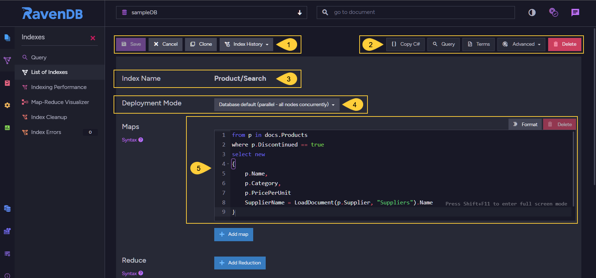
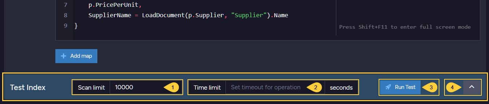
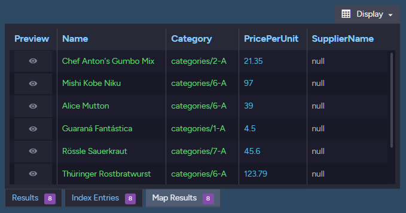
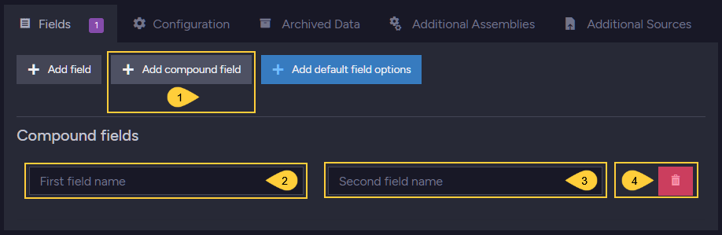
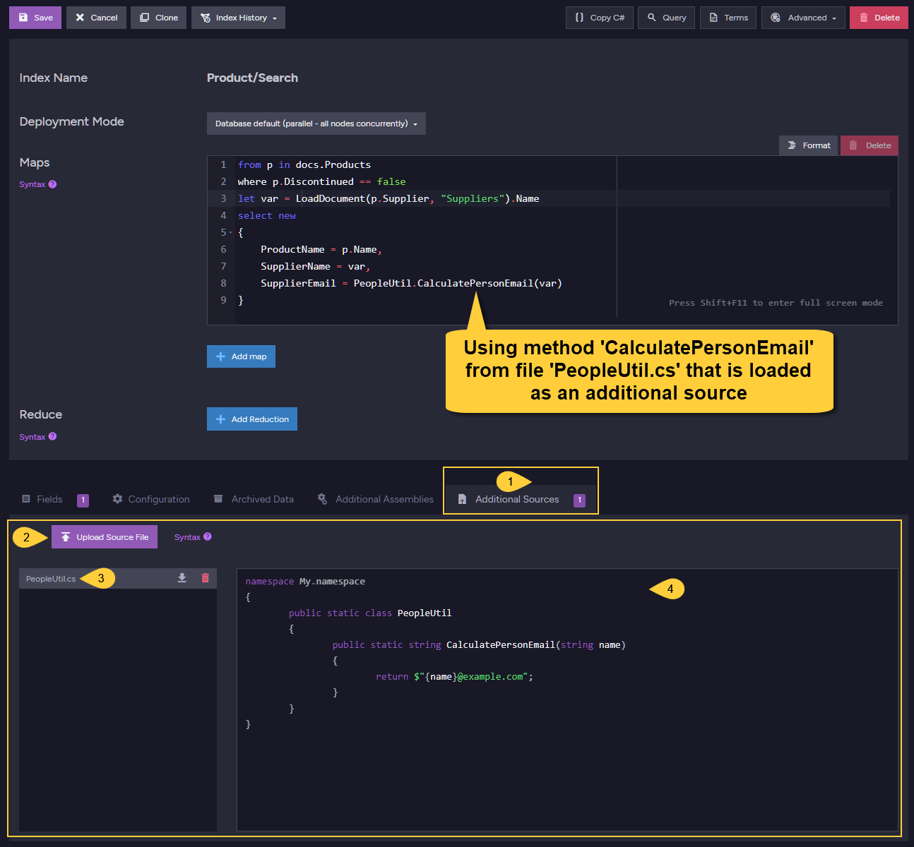

import Admonition from '@theme/Admonition';
import Tabs from '@theme/Tabs';
import TabItem from '@theme/TabItem';
import CodeBlock from '@theme/CodeBlock';
import LanguageSwitcher from "@site/src/components/LanguageSwitcher";
import LanguageContent from "@site/src/components/LanguageContent";

# Create Map Index
<Admonition type="note" title="">

* A **Map index** consists of one or more LINQ-based or JavaScript mapping functions 
  that indicate how to index selected document fields, counters, and time series data.  

* In this page:  
  * [Edit Index View](../../../studio/database/indexes/create-map-index.mdx#edit-index-view)  
  * [Test Index](../../../studio/database/indexes/create-map-index.mdx#test-index)  
  * [Index Fields & Terms](../../../studio/database/indexes/create-map-index.mdx#index-fields--terms)  
  * [Index Field Options](../../../studio/database/indexes/create-map-index.mdx#index-field-options)  
     * [Add Compound Field](../../../studio/database/indexes/create-map-index.mdx#add-compound-field)  
  * [Configuration](../../../studio/database/indexes/create-map-index.mdx#configuration)  
  * [Additional Assemblies](../../../studio/database/indexes/create-map-index.mdx#additional-assemblies)  
  * [Additional Sources](../../../studio/database/indexes/create-map-index.mdx#additional-sources)  
  * [Spatial Field Options](../../../studio/database/indexes/create-map-index.mdx#spatial-field-options)  
</Admonition>
## Edit Index View

1. **Save** - Save index definition.  
   **Cancel** - Return to Index List View without creating or changing the index definition.  
   **Clone** - Clone this index (available for an already saved index).  
   **Index History** - Open the [Index History Dialog](../../../studio/database/indexes/index-history.mdx#index-history-dialog).  

2. Options available for an already saved index:  
   **Copy C#** - Click to view and copy the C# class that defines the index as set in the Studio.  
   **Query** - Click to go the the Query View and query this index.  
   **Terms** - Click to see the index terms, see [below](../../../studio/database/indexes/create-map-index.mdx#index-fields--terms).  
   **Advanced** - Click to dump the raw index or optimize it.  
   **Delete** - Delete this index.  

3. **Index Name** - An index name can be composed of letters, digits, `.`, `/`, `-`, and `_`. The name must be unique in the scope of the database.  
    * Uniqueness is evaluated in a _case-insensitive_ way - you can't create indexes named both `usersbyname` and `UsersByName`.  
    * The characters `_` and `/` are treated as equivalent - you can't create indexes named both `users/byname` and `users_byname`.  
    * If the index name contains the character `.`, it must have some other character on _both sides_ to be valid. `/./` is a valid index name, but 
    `./`, `/.`, and `/../` are all invalid.  

4. **Deployment Mode** - Select the index deployment mode.  
    * _Database default (parallel - all nodes concurrently)_  
      With this option, the deployment mode will be the 
      [Default Mode](../../../indexes/rolling-index-deployment.mdx#system-wide-deployment-mode) defined on the database.  
    * _Rolling (one node at a time)_  
      The index will be deployed on the cluster nodes in a linear order, one node at a time.  
    * Parallel (all nodes concurrently)  
      The index will be deployed on all cluster nodes in parallel.  
    * Read more about deployment modes [here](../../../indexes/rolling-index-deployment.mdx).  

5. **The Map Function** of the index.  

  * In the above example, the index will go over documents from the `Products` collection and 
    index only documents whose `Discontinued` property is _'true'_.  
<TabItem value="javascript" label="javascript">
<CodeBlock language="javascript">
{`from p in docs.Products
where p.Discontinued == true
select new
\{
    p.Name,
    p.Category,
    p.PricePerUnit,
    SupplierName = LoadDocument(p.Supplier, "Supplier").Name
\}
`}
</CodeBlock>
</TabItem>

  * Note: querying this index will provide results only for Products whose _'Discontinued'_ 
    field contains _'true'_. Omitting the _'where'_ clause and defining _'from p in docs.Products'_
    would have queried the whole Products collection.  

  * Each **Index Entry** created for this index will be composed of the following 4 fields:  
    `Name`, `Category`, `PricePerUnit` & `SupplierName`.  
    The first 3 are taken directly from the document fields, while _SupplierName_ is a calculated 
    index field.  
    The supplier's name is derived from the _Name_ field that is taken from the _loaded_ supplier document.  

  * At **query time**, when querying this index, the resulting documents can be searched on and further filtered  
    by these **Index Fields** defined and by the created **Terms**. 
    See the query results on this index in Query View.  

  * See more Map-Indexes examples in [Map Index defined from Code](../../../indexes/map-indexes.mdx)  

## Test Index

The **Test Index** interface provides a secluded environment for the execution 
of test-queries over indexes.  
An index can be repeatedly changed and executed over a size-limited dataset, 
for a limited time duration, providing its users with immediate execution results 
and saving them the need to save the index first and wait for its execution 
over huge datasets in a live environment.  

In its folded form, the interface is a floating bar at the bottom of the page, to keep it 
available when the index page is scrolled up and down.  
When expanded, the interface provides an instant testing environment for additions and 
modifications in the index maps and configuration.  

* Testing an index **does not require** saving it first, so changes can be easily made, 
  tested, and either kept or unmade, in **testing** as well as **production** environments.  
* Indexes created while running test queries are **dropped** after the test.  
* [Corax](../../../indexes/search-engine/corax.mdx) indexes created while running 
  testing queries will [not train compression dictionaries](../../../indexes/search-engine/corax.mdx#corax-and-the-test-index-interface).  

1. **Scan limit**  
   Enter the maximum number of items that the index will process, from **1** to **10,000**.  
   Default: **10000**  
2. **Time limit**  
   Enter the maximum amount of time for the test execution, in seconds.  
   Default: **15 seconds**  
3. **Run test**  
   Click to run the test and expand the test bar to display the results.  
4. **Expand test bar**  
   Click to expand the test bar, displaying the index query editor and the result tabs.  

1. **Query editor**  
   Initially, the editor displays a simple query over the index.  
   You can edit the query so it applies any logic that would help you 
   understand the results and improve the index, e.g. make the query 
   display only a selected subset of the index results.  
2. **Fold interface**  
   Click to fold the test interface back to its floating bar form.  
3. **Display**  
   Click to select which columns to display.  
4. **Results tab**  
   Click to display query results.  
5. **Index entries tab**  
   Click to view the values of document properties retrieved by the query.  
   
      

6. **Map results tab**  
   Click to view mapped index parameters.  

      

      <Admonition type="note" title="Map Reduce Results" id="map-reduce-results" href="#map-reduce-results">
      When the index includes a Map Reduce section, the test will display 
      the results of this section in a **Reduce Results** tab.  

      

      </Admonition>

## Index Fields & Terms

1. **Index Fields**  
   Click an index field to expand the terms listed under it.  

2. **Terms**  
   Hover over a term to Query the index by this term, Preview the term, or Copy the term to the clipboard.  
   <Admonition type="info" title="">
   Terms are created from the value of the field that was requested to be indexed 
   by the specified [Field Options](../../../studio/database/indexes/create-map-index.mdx#index-field-options).  
   </Admonition>

## Index Field Options

1. **Add field**  
   Create indexing options for one document field in the collection this index applies to.  

1. **Add compound field**  
   If the Corax search engine is used, compound fields can be added to optimize specific queries.  
   This option is for **expert users only**.  
    * Learn about Corax and compound fields [here](../../../indexes/search-engine/corax.mdx#compound-fields).  
    * Learn to add a compound field using Studio [below](../../../studio/database/indexes/create-map-index.mdx#add-compound-field).  

3. **Add default field options**  
   Use this option to set default field options for all indexed fields.  
   
      

4. **Field name**  
   Click the text box to display a dropdown menu of fields, and 
   select a field whose options will replace the default options.  

5. **Basic options**  
    * [Store](../../../indexes/storing-data-in-index.mdx)  
      Select Inherit, Yes, or No.  
      **Inherit** to apply the default database/server value.  
      During a query, if **Store** is enabled, the value is 
      fetched from the index rather than from the queried document.  
      If the value is not found in the index, it will be fetched from the document.  
      Storing data in the index decreases reaction time, but increases the index size.  

    * [Full-Text-Search](../../../indexes/querying/searching.mdx)  
      Set this to _'Yes'_ to allow searching for strings inside the text values of this field.  
      The indexed terms are _tokens_ that are split from the original string according to the 
      specified [Analyzer](../../../indexes/using-analyzers.mdx).  
      The Analyzer is set using the _'Indexing'_ and _'Analyzer'_ dropdown menus (see Advanced Options below).  
      The default analyzer is a simple case-insensitive analyzer.  

    * [Highlighting](../../../indexes/querying/highlighting.mdx)  
     Set to _'Yes'_ to enable highlighting.  
     Requires _'Store'_ to be set to `Yes`.  
     In the advanced options, Indexing needs to be set to 'Search' and Term Vector set 
     to 'WithPositionsAndOffsets'.  

    * [Suggestions](../../../indexes/querying/suggestions.mdx)  
      Setting _'Suggestions'_ will allow you to query what the user probably meant to 
      ask about (i.e. spelling errors).  

    * [Spatial](../../../indexes/querying/spatial.mdx)  
      See [below](../../../studio/database/indexes/create-map-index.mdx#spatial-field-options)  

6. **Advanced Options**  
   Click to display or hide these advanced index field options:  

     

     * `Term Vector`  
       Term Vectors are used in RavenDB's query feature [More Like This](../../../indexes/querying/morelikethis.mdx), 
       which suggests documents that are similar to a selected document, based on shared 
       indexed terms. I.e., suggest similar catalogs.  
       A _'Term Vector'_ for a text paragraph will contain a list of all unique words and 
       how often they appeared.  
       Set _'full-text-search'_ on the field (index entry) and define it to have a _'Term Vector'_.  
       Learn more in [Indexes: Term Vectors](../../../indexes/using-term-vectors.mdx), 
       and in this [Blog Post](https://ayende.com/blog/180900/queries-in-ravendb-gimme-more-like-this).  

     * `Indexing`  
       This setting determines which [Analyzer](../../../indexes/using-analyzers.mdx) (see the next option below) 
       can be used.  
        * **Exact**  
          Analyzer: 'Keyword'  
          The text is not split into tokens.  
          The entire value of the field is handled as one token.  
        * **Default**  
          Analyzer: 'LowerCase Keyword'  
          The text is not split into tokens.  
          The text is converted to lowercase, and matches are case insensitive.  
        * **Search**  
          Use the `Analyzer` dropdown menu to select an analyzer.  
          'StandardAnalyzer' will be used by default.  
          When a [custom analyzer](../../../studio/database/settings/custom-analyzers.mdx) 
          is created, it is added to the dropdown menu.  

     * `Analyzer`  
       This is the analyzer in use, determined either by the `Indexing` setting above 
       or (when `Indexing` is set to **Search**) by clicking the `Analyzer` edit box 
       and explicitly selecting the analyzer from a dropdown list.  

7. **Delete Field**  
   Click to remove this field from the index.  
#### Add Compound Field  

Compound fields are used by Corax to optimize specific queries.  
A compound field is always comprised of two simple data elements, 
and its content is sorted by the first element and then by the second.  
When a query that is based on these two data elements is executed, 
it will automatically use the pre-sorted compound field and run the 
query much faster.  
Read more about this feature [here](../../../indexes/search-engine/corax.mdx#compound-fields).  

* An index that uses a search engine other than Corax will not be able 
  to use compound fields. Click "Change to Corax" to set Corax as the 
  search engine for this index.  

1. Click to set the search engine for this index to Corax and add a compound field.  
2. Click to select the first data element for the compound field.  
3. Click to select the second data element for the compound field.  
4. Click to remove the compound field.    

## Configuration

1. **Configuration tab**  
   Click to set index-specific configuration options.  
2. **Add customized indexing configuration**  
   Click to add a configuration key.  
3. **Search engine type**  
   Select the search engine. Have this index inherit the default search engine, 
   or set it explicitly to Lucine or Corax.  
4. **Indexing Configuration Key**  
   Paste or select the configuration key that you want to set.  
   You can set any [indexing configuration](../../../server/configuration/indexing-configuration.mdx) 
   that has a __"per-index"__ scope.  
5. **Value**  
   Enter the new value for this configuration key.  
6. **Delete Configuration**  
   Remove this configuration key.

   <Admonition type="info" title="">
   Remember to save the index using the **Save** button at the top to keep the modified configuration.  
   </Admonition>

## Additional Assemblies

Use the [Additional Assemblies](../../../indexes/additional-assemblies.mdx) 
feature to enhance Index capabilities with classes and methods taken from libraries.  
In the below example, `Path.GetFileName` can be used by the index map method because the 
runtime library `System.IO` is added as an additional assembly.  

1. **Add Assembly**  
   Click to add an assembly source for your index usage.  

2. **Syntax**  
   See syntax samples.  

3. **Assembly Source**  
   Select the assembly source type.  
   Added assemblies can be -  
    * _Server Runtime_ - a runtime library.  
    * _Path_ - The path to a library file on your local disk.  
    * _Nuget_ - a Nuget package.  
      <Admonition type="note" title="">
      Note that additional assemblies are allowed to include pre-release packages.  
      
      </Admonition>

4. **Remove Assembly**  
   Click to remove the assembly.  
**Server Runtime Library**  

1. **Assembly Source**  
   In this example, the assembly is a runtime library.  

2. **Assembly Name**  
   The name of the runtime library you want to use.  

3. **Usings**  
   Optionally, choose a namespace within the assembly.  
   
4. **Add Namespace**  
   Click to add the namespace to the list of `Usings`.  

5. **Namespaces list**  
   The list of namespaces used.  

6. **Remove Namespace**  
   Click to remove this namespace from the list.  

7. **Remove Assembly**  
   Click to remove this assembly.  
**Nuget Package**  

1. **Assembly Source**  
   In this case, _Nuget_ was chosen so the index can use classes and methods taken from a Nuget package.  

2. **Package Name**  
   Nuget package name.  

3. **Package version**  
   Nuget package version.  

4. **Default Package Source URL**  
    * Toggle ON to use the package default URL.  
    * Toggle OFF to provide the URL yourself.  
      

5. **Usings**  
   Optionally, choose a namespace within the Nuget package.  
   
6. **Add Namespace**  
   Click to add the namespace to the list of `Usings`.  

7. **Remove Assembly**  
   Click to remove this assembly.  
**Local Library Path**  

1. **Assembly Source**  
   In this case, _Path_ was chosen so the index can use classes and methods taken from a local library.  

2. **Assembly Path**  
   Provide a path to the local library file.  

3. **Usings**  
   Optionally, choose a namespace within the local library.  
   
4. **Add Namespace**  
   Click to add the namespace to the list of `Usings`.  

5. **Remove Assembly**  
   Click to remove this assembly.  

## Additional Sources

You can extend the logic of the Map & Map-Reduce methods by referencing classes and methods 
from additional source files. This enables advanced scenarios since complex logic can be performed 
during the indexing process.  

In the above example, file _'PeopleUtil.cs'_ was uploaded and method _'CalculatePersonEmail'_ is 
used to calculate the index entry _'SupplierEmail'_.  

1. **Additional Sources tab**  
   Click to open the additional assemblies tab.  
2. **Upload Source File**  
   Click to upload a file from the file system that contains classes and methods you want to use.  
3. **Uploaded File**  
   The file that has been uploaded whose contents can be used within the index methods.  
4. **Source Code**  
   Read-only view of the uploaded file's source code.  
   

## Spatial Field Options

Spatial searches use geographical data. To perform such searches, 
a _spatial index field_ has to be defined.  

The `CreateSpatialField()` method used in the index definition 
below instructs RavenDB to use the document longitude and latitude 
properties and create the spatial field 'Coordinates' that spatial 
queries can then use.  

1. **Add Field**  
    Create indexing options for the spatial field.  

2. **Field Name**  
   Select the spatial field, in this case "Coordinates".  

3. **Spatial**  
   Toggle on to enable spatial options.  
    * **Spatial Type**  
      RavenDB supports both the **Geography** and the **Cartesian** systems.  
    * **Spatial Indexing Strategy**  
      Strategy determines the format of the indexed term values.  
      The following indexing strategies are supported:  
       • _Bounding box_  
       • _Geohash prefix tree_  
       • _Quad prefix tree_  
    * **Radius Units**  
      Set the units (miles, kilometers) to be used when querying with RQL `spatial.circle`.  
      Learn more about querying spatial fields here: [Querying: Spatial](../../../indexes/querying/spatial.mdx)  
    * **Max Tree Level**  
      Control spatial queries precision.  
    * **X and Y Min/Max Values**  
      Setting the min/max values for X and Y is relevant only for the Cartesian system type.  

<Admonition type="info" title="">
Learn more about spatial indexes in [Indexing: Spatial](../../../indexes/indexing-spatial-data.mdx).  
</Admonition>

