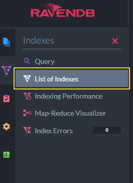

import Admonition from '@theme/Admonition';
import Tabs from '@theme/Tabs';
import TabItem from '@theme/TabItem';
import CodeBlock from '@theme/CodeBlock';
import LanguageSwitcher from "@site/src/components/LanguageSwitcher";
import LanguageContent from "@site/src/components/LanguageContent";

# Index History
<Admonition type="note" title="">

* An index revision is created for any change made to the index definition.  

* By default 10 index revisions are kept. This number can be modified using 
  the [Database Settings view](../../../studio/database/indexes/index-history.mdx#view-and-update-number-of-index-revisions) 
  or through [configuration](../../../server/configuration/configuration-options.mdx).  

* The Index History dialog allows you to browse these revisions and revert 
  the current index definition to any of its past revisions.  

* You can revert only the 'Map and Reduce' methods or the full index definition.  

* In this page:  
  * [Open Index History Dialog](../../../studio/database/indexes/index-history.mdx#open-index-history-dialog)  
  * [Index History Dialog](../../../studio/database/indexes/index-history.mdx#index-history-dialog)  
  * [Select and Load an Index Revision](../../../studio/database/indexes/index-history.mdx#select-and-load-an-index-revision)  
  * [View and Update Number of Index Revisions](../../../studio/database/indexes/index-history.mdx#view-and-update-number-of-index-revisions)  

</Admonition>
## Open Index History Dialog

To open the index history dialog:  

1. Open the **Indexes** &gt; **List of Indexes** [view](../../../studio/database/indexes/indexes-list-view.mdx).  
   
2. Select an Index.  
   
3. Open the Index History dialog.  
   

## Index History Dialog

1. **Index History Dialog**  
2. **Revisions List**  
   The history of changes made in this index, ordered by revision creation time.  
3. **Index Definition Preview**  
   The full definition of the highlighted index revision, including not just its Map and 
   Reduce sections but also all settings and field options.  

## Select and Load an Index Revision

1. **Revisions List**  
   To preview a revision, hover over its creation date or select it using the arrow keys.  
2. **Load Index Revision**  
   Click the Load Index button to load the previewed revision,  
   or click the creation time of any revision in the list to load it without preview.  

1. **Load Index Revision**  
   Click the Load Index button to load the previewed revision in its entirety, 
   including its [field options](../../../studio/database/indexes/create-map-index.mdx#index-field-options) 
   and any additional settings.  
2. **Load Map & Reduce Only**  
   Click the arrow and choose the "Load Map & Reduce Only" dropdown to load the selected 
   revision's *Map and Reduce sections* only, leaving its other settings unchanged.  

## View and Update Number of Index Revisions

The number of index revisions kept by the server can be modified through [configuration](../../../server/configuration/configuration-options.mdx),  
or using the Database Settings view:  

1. Open the **Settings** &gt; **Database Settings** view.  
   
2. Enter **Indexing.History.NumberOfRevisions** in the search box to locate the 
   index revisions number *Configuration Key* and see its current value.  
   
3. Click **Edit** to change the configuration key value.  
   
4. Edit the configuration key value and apply your changes.  
   

