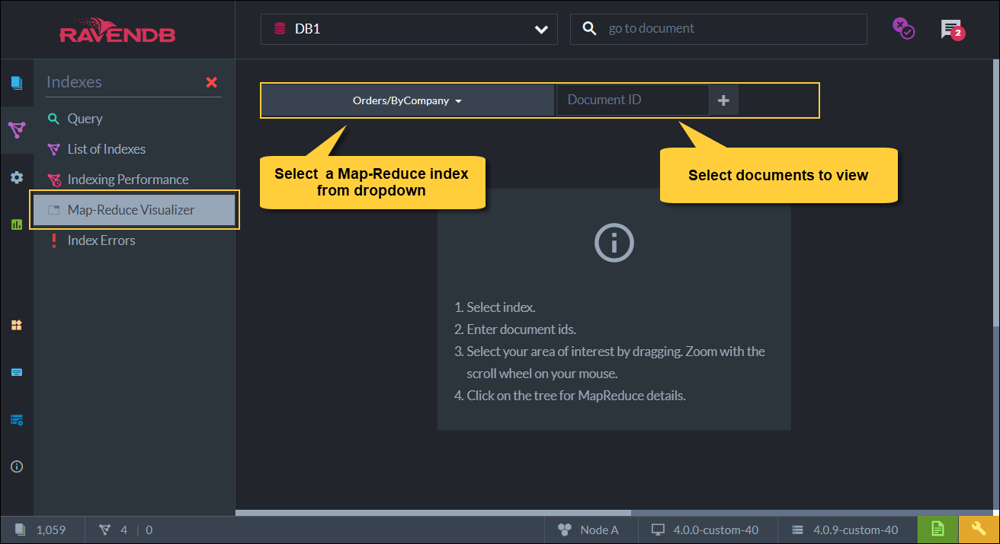

import Admonition from '@theme/Admonition';
import Tabs from '@theme/Tabs';
import TabItem from '@theme/TabItem';
import CodeBlock from '@theme/CodeBlock';
import LanguageSwitcher from "@site/src/components/LanguageSwitcher";
import LanguageContent from "@site/src/components/LanguageContent";

# Map-Reduce Visualizer
<Admonition type="note" title="">

* The **MapReduce visualizer** allows inspecting the internal structure of a Map-Reduce index 
  by graphing the relations between the documents and the Map-Reduce results.  

* In this page:
  * [Map-Reduce Visualizer Usage Flow](../../../studio/database/indexes/map-reduce-visualizer.mdx#map-reduce-visualizer-usage-flow)
  * [Map-Reduce Visualizer for Big Data](../../../studio/database/indexes/map-reduce-visualizer.mdx#map-reduce-visualizer-for-big-data)

</Admonition>
## Map-Reduce Visualizer Usage Flow

* **1.** Select a Map-Reduce index and the documents to view

* **2**. View the graphical representation of the documents and their related 'group-by' reduced key field from the index

  * In the above example, the selected documents `orders/1-A, orders/27-A, orders/829-A` 
    are related to the key: `companies/85-A`.  
    i.e. All 3 documents have the value **'companies/85-A'** in their **'Company'** field in the document body.  

  * Document `ordes/100-A` has the value `companies/21-A` in its 'Company' field.

* **3**. View the detailed view for the key reduced results

  1. The **total** number of orders documents made that contain the key 'companies/85-A' - **which is 6**  
     and the **total** orders amount made by company 'companies/85-A' - **which is 2,272.75**

  2. A detailed info of these aggregated values showing per document selected.  
     Note: per each document, the OrdesCount is **'1'**, as each company makes one order.  

* **4**. View details of all entries

  * A detailed view of **all** the entries in the index that have 'companies/85-A' for their key (the 'Company' field).  
    Only the selected documents are listed explicitly in the Source Document column.    

## Map-Reduce Visualizer for Big Data

* **5**. Visualizer results for big data

  * Once past a certain size, RavenDB starts processing the Map-Reduce entries in a **treelike** fashion.

* **6**. Visualizer details for big data

  * When there is a lot of data for a particular key, RavenDB will **segment the data**,  
    so that a minimal number of aggregation operations is required. 

  * For example, consider an update to document `orders/77-A` in the above image.  
    First, the Map function is run on the updated document, giving a Map entry to write to **page #1047**.  
    Then, the Reduce function is run on this page, giving the final tally for page #1047.  
    We'll then recurse upward, toward **page #1391**, where the Reduce is run again.  

