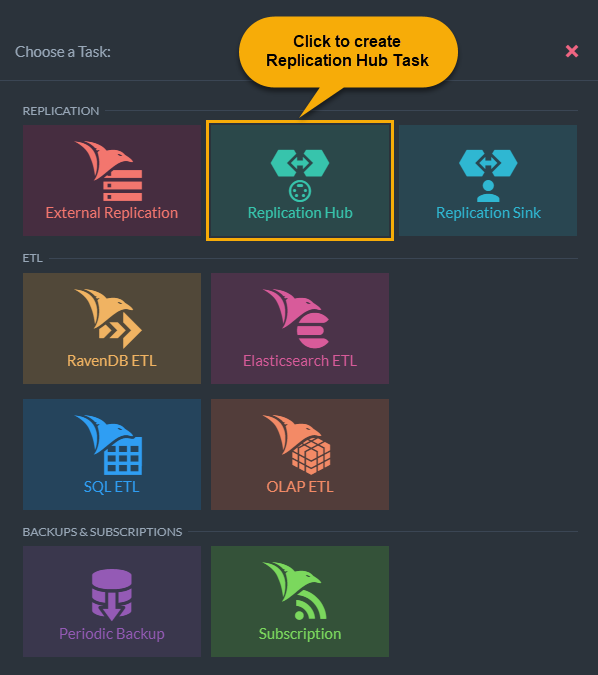

import Admonition from '@theme/Admonition';
import Tabs from '@theme/Tabs';
import TabItem from '@theme/TabItem';
import CodeBlock from '@theme/CodeBlock';
import LanguageSwitcher from "@site/src/components/LanguageSwitcher";
import LanguageContent from "@site/src/components/LanguageContent";

# Hub/Sink Replication: Hub Task
<Admonition type="note" title="">

* A Replication Hub is an ongoing task, designed to replicate documents to and/or 
  from Sink tasks to maintain a live replica of a database or chosen documents of it.  
   * The Sink is always the one to initiate the connection with the Hub, but data can 
     be replicated in either or both directions.  
   * Hub/Sink connections are secure, and require [certification](../../../../../studio/database/tasks/ongoing-tasks/hub-sink-replication/overview.mdx#certificates).  

* While defining a Hub task using the Studio, you can -  
   * Issue certificates that would be imported later on by Sink tasks that wish to access it  
   * Choose replication direction/s (`Hub->Sink` / `Hub<-Sink` / `Hub<->Sink`)  
   * Use [Filtered Replication](../../../../../studio/database/tasks/ongoing-tasks/hub-sink-replication/overview.mdx#filtered-replication) to choose which documents are to be replicated  

* In this page:
   * [Create an Ongoing Replication Hub Task](../../../../../studio/database/tasks/ongoing-tasks/hub-sink-replication/replication-hub-task.mdx#create-an-ongoing-replication-hub-task)  
   * [Hub Configuration](../../../../../studio/database/tasks/ongoing-tasks/hub-sink-replication/replication-hub-task.mdx#hub-configuration)  
   * [Access Configuration](../../../../../studio/database/tasks/ongoing-tasks/hub-sink-replication/replication-hub-task.mdx#access-configuration)  
   * [Viewing and Editing Existing Accesses](../../../../../studio/database/tasks/ongoing-tasks/hub-sink-replication/replication-hub-task.mdx#viewing-and-editing-existing-accesses)  
   * [Defining Filtered Replication](../../../../../studio/database/tasks/ongoing-tasks/hub-sink-replication/replication-hub-task.mdx#defining-filtered-replication)  
   * [Ongoing Tasks View](../../../../../studio/database/tasks/ongoing-tasks/hub-sink-replication/replication-hub-task.mdx#ongoing-tasks-view)  

</Admonition>
## Create an Ongoing Replication Hub Task

## Hub Configuration

1. **Choose Database**  
   Choose the database that the task would replicate data for,  
   from a list of databases whose database-group includes this node.  

2. **Task Name**  
   Name the Hub task.  

3. **Set Replication Delay Time**  
   Set a **delay time** to initiate replication only after this period has passed after each data change.  

4. **Choose preferred mentor node manually**  
   Choose which node would run the Hub task by default, 
   from a list of nodes running the database you chose.  

5. **Allow replication from Hub to Sink**  
   Enable or Disable data replication from Hub to Sink.  

6. **Allow replication from Sink to Hub**  
   Enable or Disable data replication from Sink to Hub.  

7. **Allow Replication Filtering**  
   Toggle this ON if you want to choose which documents are allowed to be replicated.  
   Leave it toggled OFF if you want the entire database to be replicated.  

8. **Save the new task or Cancel it.**  
    * **Save** to create or update the task  
      You have to save the new task before you can continue configuring it.  
    * **Cancel** to dismiss any changes or cancel task creation  

9. **Add Access**  
   After saving the task, you can add as many accesses as you want.  
   Each access defines a connection to a Sink task, that uses the configuration 
   you have provided in this page.  

## Access Configuration

1. **Access Name**  
   You can give the access whatever name you want.  

2. **Certificate**  
   Use one of the two options to issue the certificate that the Hub and Sink 
   tasks would use to establish a secure connection.  
    * **Upload existing certificate**  
      Choose this option if you prefer to import and reuse the certificate 
      that is already used by the server to validate client access.  
      Choosing it will open a file explorer window and allow you to 
      search for the certificate.  
    * **Generate new certificate**  
      Choose this option to create a new certificate that would be used 
      only by this task and its Sinks.  
      Choosing to create a new certificate will open a page that would 
      allow you to choose its longevity.  
       
            `1`. Choose how long the certificate would be valid before it expires.  
            `2`. Generate the new certificate or cancel the operation.  

3. **Information for Sink: Export access configuration**  
   Choose this option to export your Hub configuration and make it 
   available for import by Sink tasks, to save yourself the effort 
   of retyping data you have already provided.  

4. **Information for Sink: Download generated certificate**  
   Choose this option to dump the certificate (whether you've issued 
   or imported it) to a file, so you'd be able to import and use 
   it from a Sink task.  

     <Admonition type="info" title="">
     RavenDB prevents you from saving the access unless you download 
     the certificate, because this is your last chance to get hold of 
     the Private key (which the Hub doesn't keep when the access is saved).  
     </Admonition>
   
5. **Cancel / Save**  
   Use this option to either create the new access or cancel its configuration.  

## Viewing and Editing Existing Accesses

Defined accesses are listed below the main Hub configuration page.  
You can use this view to expand and collapse their details, edit accesses 
and remove them.  

## Defining Filtered Replication

1. **Allow Replication Filtering**  
   Toggle this ON to allow Filtered Replication.  

2. **From Hub to Sink**  
   Enter each path you want the Hub to replicate to the Sink, 
   in the `Enter documents prefix` text box. Click `Add Prefix` 
   to add it to the prefix list.  
    * You can define a prefix that uses a wildcard (`*`).  
      Place the wildcard in the prefix' suffix, after `/` or `-`.  
      e.g. `products/*`  
    * You can provide exact document IDs.  

3. **Use above prefixes (Hub to Sink) for both directions**  
    * You can define a single list of prefixes, that would be used for 
      the filtering of both **incoming** and **outgoing** documents.  
      To define a single list, toggle the switch **ON**.  
    * You can also define two different prefix lists, one for 
      *incoming* documents and another for *outgoing* documents.  
      You can use this, for example, to allow the reception of 
      a document but not its delivery (or vice versa).  
      To define two separate lists, toggle the switch **OFF**.  

         <Admonition type="info" title="">
         Note that only paths approved for replication by 
         both the Hub **and** the Sink, will be replicated.  
         </Admonition>

## Ongoing Tasks View

1. **Number of active sinks**  
   The number of sinks currently connected to this Hub.  

3. **Topology View**  
   Show the task and its responsible node in the database group topology.  

1. **Enable/Disable task**  
2. **Edit task**  
3. **Delete task**  
4. **Info button**  
   Click the Info button to show which Sink tasks are currently connected to this Hub.  
     

