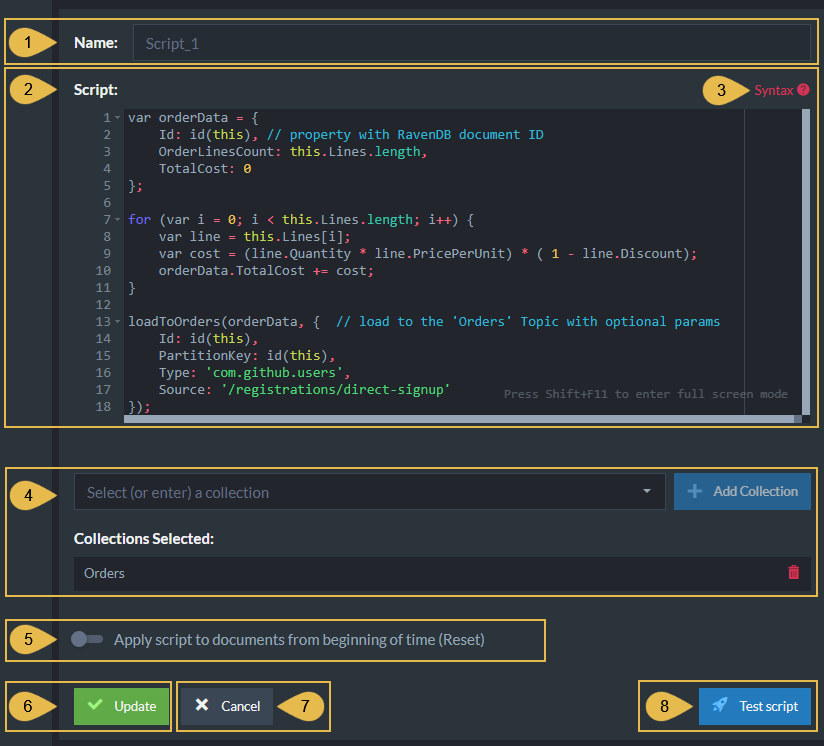

import Admonition from '@theme/Admonition';
import Tabs from '@theme/Tabs';
import TabItem from '@theme/TabItem';
import CodeBlock from '@theme/CodeBlock';
import LanguageSwitcher from "@site/src/components/LanguageSwitcher";
import LanguageContent from "@site/src/components/LanguageContent";

# Kafka ETL Task
<Admonition type="note" title="">

* RavenDB ETL tasks for **Apache Kafka** -  
   * **Extract** selected data from RavenDB documents  
   * **Transform** the data to new JSON objects and add the new objects to CloudEvents messages.  
   * **Load** the messages to **topics** of a Kafka broker.  
 
* Messages enqueued in Kafka topics are added at the queue's tail.  
  When the messages reach the queue's head, Kafka clients can access and consume them.  
 
* Kafka ETL tasks transfer **documents only**.  
  Document extensions like attachments, counters, or time series, are not transferred.  
 
* This page explains how to create a Kafka ETL task using the Studio.  
  [Learn here](../../../../server/ongoing-tasks/etl/queue-etl/kafka.mdx) how to define a Kafka ETL task using code.  

* In this page:  
  * [Open Kafka ETL Task View](../../../../studio/database/tasks/ongoing-tasks/kafka-etl-task.mdx#open-kafka-etl-task-view)  
  * [Define Kafka ETL Task](../../../../studio/database/tasks/ongoing-tasks/kafka-etl-task.mdx#define-kafka-etl-task)  
  * [Use RavenDB Certificate](../../../../studio/database/tasks/ongoing-tasks/kafka-etl-task.mdx#use-ravendb-certificate)  
  * [Options Per Topic](../../../../studio/database/tasks/ongoing-tasks/kafka-etl-task.mdx#options-per-topic)  
  * [Edit Transformation Script](../../../../studio/database/tasks/ongoing-tasks/kafka-etl-task.mdx#edit-transformation-script)  

</Admonition>
## Open Kafka ETL Task View

1. **Ongoing Tasks**  
   Click to open the ongoing tasks view.  
2. **Add a Database Task**  
   Click to create a new ongoing task.  

* **Kafka ETL**  
  Click to define a Kafka ETL task.  
   

## Define Kafka ETL Task

1. **Task Name** (Optional)  
   * Enter a name for your task  
   * If no name is provided, the server will create a name based on the defined connection string,  
     e.g. *Queue ETL to conStr*  

2. **Task State**  
   Select the task state:  
   Enabled - The task runs in the background, transforming and sending documents as defined in this view.  
   Disabled - No documents are transformed and sent.  

3. **Responsible Node** (Optional)  
  * Select a node from the [Database Group](../../../../studio/database/settings/manage-database-group.mdx) to be responsible for this task.  
  * If no node is selected, the cluster will assign a responsible node (see [Members Duties](../../../../studio/database/settings/manage-database-group.mdx#database-group-topology---members-duties)).  

4. **Create new Kafka connection String**  
    * Select an existing connection string from the list or create a new one.  
    * The connection string defines the destination Kafka broker/s URL/s.  
    * **Name** - Enter a name for the connection string.  
    * **Bootstrap Servers** - Provide at least one target `URL:Port` pair.  
      To push messages to more than one server, use this format: `localhost:9092, localhost:9093`

5. **Add new Connection Option**  
   An optional Key/Value dictionary.
   This option can be used, for example, to provide the additional fields required 
   to connect a secure Kafka server.  
   
     

6. **Test Connection**  
   Click after defining the connection string, to test the connection to 
   the Kafka topic.  

     

  

## Use RavenDB Certificate

If RavenDB has been set up **securely**, another option will show up: **Use RavenDB Certificate**

If enabled, RavenDB will export to the target machine/s the cluster-wide 
certificate defined during setup, and secure its connection with them.  

* If you do that, you will no longer need to define your security options manually 
  (using [Add new connection option](../../../../studio/database/tasks/ongoing-tasks/kafka-etl-task.mdx#define-kafka-etl-task)).  
* **Note**, however, that to complete the process you still need to register RavenDB's 
  exported certificate in [Kafka's truststore](https://kafka.apache.org/documentation/streams/developer-guide/security.html) 
  on the target machine/s.  

## Options Per Topic

Clicking the Advanced button will display per-topic options.  
In it, you'll find the option to delete documents from RavenDB 
while they were processed by the selected topic.  

1. **The Topic**  
   `loadToOrders` is the script instruction to transfer documents to the `Orders` topic.  
2. **Add Topic Options**  
   Click to add a per-topic option.  
3. **Collection/Topic Name**  
   This is the name of the Kafka topic to which the documents are pushed.  
4. **Delete Processed Documents**  
   Enabling this option will remove from the RavenDB collection documents that 
   were processed and pushed to the Kafka topic.  
   <Admonition type="warning" title="">
    Enabling this option will **remove processed documents** from the database.  
    The documents will be deleted after the messages are pushed.  
   </Admonition>

## Edit Transformation Script

1. **Script Name**  
   Enter a name for the script (Optional).  
   A default name will be generated if no name is entered, e.g. Script_1  

2. **Script**  
   Edit the transformation script.  
   * Define a **document object** whose contents will be extracted from 
     RavenDB documents and appended to Kafka topic/s.  
     E.g., `var orderData` in the above example.  
   * Make sure that one of the properties of the document object 
     is given the value `id(this)`. This property will contain the 
     RavenDB document ID.  
   * Use the `loadTo<TopicName>` method to pass the document object 
     to the Kafka destination.  

3. **Syntax**  
   Click for a transformation script Syntax Sample.  

4. **Collections**  
    * **Select (or enter) a collection**  
      Type or select the names of the collections your script is using.  
    * **Collections Selected**  
      A list of collections that were already selected.  

5. **Apply script to documents from beginning of time (Reset)**  
    * When this option is **enabled**:  
      The script will be executed over **all existing documents in the 
      specified collections** the first time the task runs.  
    * When this option is **disabled**:  
      The script will be executed **only over new and modified documents**.  

6. **Add/Update**  
   Click to add a new script or update the task with changes made in an existing script.  

7. **Cancel**  
   Click to cancel your changes.  

8. **Test Script**  
   Click to **test** the transformation script.  

