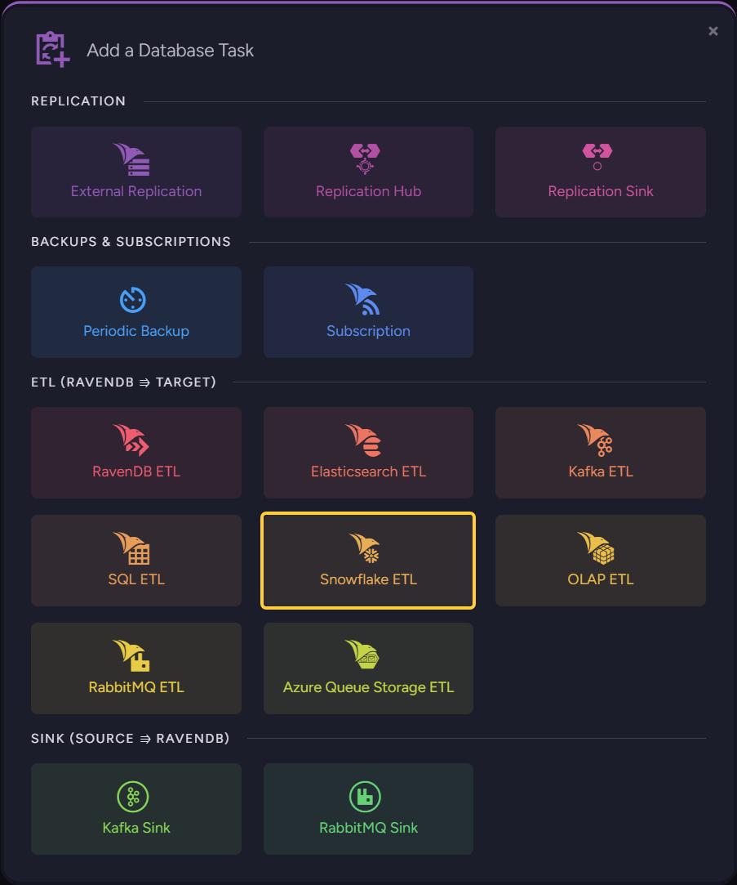
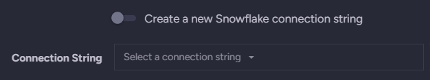
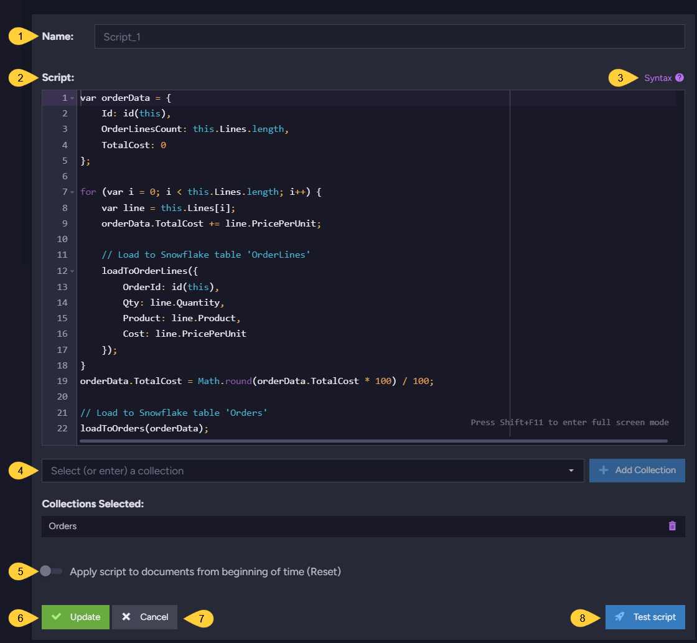

import Admonition from '@theme/Admonition';
import Tabs from '@theme/Tabs';
import TabItem from '@theme/TabItem';
import CodeBlock from '@theme/CodeBlock';
import LanguageSwitcher from "@site/src/components/LanguageSwitcher";
import LanguageContent from "@site/src/components/LanguageContent";

# Studio: Snowflake ETL Task
<Admonition type="note" title="">

* A Snowflake task is an [ETL](../../../../server/ongoing-tasks/etl/basics.mdx) process that -  
  **Extracts** selected data from RavenDB documents,  
  **Transforms** the data to SQL format,  
  and **Loads** the transformed data to a Showflake warehouse.  

* This page explains how to create a Snowflake ETL task using Studio.  
  Learn more [here](../../../../server/ongoing-tasks/etl/snowflake.mdx).  

* In this page:  
  * [Add a Database Task](../../../../studio/database/tasks/ongoing-tasks/snowflake-etl-task.mdx#add-a-database-task)  
  * [Define a Snowflake ETL Task](../../../../studio/database/tasks/ongoing-tasks/snowflake-etl-task.mdx#define-a-snowflake-etl-task)  
  * [Add or Edit Transformation Script](../../../../studio/database/tasks/ongoing-tasks/snowflake-etl-task.mdx#add-or-edit-transformation-script)  

</Admonition>
## Add a Database Task

1. **Ongoing Tasks**  
   Click to open the ongoing tasks view.  
2. **Add a Database Task**  
   Click to create a new ongoing task.  

* **Snowflake ETL**  
  Click to define a Snowflake ETL task.  
   

## Define a Snowflake ETL Task

1. **Task Name** (Optional)  
   * Enter a name for your task  
   * If no name is provided, the server will create a name based on the defined connection string,  
     e.g. *ETL to conStr*  

2. **Task State**  
   Select the task state:  
   Enabled - The task runs in the background, transforming and sending documents as defined in this view.  
   Disabled - No documents are transformed and sent.  

3. **Set responsible node** (Optional)  
  * Select a node from the [Database Group](../../../../studio/database/settings/manage-database-group.mdx) to be responsible for this task.  
  * If no node is selected, the cluster will assign a responsible node (see [Members Duties](../../../../studio/database/settings/manage-database-group.mdx#database-group-topology---members-duties)).  

4. **Connection String**  
   The connection string defines the location of the destination warehouse.  
    * `A.` **Create a new Snowflake connection string**  
       Toggle to choose whether to create a new connection string or use an existing string.  
       If you choose to use an existing string, you will be given a list of existing strings to select from.  
       
    * `B.`**New connection string Name**  
       If you choose to create a new connection string, enter a name for it here.  
    * `C.`**New connection string**  
       If you choose to create a new connection string, enter the string here.  
       It is a single string that includes all the options required to connect the Snowflake warehouse.  
    * `D.`**Advanced**  
       Click for advanced configuration options.  
        * **Command Timeout**  
          Specify the number of seconds after which an SQL command will timeout.  
          
    * `E.`**Test Connection**  
       Click after defining the connection string, to test the connection to the destination database.  

5. **Snowflake Tables**  
   Specify all the SQL tables on the destination database, that the ETL process is to transfer data to.  
   <Admonition type="note" title="">
   Please note that adding tables to this list does **not** mean that the ETL process would create them.  
   Prior to running the ETL task, you must create these tables on the destination database.  
   </Admonition>
    
    * `A.` **Add Table**  
       Click to add a new table raw.  
    * `B.`**Table Name**  
       Enter the table's name.  
    * `C.`**Document ID Column Name**  
       For each table, specify which column would hold the IDs of the documents that data is extracted from.  
       RavenDB will fill this column with source document IDs, and use these IDs to handle updates and deletes.  
    * `D.`**Insert Only**  
       Enable this option if the target database is _append-only_, to boost performance by inserting the data 
       without running a set of DELETE statements first.  
    * `E.`Confirm to add the new table, or Cancel to remove this raw.  

6. **Add Transformation Script**  
   Click to add a transformation script.  
   An ETL task can apply multiple transformation scripts.  
   Each script is defined per collection. Once defined, it **cannot** be empty.  

  

## Add or Edit Transformation Script

1. **Script Name**  
   Enter a name for the script (Optional).  
   A default name will be generated if no name is entered, e.g. Script_1  

2. **Script**  
   Edit the transformation script.  
   * Define a **document object** whose contents will be extracted from 
     RavenDB documents and sent to the destination database.  
     E.g., `var orderData` in the above example.  
   * Make sure that one of the properties of the document object 
     is given the value `id(this)`. This property will contain the 
     RavenDB document ID.  
   * Use the `loadTo<TableName>` method to pass the document object 
     to the destination table.  

3. **Syntax**  
   Click for a transformation script Syntax Sample.  

4. **Collections**  
    * **Select (or enter) a collection**  
      Type or select the names of the collections your script is using.  
    * **Collections Selected**  
      A list of collections that were already selected.  

5. **Apply script to documents from beginning of time (Reset)**  
    * When this option is **enabled**:  
      The script will be executed over **all existing documents in the 
      specified collections** the first time the task runs.  
    * When this option is **disabled**:  
      The script will be executed **only over new and modified documents**.  

6. **Add/Update**  
   Click to add a new script or update the task with changes made in an existing script.  

7. **Cancel**  
   Click to cancel your changes.  

8. **Test Script**  
   Click to **test** the transformation script.  

