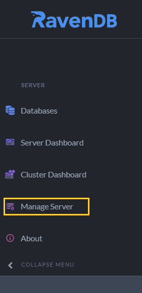

import Admonition from '@theme/Admonition';
import Tabs from '@theme/Tabs';
import TabItem from '@theme/TabItem';
import CodeBlock from '@theme/CodeBlock';
import LanguageSwitcher from "@site/src/components/LanguageSwitcher";
import LanguageContent from "@site/src/components/LanguageContent";

# Server Settings
<Admonition type="note" title="">

* The **Server Settings** view displays settings common to all the databases 
  hosted by the server.  
* This is a **read-only** view, showing settings made using 
  [environment variables](../../server/configuration/configuration-options.mdx#environment-variables), 
  the [settings.json](../../server/configuration/configuration-options.mdx#settingsjson) 
  configuration file, and [command line arguments](../../server/configuration/configuration-options.mdx#command-line-arguments).  
* For the server settings view open **Manage Server** `>>` **Server Settings**  
* To modify the settings of individual databases use the [Database Settings](../../studio/database/settings/database-settings.mdx) view.  

* In this page:  
  * [Server Settings View](../../studio/server/server-settings.mdx#server-settings-view)  

</Admonition>
## Server Settings View

* **Manage Server**  
  Click to open the Manage Server section.  

* **Server Settings**  
  Click to open the server settings view.  

* **Settings**  
  Hover any setting for a description of its functionality.  

* **Settings Selection Box**  
  Enter a string to display only the settings whose names contain this string.  

